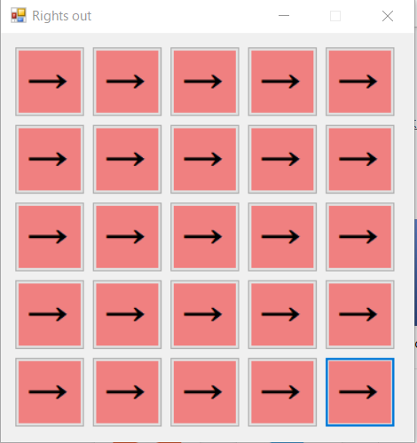
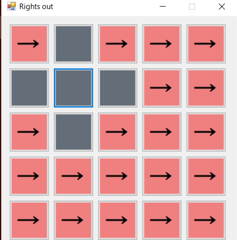

# ksnctf 24 Rights out 100pt
```
Solving the puzzle is not sufficient.

http://ksnctf.sweetduet.info/q/24/rightsout.exe
```

### 解法
- 上記のurlからrightout.exeを落としてくる。

- 以下の結果からもわかるように与えられたファイルは.Netで作られたexeファイルので、とりあえずWindows上で動かしてみる。

```bash
$ file rightsout.exe 
rightsout.exe: PE32 executable (GUI) Intel 80386 Mono/.Net assembly, for MS Windows
```

- 動かしてみると、以下の画像のようなGUIアプリケーションが起動する。
- このアプリケーションでは、ある四角のマスをクリックするとそのマスと上下左右のマスの色が反転するようだ。





- 自分はこのアプリを全て灰色にできるのではないかと考えてひたすらマスをクリックしたが、埒が明かなかった。

- 問題文を振り返ってみると、`Solving the puzzle is not sufficient.`と書いてあるので、Windows上でデコンパイルしてみることにした。今回用いたツールはググって一番上に引っかかった `dnSpy` である。

- そうして、デコンパイルしたプログラムを見ていくと、以下のようなFLAGがありそうな箇所が見つかった。

```c#
// Token: 0x06000009 RID: 9 RVA: 0x000023DC File Offset: 0x000005DC
private void check() {
    if (Array.IndexOf<bool>(this.state, true) < 0) {
        MessageBox.Show("Congratulations!");
        int[] array = new int[]
        {
            1,
            7,
            16,
            11,
            14,
            19,
            20,
            18
        };
        bool flag = true;
        for (int i = 0; i < 8; i++)
        {
            if (this.hist[i] != array[i])
            {
                flag = false;
            }
        }
        if (flag)
        {
            int[] array2 = new int[]
            {
                85,
                111,
                117,
                43,
                104,
                127,
                117,
                117,
                33,
                110,
                99,
                43,
                72,
                95,
                85,
                85,
                94,
                66,
                120,
                98,
                79,
                117,
                68,
                83,
                64,
                94,
                39,
                65,
                73,
                32,
                65,
                72,
                51
            };
            string text = "";
            for (int j = 0; j < array2.Length; j++)
            {
                text += (char)(array2[j] ^ array[j % array.Length]);
            }
            MessageBox.Show(text);
        }
    }
}
```

- この関数内の `text` を求めればFLAGが見つかる。このExploitに関してはsolve.pyを参考にしてもらいたい。

### 参考
- [凄すぎて大草原不可避な.NET デコンパイラdnSpyを使ってみる](https://qiita.com/Tokeiya/items/54fbf30cb21c77c05c41)

- [dnSpy v6.0.4](https://github.com/0xd4d/dnSpy/releases)
