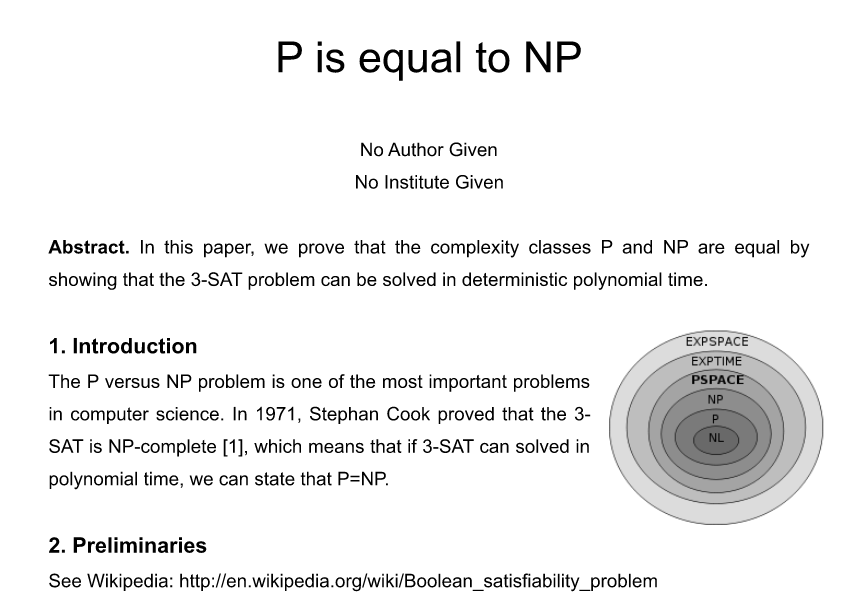

# Double Blind 50pt
```text
Who is the author of this paper?
Of course, kusano, @kusano_k, ksn,... is not a correct flag.

http://ksnctf.sweetduet.info/q/29/paper.docx
```

### 解説
- まず、上のurlからファイルを落としてくる。以下の画像のような論文が手に入る。



- このページにはflagらしきものはなかったので、とりあえず問題名をググってみる。

```
二重盲検法（にじゅうもうけんほう、英: Double blind test）とは、特に医学の試験・研究で、実施している薬や治療法などの性質を、医師（観察者）からも患者からも不明にして行う方法である。 プラセボ効果や観察者バイアスの影響を防ぐ意味がある。
```

- 特に参考にならなかったので、MSのwordの拡張子について調べてみると、wordは様々なコンテンンツを含んだ圧縮ファイルになっていることがわかるので、解凍してみると、色々なファイルが出てくる。このファイル群の中でflagを探してみると、見つかる。

### 参考
- [今更だけどdoc形式とdocx形式の違いとは？なぜdocxを使うべきかその理由を考えた。](https://work.lifemake.design/entry/2017/07/05/183000)
