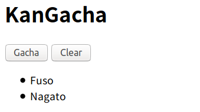
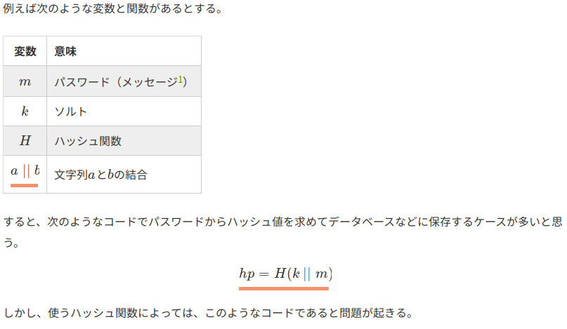
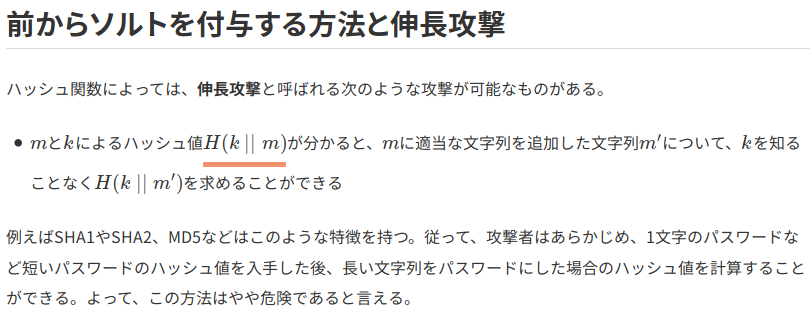

# KanGacha 130pt
```text
Task: Acquire Yamato
http://ctfq.sweetduet.info:10080/~q31/kangacha.php
source(http://ksnctf.sweetduet.info/q/31/kangacha.php)
```

- トップページの画像



### 解説
- 問題にソースが添付されていたのでそれを読む。

```php
<?php
$salt = 'FLAG_????????????????';
$shipname = array(
    'Nagato',
    'Mutsu',
    'Kongo',
    'Hiei',
    'Haruna',
    'Kirishima',
    'Fuso',
    'Yamashiro',
    'Ise',
    'Hyuga',
    "Yamato [Congratulations! The flag is $salt. ??????????????????????????????????????.]"
);

//  Check signature and read
if (isset($_COOKIE['ship']) and
    isset($_COOKIE['signature']) and
    hash('sha512', $salt.$_COOKIE['ship']) === $_COOKIE['signature'])
    $ship = explode(',', $_COOKIE['ship']);
else
    $ship = array();

if (isset($_POST['submit']))
{
    //  Gacha
    if ($_POST['submit'] === 'Gacha')
    {
        //  Yamato is ultra rare
        $ship[] = mt_rand(0, count($shipname)-2);

        $s = implode(',', $ship); // , で配列の要素を結合した文字列を返す
        $sign = hash('sha512', $salt.$s); // flagと上述の文字列を結合したのをsha512にかける

        setcookie('ship', $s);
        setcookie('signature', $sign);
    }

    //  Clear
    if ($_POST['submit'] === 'Clear')
    {
        setcookie('ship', '', 0);
        setcookie('signature', '', 0);
    }

    header("Location: {$_SERVER['REQUEST_URI']}");
    exit();
}

?>
<!DOCTYPE html>
<html>
  <head>
    <title>KanGacha</title>
  </head>
  <body>
    <h1>KanGacha</h1>
    <form method="POST">
      <input type="submit" name="submit" value="Gacha">
      <input type="submit" name="submit" value="Clear">
    </form>
    <ul>
<?php
for ($i=0; $i<count($ship); $i++)
    echo "<li>{$shipname[$ship[$i]]}</li>\n";
?>
    </ol>
  </body>
</html>
```

- 一部抜粋

```php
$salt = 'FLAG_????????????????';

$shipname = array(
    'Nagato',
    'Mutsu',
    'Kongo',
    'Hiei',
    'Haruna',
    'Kirishima',
    'Fuso',
    'Yamashiro',
    'Ise',
    'Hyuga',
    "Yamato [Congratulations! The flag is $salt. ??????????????????????????????????????.]"
);

~~~~~~

//  Yamato is ultra rare
$ship[] = mt_rand(0, count($shipname)-2);

$s = implode(',', $ship); // , で配列の要素を結合した文字列を返す
$sign = hash('sha512', $salt.$s); // flagと上述の文字列を結合したのをsha512にかける
```

- この処理からわかるのは、$shipnameという配列からYanato以外のインデックスをランダムに取り出して、別の配列の$shipに追加で格納する。そして、格納した結果を,で区切って結合する。最後に$saltとそれを結合したものをsha512をかける。これらの値を用いて、cookieを操作していることが検証画面からもわかる。

- 以上の箇所に脆弱性があると推測されたので、ハッシュ ソルトで検索をすると、以下のことがわかった。





- 今回の攻撃方法は`伸長攻撃(Length Extension Attack)`という方法が使えそうでる。

- ここで、現状持ち合わせている情報は$shipnameの書く要素に対するインデックスとソルトを結合したものの各ハッシュ値である。これらを用いて、攻撃を行うためのツールが `hashpump` である。使い方は以下に記載しておく。

```bash
$ hashpump -s (既知ハッシュ) -d (既知初期文字列) -k (UNKNOWNの長さ) -a (追加文字列)
出力1行目: hash(UNKNOWN ~ 初期既知文字列 ~ 何らかの文字列 ~ 追加文字列)
出力2行目: 初期既知文字列 ~ 何らかの文字列 ~ 追加文字列
```

- 注意したい点が、出力の２行目をhash関数にかけると出力の１行目が現れるということである。(自分は上の文字列の ~ の意味がわからずひどく困惑して時間を溶かした ...)

- したがってExploitの方法はhashpumpを用いて、わかるcookieと10(Yamatoのインデックスの値)から、cookieのshipとsignatureを求める。その値を用いてcookieを書き換える。solve.pyにExploitコードを記載しておく。

### 補足
- phpの`変数名.変数名`は結合と等しい。

```php
<?php
$a = "Hello";
$b = "!!!";
echo $a.$b;
?>
# Hello!!!
```

- Pyhtonのstrip()に関して。

```text
文字列の両端から指定文字をはぎとる。
指定文字以外の文字になるまで消し続ける。
文字を指定しない場合は、「空白文字」を削除。
```

- cookieの値はurlエンコードをしないといけない。

### 参考
- [ソルトとハッシュ関数だけでパスワードをハッシュ化するのが微妙な理由](https://qiita.com/yyu/items/2196b05208fb730e5af0)

- [hashpump の公式](https://github.com/bwall/HashPump)

- [hashpump の具体的な使い方](https://wiki.mma.club.uec.ac.jp/CTF/Toolkit/HashPump)

- [Pythonでコマンドの実行結果の標準出力を取得する](http://te2u.hatenablog.jp/entry/2015/07/15/235240)
