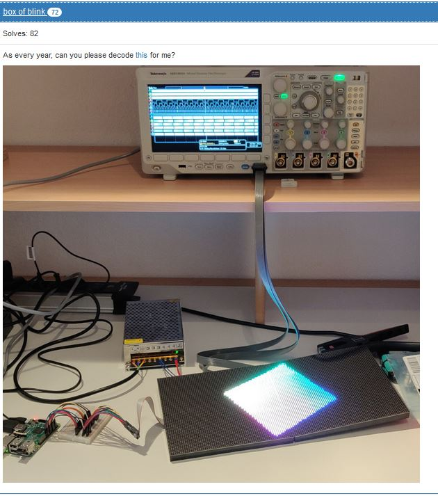
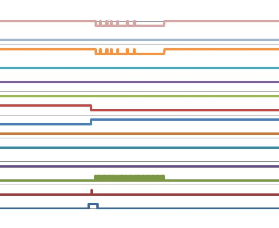
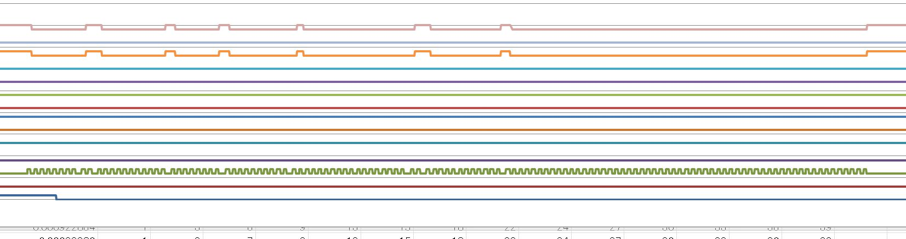
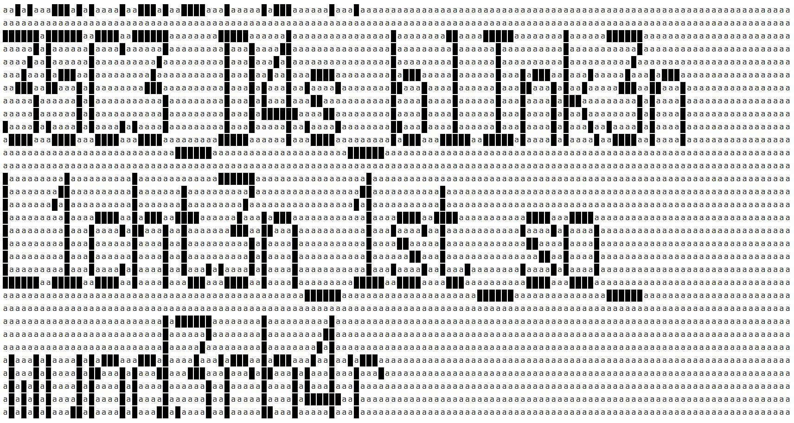

# 問題


 


画像が与えられて```As every year, can you please decode this for me?```と言われる．
thisのところに約400 MBの```blink.csv.gz```へのリンクが張られている。


# 解き方


## まずはファイルを開いてみる
```
$ gunzip blink.csv.gz
$ ls -lh blink.csv
-rw-r--r-- 1 saru 197121 411M 2月  25 05:07 blink.csv

```

blink.csv

```
#Model,MDO3014
#Firmware Version,1.26
#
#Waveform Type,DIGITAL,,,,,,,,,,,,,
#Point Format,Y,,,,,,,,,,,,,
#Horizontal Units,s,,,,,,,,,,,,,
#Horizontal Scale,0.004,,,,,,,,,,,,,
#,,,,,,,,,,,,,,
#Sample Interval,4e-09,,,,,,,,,,,,,
#Record Length,1e+07,,,,,,,,,,,,,
#Gating,0.0% to 100.0%,,,,,,,,,,,,,
#,,,,,,,,,,,,,,
#Vertical Units,V,V,V,V,V,V,V,V,V,V,V,V,V,V
#Threshold Used,1.65,1.65,1.65,1.65,1.65,1.65,1.65,1.65,1.65,1.65,1.65,1.65,1.65,1.65
#,,,,,,,,,,,,,,
#,,,,,,,,,,,,,,
#,,,,,,,,,,,,,,
#,,,,,,,,,,,,,,
#,,,,,,,,,,,,,,
#Label,OE,LAT,CLK,E,D,C,B,A,B2,B1,G2,G1,R2,R1
#TIME,D13,D12,D11,D10,D9,D8,D7,D6,D5,D4,D3,D2,D1,D0
-1.0000000e-03,0,0,0,0,1,0,0,0,0,0,0,1,0,1
-9.9999600e-04,0,0,0,0,1,0,0,0,0,0,0,1,0,1
-9.9999200e-04,0,0,0,0,1,0,0,0,0,0,0,1,0,1
-9.9998800e-04,0,0,0,0,1,0,0,0,0,0,0,1,0,1
-9.9998400e-04,0,0,0,0,1,0,0,0,0,0,0,1,0,1
-9.9998000e-04,0,0,0,0,1,0,0,0,0,0,0,1,0,1
-9.9997600e-04,0,0,0,0,1,0,0,0,0,0,0,1,0,1
```

まぁCSVファイルだということは分かる。
なんと1000万行もある。
MDO3014はミックスドドメインオシロスコープ。

## まずは画像を眺めてみる

分かるのは
- Raspberry Piがある
- LEDのマトリクスがある
- ロジアナがある

Raspberry PiでたぶんLEDのマトリクスに対してFlagを表示していて、Raspberry PiからLEDのマトリクスへの信号をロジアナでキャプチャした結果がblink.csv

## 連続した同じ行を削除

時間刻みが身近0がずーっと続いていてる行を削除して見やすくする。
まず処理しやすいようにヘッダ部分を削除。
そしてremove_duplicate.pyで同じ値が連続する行を削除する。
そうすると3.3MB、85835行のファイルになる。

- B
- C
- D
- E: カウンタ
- F: カウンタ
- G: カウンタ
- H: カウンタ
- I: カウンタ
- J: 動きなし
- K: 動きなし
- L: Nと連動 少ない データ
- M: Oと連動 多い データ
- N: Lと連動 少ない データ
- O: Mと連動 多い データ

Excelで開いてざーっと流すとEFGHIがカウンタのように見える。
32bitのカウンタかな？

## 波形として表示しやすいようにするために変化点のみ出力

連続した同じ行を削除だけだとタイミングが分かりづらい。
ので今度はextract_change.py変化点だけ抽出する。
6.9 MBの17万行。

詳細は002_change.xlsxを見て欲しい。
Excelで値をうまく整形して波形を同時表示。
Dが出ている間にデータが出てるように見える。

- B
- C
- **D: データ用のクロック？**
- E: カウンタ
- F: カウンタ
- G: カウンタ
- H: カウンタ
- I: カウンタ
- J: 動きなし
- K: 動きなし
- L: Nと連動 少ない データ
- M: Oと連動 多い データ
- N: Lと連動 少ない データ
- O: Mと連動 多い データ




データの部分を拡大してみる


Dのクロックに合わせてMでデータが出てるように見える。

001_unique.csvからDの1回当たりのクロックのエッジの数を数えてみると128個ある。

**32×128のLEDマトリクスだと考えるとなんとなく良さそうな気がする**

## デコーダプログラムを書いてみる


decoder.pyは002_change.csvを読み込んで信号に合わせてLEDの点灯っぽいhtmlファイルを出力するプログラム。
部分部分だけ説明すると

↓32bitカウンタの値の最上位が1から0になるときにhtmlファイルを初期化している。
32bitカウンタが1回転する毎にファイルを生成している。

```
    if current_values[4] == 0 and pre_values[4] == 1:
        output = StringIO()
        numpy.savetxt(output, bitmap, delimiter="", fmt="%d")
        print(output.getvalue())
        sys.stdout.flush()
        print("renew")
        s = get_html(bitmap)
        wfp.write(s)
        wfp.close()
        file_index = file_index + 1
        wfp = open("%04d.html" % file_index, "w")
        
        bitmap = []
        for i in range(32):
            bitmap.append([0] * 128)
        counter = 0
        counter_clock = 0
```

↓Bが0から1になるときに128個のLED用のカウンターをゼロにクリアしている。
```
    if current_values[1] == 1 and pre_values[1] == 0:
        counter_clock = 0
        counter = counter + 1
```


↓Dのクロックのライジングエッジに合わせてNとOのorを取っている。
NとOが一致してなかったのでどちらかONならONにしてみた。

```
    if current_values[3] == 1 and pre_values[3] == 0:
        bitmap[counter][counter_clock] = (current_values[12] or current_values[13])
    
        counter_clock = counter_clock + 1
```


decoder.pyを実行すると0001.html～0009.htmlができる。
そのうちの一つが↓の画像。




