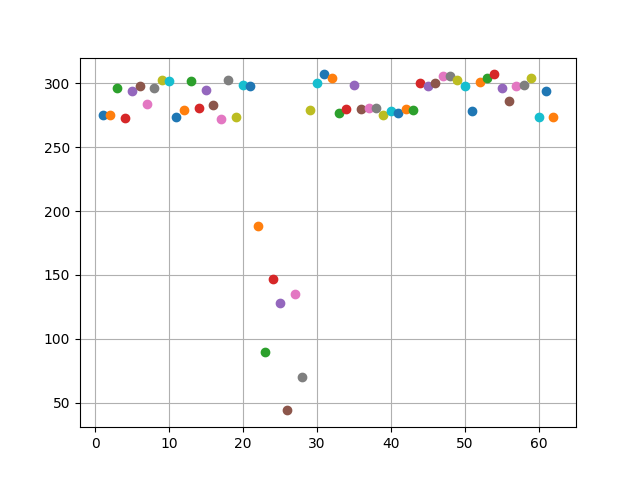
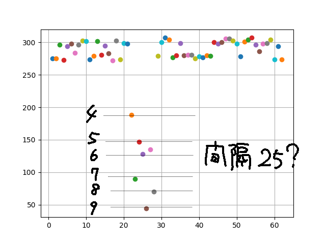
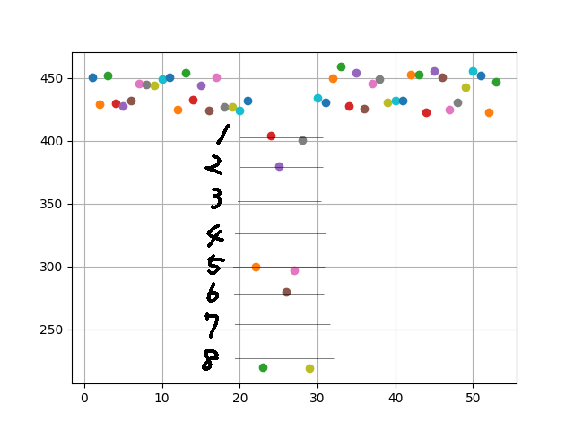

# STEM CTF: Cyber Challenge 2019 "Light at the End of the Tunnel" writeup

## Description
The team has recovered the light sensor values from the target's phone. We need you to use these values and identify the target's 8-digis bank PIN.

The target is a creature of habit so we've used that to our advantage. The sensor values are taken over a week during his commute on the subway. Same seat and roughly the same time so the conditions are good for your technique. There is good intelligence that the target typed in the PIN multiple times throughout the week during the commute.

We also recovered the light sensor values from right before a phone call was made on the target's phone, when the target was typing in a known phone number. However, these values were recorded under different lighting conditions than when the target was entering their 8-digit bank PIN.

Note: The flag for this challenge is MCA{PIN}

[Samples](Samples.txt)

## Solution

光センサーのデータを元に、8桁のPINを推測していく。数値のデータを眺めていてもわかりにくいのでmatplotで適当にグラフにしてみる。番号が既知なので、電話をかける時のデータから見てみる。

7箇所が他の値と明らかに外れているのでこれが、`4756968`に対応しているだろうと推測できる。
更に大雑把に推測すると、lux が大きいほうから 0, ..., 9 または 1, ..., 9, 0 となっていて、また隣の整数との間隔は大体25であると思える。

 
かなり雑な推測だが、とりあえずFridayのデータに対して試してみると、次のようになる。

他の日のデータもほぼ同じように当てはめられ、PINは`58126518`と予想できたので、試しに提出してみると正解だった。

Flag : `MCA{58126518}`
