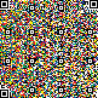

# STEM CTF: Cyber Challenge 2019 "QvR Code" writeup


## Description
This is now a STEAM focused competition. Check out our new patented Quade van Ravesteyn (QvR) code. QvR beats similar codes by marginally increasing storage capacity. And it's prettier to look at. Each encoding is like its own masterpiece.




## Solution
QRコード亜種っぽい。様々な色があるが、黒と白に関してはQRコードのパターンを決めているので恐らく確定している。<sup><a href="#1">[1]</a></sup>　残っている色に注目すると、そんなに種類は多くないので、その色を黒にするか白にするかで全探索し、各パターンで生成したQRコードからデータが読み取れるかをpyzbarで確かめる。

```python
from PIL import Image
import itertools
from pyzbar.pyzbar import decode


img = Image.open('./QvR.png')
color = set([])
for y in range(img.size[0]):
    for x in range(img.size[1]):
        pix = img.getpixel((x, y))
        if pix not in color and not (pix[0] == 0 and pix[1] == 0 and pix[2] == 0 or pix[0] == 255 and pix[1] == 255 and pix[2] == 255):
            color.add(pix)
color = list(color)

for i in range(1 << len(color)):
    img2 = img.copy()
    for y in range(img2.size[0]):
        for x in range(img2.size[1]):
            pix = img2.getpixel((x, y))
            blk = []
            for j in range(len(color)):
                if (i>>j)&1:
                    blk.append(color[j])

            if pix in blk:
                img2.putpixel((x, y), (0, 0, 0))
            elif pix[0] == 0 and pix[1] == 0 and pix[2] == 0:
                img2.putpixel((x, y), (0, 0, 0))
            elif pix[0] == 255 and pix[1] == 255 and pix[2] == 255:
                img2.putpixel((x, y), (255, 255, 255))
            else:
                img2.putpixel((x, y), (255, 255, 255))

    d = decode(img2)
    if len(d) != 0:
        print(d[0][0].decode()+'\n')
```

すると3つの文章が得られるので、意味が通るように並べ替えて頑張って英語を読む。 Flagに関する部分だけ抜き出すと、
```
Enclose with MCA{} for final flag.
Prepend salt_ and append _pepper to flag
Flag is impossible_color_theory Art: Art art art art art art art art. <- art.
```

Flag : `MCA{salt_impossible_color_theory_pepper}`

## Reference
<span id="1">1. QRコードの構成 [https://www.keyence.co.jp/ss/products/autoid/codereader/basic2d_qr.jsp](https://www.keyence.co.jp/ss/products/autoid/codereader/basic2d_qr.jsp)</span>
