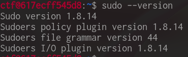
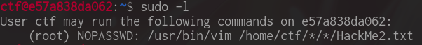
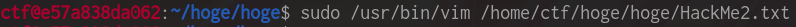
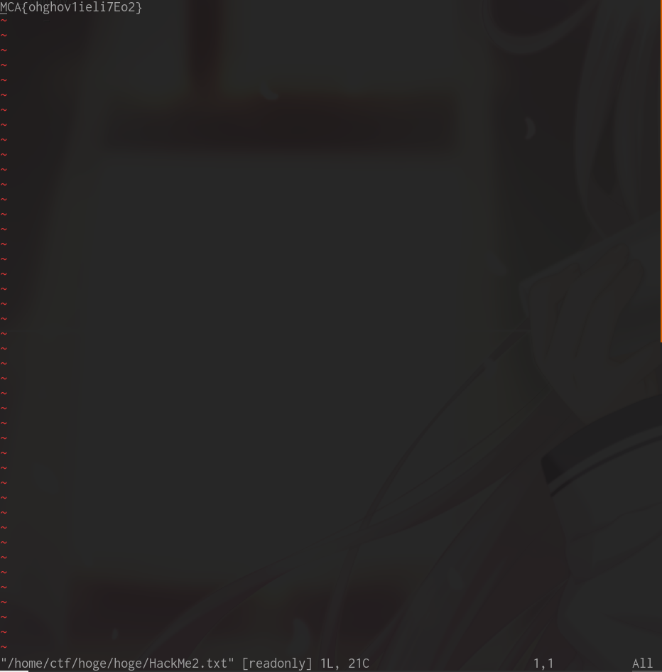

# STEM CTF: Cyber Challenge 2019 "January 8, 2014" writeup

## Description
All you need to do is read the flag!

`ssh ctf@138.247.13.103`

## Solution
SSHで接続後、ディレクトリ内を探っていくと、sudo-1.8.14というフォルダが残っていた。sudoのバージョンを実際に調べてみると1.8.14であったので、使える脆弱性がないか検索してみた。すると、CVE-2015-5602<a href="#2">[1]</a>があった。`sudo -l`を見てみると、この脆弱性にお誂え向きな設定であったので、この方針でほぼ確信した。

 

 

あとはPoCなどを元に、`HackMe2.txt`という名前で`/root/flag.txt`へのシンボリックリンクを作り、`sudo -l`の設定通りにこのリンクを開くと、Flagが表示された。

## Reference
1.  NVD - CVE-2015-5602 [<u>https://nvd.nist.gov/vuln/detail/CVE-2015-5602</u>](https://nvd.nist.gov/vuln/detail/CVE-2015-5602)
