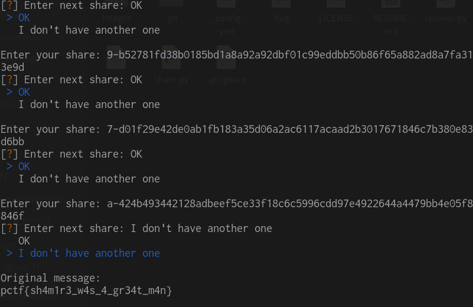

# Pragyan CTF 2019 "The Order of the Phoenix" writeup

## Description

It's a new age Order of the Phoenix. The current members are:

1. Harry
2. Hermione
3. Ron
4. George
5. Charlie
6. Bill
7. Ginny
8. Fleur
9. Luna
10. Neville

Each of them has a secret QR code associated with him/her which is given to you. At the entrance of the Grimmauld place, is a system to scan their QR codes.

Any 5 or more of them can enter at once, but not less than 5. This is in place to prevent any rash decisions made by very few people regarding the matters concerning the Order.

However, now is an emergency time. Malfoy is causing trouble again, and Harry needs to enter Grimmauld Place for which he needs to know the secret associated with the entry system to let him in. Help him out.

## Solution

10人がKeyを持っていて、5人集まれば情報が得られるという事から、シャミアの秘密分散法（Shamir's Secret Sharing）を使っているだろうと予想した。しばらくこれについて調べていると問題で与えられたのと同じ形式で秘密を分散させる [QR Secret Sharing](https://github.com/skewthreads/QR-secret-sharing) を見つけた。これの復号を実行するだけで良さそう。

また、事前に pyzbar で QRコードをまとめて読み取っておいた。

```python
from PIL import Image
from pyzbar.pyzbar import decode

namelist = ['Harry', 'Hermione', 'Ron', 'George', 'Charlie', 'Bill', 'Ginny', 'Fleur', 'Luna', 'Neville']

for name in namelist:
    qr = Image.open('{}.png'.format(name))
    print(decode(qr)[0][0].decode())
```


10個のKeyから5個のKeyを入力すると Flag が得られた。



Flag : `pctf{sh4m1r3_w4s_4_gr34t_m4n}`
