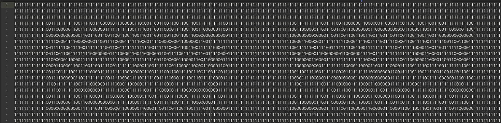
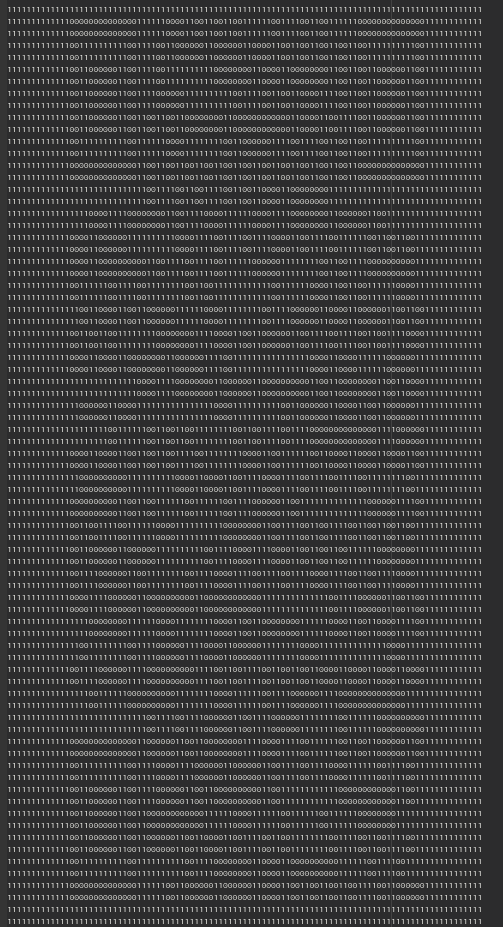
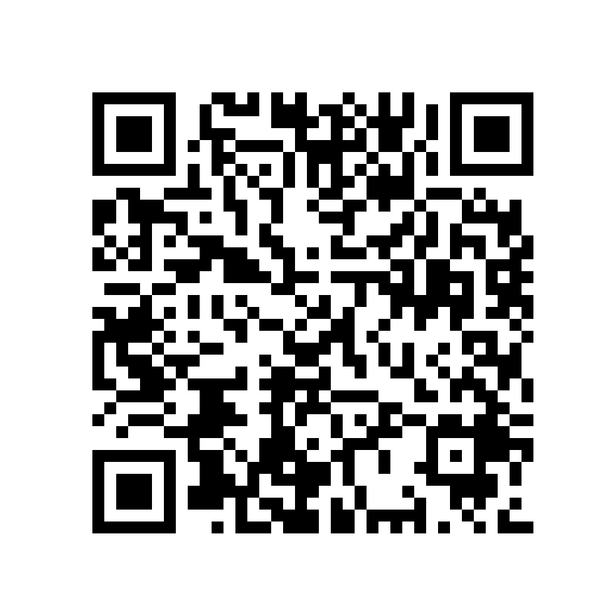

# Pragyan CTF 2019 "EXORcism" writeup

## Description

My friend Alex needs your help very fast. He has been possessed by a ghost and the only way to save him is if you tell the flag to the ghost. Hurry up, time is running out!

## Solution

とりあえずテキストファイルの全体を見たいが、一文字ごとに改行されているのが厄介なので `tr -d '\r\n' `で取り払う。その結果を出力してエディタで開くと、0 がある決まった範囲に現れる事が分かる。



現れたパターンを観察していると、QRコードっぽいことが分かる。文字数を調べるとちょうど10,000文字であったので、とりあえず100文字ずつで改行した。

すると、このようになった。



確かにQRコードになっていることが分かる。
これを画像に変換して読み取る。

画像変換はPythonでPILを用いた。
[makeqr.py](makeqr.py)
```python
from PIL import Image, ImageDraw
from pyzbar.pyzbar import decode

def xor_strings(s, t):
    if isinstance(s, str):
        return "".join(chr(ord(a) ^ ord(b)) for a, b in zip(s, t))
    else:
        return bytes([a ^ b for a, b in zip(s, t)])

with open('01qr', 'r') as f:
    qr = f.read()
    qr = qr.split('\n')
    usepadding = False

    h, w = len(qr)-1,len(qr[0])
    H, W = 500, 500

    image = Image.new('RGB', (H, W), (255,255,255))
    black = Image.new('RGB', (5, 5), (255,255,255))
    white = Image.new('RGB', (5, 5), (255,255,255))

    black_d = ImageDraw.Draw(black)
    white_d = ImageDraw.Draw(white)
    black_d.rectangle((0, 0, 5 ,5), fill=(0,0,0))
    white_d.rectangle((0, 0, 5 ,5), fill=(255,255,255))

    if usepadding:
        padding = (W-len(qr[0])*5)//2
    else:
        padding = 0

    for i in range(h):
        for j in range(w):
            if(qr[i][j] == '0'):
                image.paste(black, (padding+j*5, padding+i*5))
            else:
                image.paste(white, (padding+j*5, padding+i*5))

    ans = ''
    d = decode(image)[0][0].decode()
    for a, b in zip(d[::2], d[1::2]):
        ans += chr(int(a+b, 16))

    ans = ''.join(ans)
    print(d)
    print(ans)
    print(xor_strings(ans, 'flagflagflagflagflagflagflagflag'))
```




読み取った結果は
`160f15011d1b095339595138535f135613595e1a`

16進数→文字列の変換をするが、`9YQ8S_VY^` となり、ただ変換するだけでは意味のある文字列は得られなかった。
ここで、問題名 EXORcism をヒントにXORを取るのだろうと予想したが、何とのXORを取ればよいかが分からない。復号結果は Flag になっているだろうと予想し、読み取った結果を文字列に直したときの先頭5文字と`pctf{`の5文字で試しにXORを取ってみた。すると`flagf`という文字列が得られた。`flagflagflagfl...`と続くと予想し、これとQRコードの復号結果のXORを取ると Flag が取れた。

```python
from PIL import Image
from pyzbar.pyzbar import decode

def xor_strings(s, t):
    if isinstance(s, str):
        return "".join(chr(ord(a) ^ ord(b)) for a, b in zip(s, t))
    else:
        return bytes([a ^ b for a, b in zip(s, t)])

image = Image.open('qr.png')
ans = ''
d = decode(image)[0][0].decode()
for a, b in zip(d[::2], d[1::2]):
    ans += chr(int(a+b, 16))

ans = ''.join(ans)
print(d)
print(ans)
print(xor_strings(ans, 'flagflagflagflagflagflagflagflag'))

```


Flag : `pctf{wh4_50_53r1u5?}`

