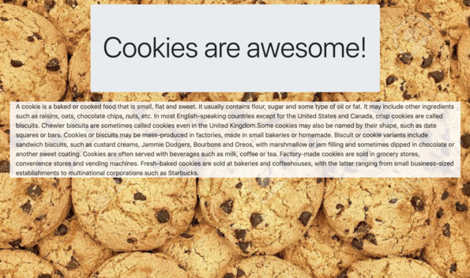
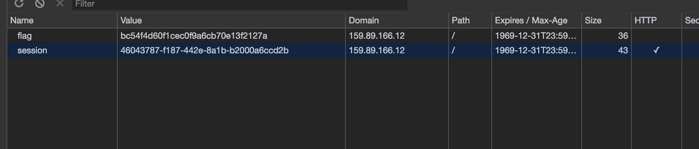

# Pragyan CTF 2019 "Cookie Monster" writeup

This problem is solved by hi120ki and saru.

## check problem

```
Do prepare to see cookies lurking everywhere.
http://159.89.166.12:13500/
```



## see websites

I check html code, but there are no hints.

But, it seems that something is hidden in cookie.

## check cookie



I find cookie that name is "flag".

When I reload browser, flag value is changed.

But, flag value is looped like this.

```
bc54f4d60f1cec0f9a6cb70e13f2127a
114d6a415b3d04db792ca7c0da0c7a55
b2984e12969ad3a3a2a4d334b8fb385a
6f570c477ab64d17825ef2d2dfcb6fe4
988287f7a1eb966ffc4e19bdbdeec7c3
0d4896d431044c92de2840ed53b6fbbd
f355d719add62ceea8c150e5fbfae819
12eccbdd9b32918131341f38907cbbb5
639307d281416ad0642faeaae1f098c4
96bc320e4d72edda450c7a9abc8a214f
c716fb29298ad96a3b31757ec9755763
51de5514f3c808babd19f42217fcba49
05cb7dc333ca611d0a8969704e39a9f0
bc781c76baf5589eef4fb7b9247b89a0
ff108b961a844f859bd7c203b7366f8e
2349277280263dff980b0c8a4a10674b
0b1cdc9fe1f929e469c5a54ffe0b2ed5
364641d04574146d9f88001e66b4410f
c758807125330006a4375357104f9a82
fcfdc12fb4030a8c8a2e19cf7b075926
440c5c247c708c6e46783e47e3986889
97a7bf81a216e803adfed8bd013f4b85
c1d12de20210d8c1b35c367536e1c255
a8655da06c5080d3f1eb6af7b514e309
```

These are like hash value.

I try to decode them by MD5.

```
bc54f4d60f1cec0f9a6cb70e13f2127a : pc
114d6a415b3d04db792ca7c0da0c7a55 : tf
b2984e12969ad3a3a2a4d334b8fb385a : {c
6f570c477ab64d17825ef2d2dfcb6fe4 : 0o
988287f7a1eb966ffc4e19bdbdeec7c3 : ki
0d4896d431044c92de2840ed53b6fbbd : 3s
f355d719add62ceea8c150e5fbfae819 : _@
12eccbdd9b32918131341f38907cbbb5 : re
639307d281416ad0642faeaae1f098c4 : _y
96bc320e4d72edda450c7a9abc8a214f : Um
c716fb29298ad96a3b31757ec9755763 : _b
51de5514f3c808babd19f42217fcba49 : Ut
05cb7dc333ca611d0a8969704e39a9f0 : _t
bc781c76baf5589eef4fb7b9247b89a0 : HE
ff108b961a844f859bd7c203b7366f8e : y_
2349277280263dff980b0c8a4a10674b : @l
0b1cdc9fe1f929e469c5a54ffe0b2ed5 : s0
364641d04574146d9f88001e66b4410f : _r
c758807125330006a4375357104f9a82 : 3v
fcfdc12fb4030a8c8a2e19cf7b075926 : Ea
440c5c247c708c6e46783e47e3986889 : L_
97a7bf81a216e803adfed8bd013f4b85 : @_
c1d12de20210d8c1b35c367536e1c255 : l0
a8655da06c5080d3f1eb6af7b514e309 : t}
```

Then, I get flag pctf{c0oki3s_@re_yUm_bUt_tHEy_@ls0_r3vEaL_@_l0t}
