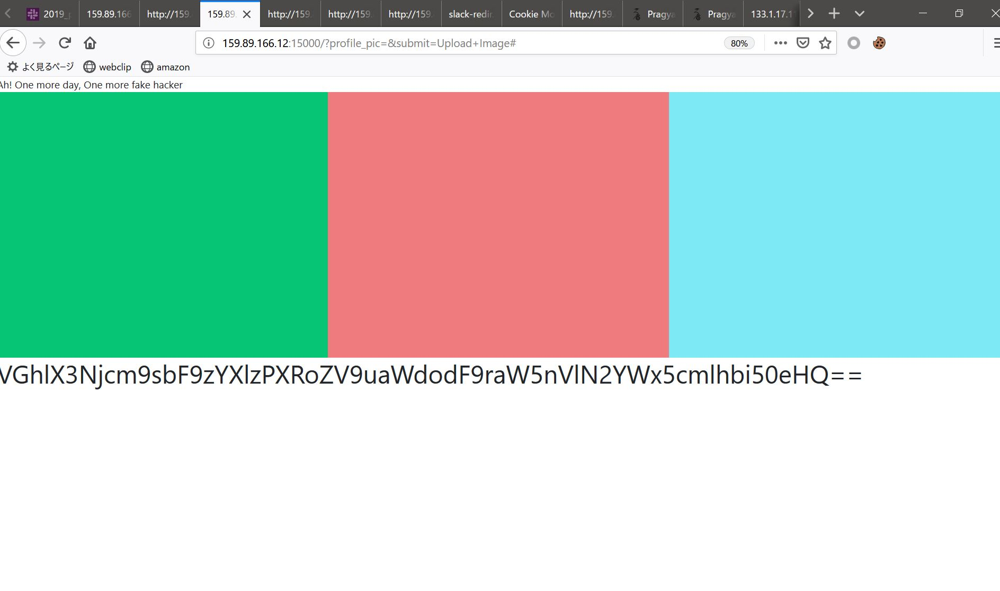

# 問題


これ壊れてたのかな、っていう問題。

# 解法

アクセスすると↓な画面に。

何にもない。


!(画面)[./001.jpg]

ソースを見るとformがある。
しかも一番左のboxの辺りっぽい。

```html
<!DOCTYPE html>
<html lang="en" dir="ltr">
  <head>
    <link rel="stylesheet" href="https://stackpath.bootstrapcdn.com/bootstrap/4.3.1/css/bootstrap.min.css" integrity="sha384-ggOyR0iXCbMQv3Xipma34MD+dH/1fQ784/j6cY/iJTQUOhcWr7x9JvoRxT2MZw1T" crossorigin="anonymous">
    <link rel="stylesheet" href="index.css">
    <meta charset="utf-8">
    <title></title>
  </head>
  <body>
    <div class="row">
      <div class="col-lg-4" id="item1" >
        <div class="container">
        <div class="form_img" >
	  <form action='#' method = "GET" target="resultFrame">
              Upload Your Profile Picture : <input type="file" name="profile_pic" >
              <input type="submit" value="Upload Image" name="submit">
          </form>
        </div>
      </div>
      </div>
      <div class="col-lg-4" id="item2">

      </div>
      <div class="col-lg-4" id="item3">

      </div>
    </div>

    <script type="text/javascript" src="index.js"></script>
    <div class="row">
        <div class="col-lg-12" >
                  </div>
    </div>
  </body>
</html>
```


マウスを移動してみるとボタンが隠れてるのかマウスが指の形になるのでクリック。
すると文字列が。



Base64っぽいのでBase64でデコード。

```python
import base64

str = "VGhlX3Njcm9sbF9zYXlzPXRoZV9uaWdodF9raW5nVlN2YWx5cmlhbi50eHQ=="

print(base64.b64decode(str))
```
