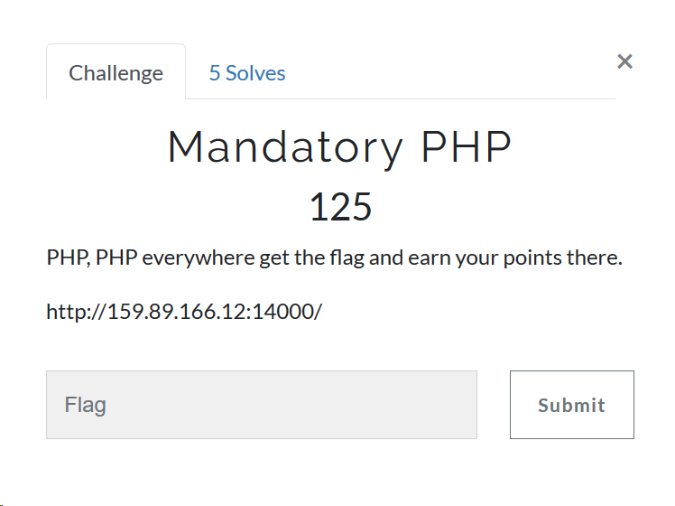

# Pragyan CTF 2019 "Mandatory PHP" writeup

## 問題



## 解法

ページにアクセスすると↓のようなソースコードが。(見やすいように少し整形済み)
GETの引数にval1～val4まで与えて、適切なやつだとフラグがゲットできるってやつ。

```php
<?php
include 'flag.php';
highlight_file('index.php');
$a = $_GET["val1"];
$b = $_GET["val2"];
$c = $_GET["val3"];
$d = $_GET["val4"];
if(preg_match('/[^A-Za-z]/', $a))
    die('oh my gawd...');
$a=hash("sha256",$a);
$a=(log10($a**(0.5)))**2;
if($c>0&&$d>0&&$d>$c&&$a==$c*$c+$d*$d)
    $s1="true";
else
    die("Bye...");
if($s1==="true")
    echo $flag1;
for($i=1;$i<=10;$i++){
    if($b==urldecode($b))
        die('duck');
    else
        $b=urldecode($b);
}    
if($b==="WoAHh!")
    $s2="true";
else
    die('oops..');
if($s2==="true")
    echo $flag2;
die('end...');
?>
Bye...
```

まずはのif文を突破することを考える。

```php
$a=hash("sha256",$a);
$a=(log10($a**(0.5)))**2;
if($c>0&&$d>0&&$d>$c&&$a==$c*$c+$d*$d)
    $s1="true";
else
    die("Bye...");
```

自鯖で動作させてたら$aに"a"を放り込むと
```php
$a=hash("sha256",$a);
$a=(log10($a**(0.5)))**2;
```
で$aがINFになることを発見。
あとは```$c*$c + $d*$d```もINFになるように調整。
具体的にはval3 (```$c```)には1を、val4(```$d```)には7E1000を入れてみたらOKが出た。


これで半分突破。

次は```$b```を10回urldecodeにかけたらWoAHh!になる文字列を考える。

```php
for($i=1;$i<=10;$i++){
    if($b==urldecode($b))
        die('duck');
    else
        $b=urldecode($b);
}    
if($b==="WoAHh!")
    $s2="true";
else
    die('oops..');
```

直感的にこれはパーセントエンコードだろうと分かったのでWをパーセントエンコードしてやっていけば解けた。具体的には%25がurldecodeされると%になるので繰り返し繰り返しやっていって最後の%57でWに変換される```%2525252525252525252557oAHh!```。

