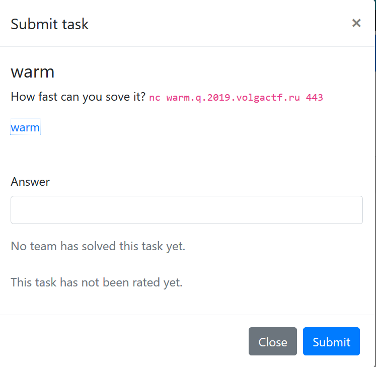
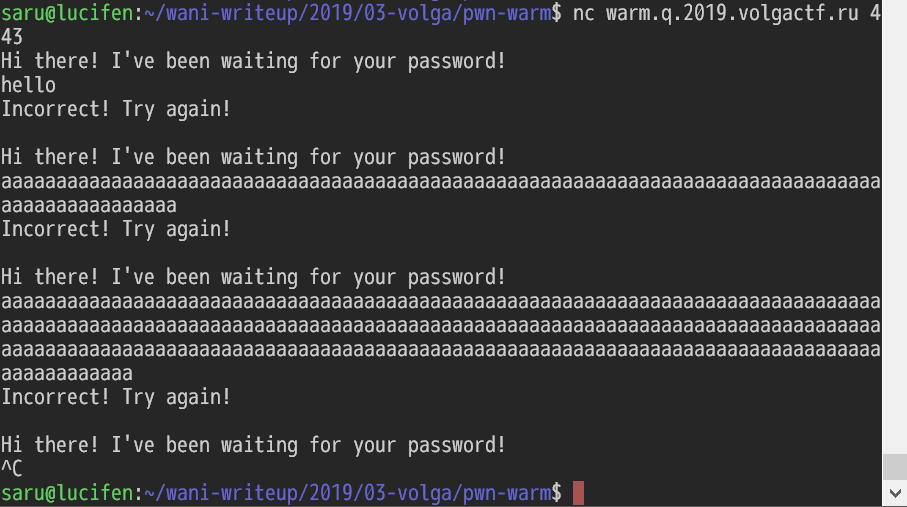
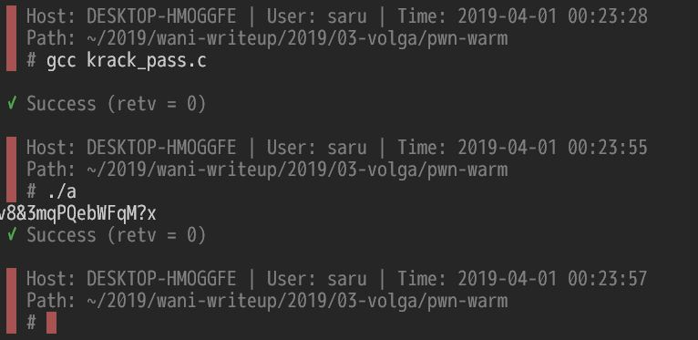
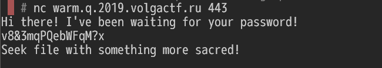
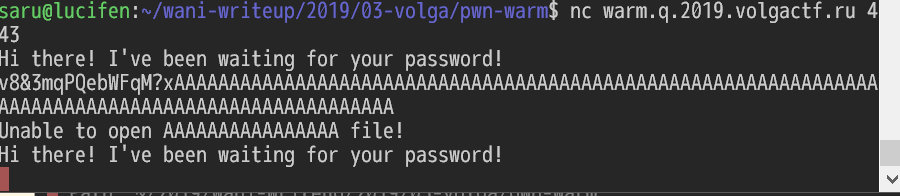
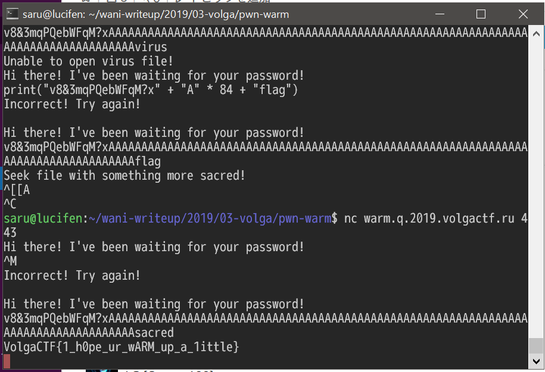

# VolgaCTF 2019 "warm [PWN 100]" writeup



このぐらいのレベルが楽しく解けてちょうど良い。


## 解法

stringsで見てみるとstrcpyとかgetsとかあるしバッファオーバフロー系かなと思う。

が、checksecで見るとフルでプロテクトかかってる。
これは苦労しそうだなと。
さらにfileコマンドで見てみると↓ARMかよ．．．ARMのgdb環境は整えてないので少し萎える。


```bash-statement
saru@lucifen:~/wani-writeup/2019/03-volga/pwn-warm$ file warm

warm: ELF 32-bit LSB shared object, ARM, EABI5 version 1 (SYSV), dynamically linked, interpreter /lib/ld-, for GNU/Linux 3.2.0, BuildID[sha1]=c549628c0b3841a5fd9a23f0faaf6b51eb858e94, stripped

saru@lucifen:~/wani-writeup/2019/03-volga/pwn-warm$
```

とりあえず繋いでみると、パスワードを聞かれる。
適当に長いやつ入れてみたけど簡単にはsegmentation faultは起きない。



そんな中でghidraにかけてみた。
なんだこれは簡単そうじゃないか．．．
一文字目は0x76、後はXORをひたすらかけてる。

```C:ghidra_001.c
undefined4 FUN_00010788(byte *pbParm1)
{
  size_t sVar1;
  undefined4 uVar2;
 
  sVar1 = strlen((char *)pbParm1);
  if (sVar1 < 0x10) {
    uVar2 = 1;
  }else {
    if (((((*pbParm1 == 0x76) && ((pbParm1[1] ^ *pbParm1) == 0x4e)) &&
	  ((pbParm1[2] ^ pbParm1[1]) == 0x1e)) &&
	 ((((pbParm1[3] ^ pbParm1[2]) == 0x15 && ((pbParm1[4] ^ pbParm1[3]) == 0x5e)) &&
	   (((pbParm1[5] ^ pbParm1[4]) == 0x1c &&
	     (((pbParm1[6] ^ pbParm1[5]) == 0x21 && ((pbParm1[7] ^ pbParm1[6]) == 1)))))))) &&
	(((pbParm1[8] ^ pbParm1[7]) == 0x34 &&
	  ((((((pbParm1[9] ^ pbParm1[8]) == 7 && ((pbParm1[10] ^ pbParm1[9]) == 0x35)) &&
	      ((pbParm1[0xb] ^ pbParm1[10]) == 0x11)) &&
	     (((pbParm1[0xc] ^ pbParm1[0xb]) == 0x37 && ((pbParm1[0xd] ^ pbParm1[0xc]) == 0x3c))))&&
	    (((pbParm1[0xe] ^ pbParm1[0xd]) == 0x72 && ((pbParm1[0xf] ^ pbParm1[0xe]) ==0x47)))))))) {
      uVar2 = 0;
    } else {
      uVar2 = 2;
    }
  }
  return uVar2;
}
```

というわけでデコードプログラムを書く。

```c:krack_pass.c
#include <stdio.h>
#include <ctype.h>

int main()
{
  uint8_t c, tmp;
  c = 0x76;
  
  putchar(c);  
  tmp = 0x4e;
  c = c ^ tmp;
  
  putchar(c);
  tmp = 0x1e;
  c = c ^ tmp;

  putchar(c);  
  tmp = 0x15;
  c = c ^ tmp;

  putchar(c);  
  tmp = 0x5e;
  c = c ^ tmp;

  putchar(c);  
  tmp = 0x1c;
  c = c ^ tmp;

  putchar(c);  
  tmp = 0x21;
  c = c ^ tmp;

  putchar(c);  
  tmp = 0x01;
  c = c ^ tmp;

  putchar(c);  
  tmp = 0x34;
  c = c ^ tmp;

  putchar(c);  
  tmp = 0x07;
  c = c ^ tmp;

  putchar(c);  
  tmp = 0x35;
  c = c ^ tmp;

  putchar(c);  
  tmp = 0x11;
  c = c ^ tmp;

  putchar(c);  
  tmp = 0x37;
  c = c ^ tmp;

  putchar(c);  
  tmp = 0x3c;
  c = c ^ tmp;

  putchar(c);  
  tmp = 0x72;
  c = c ^ tmp;

  putchar(c);  
  tmp = 0x47;
  c = c ^ tmp;

  putchar(c);
}
```

実行結果は



パスワードをサーバに入力してみると合ってはいるのだけど何かがおかしい。



もっかいghidraの結果を眺めてみる。
ファイルの入出力のところの処理を追ってみるとパスワード「```acStack220[100]```」があってた場合ファイル「```acStack120[100]```」を開いてその中身を表示させている。

```c:ghidra_002.c
undefined4 FUN_000109ec(void)
{
  int __c;
  FILE *__stream;
  char acStack220 [100];
  char acStack120 [100];
  int local_14;
  local_14 = __stack_chk_guard;
  setvbuf(stdout,(char *)0x0,2,0);
  while( true ) {
    while( true ) {
      FUN_000108f0(acStack120);
      puts("Hi there! I\'ve been waiting for your password!");
      gets(acStack220);
      __c = FUN_00010788(acStack220);
      if (__c == 0){
	break;
      }
      FUN_00010978(1,0);
    }
    __stream = fopen(acStack120,"rb");
    if (__stream != (FILE *)0x0){
      break;
    }
    FUN_00010978(2,acStack120);
  }
 
  while (__c = _IO_getc((_IO_FILE *)__stream), __c != -1) {
    putchar(__c);
  }
  fclose(__stream);
  if (local_14 == __stack_chk_guard) {
    return 0;
  }
  /* WARNING: Subroutine does not return */
  __stack_chk_fail();
}
```

じゃファイル名書き換えられるんじゃね？ということでパスワードの後に適当に```A * 100```をつけて送ってみた。
見事ファイルを書き換えられた！



たぶん```flag.txt```だろうと思ってやってみたが駄目。
flagをやってみたら```Seek file with something more sacred!```と出る。
sacredをscaredと間違えてvirusとか入れてみたけど駄目。
で、少し考えてみてsacredを入力したらゲットできた。


