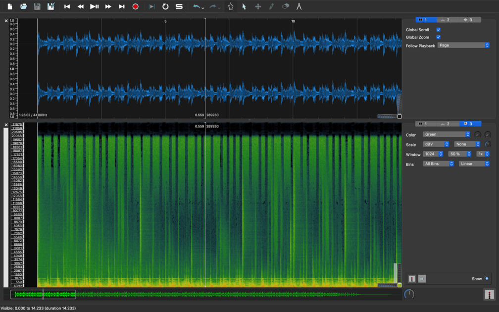

# Volga CTF 2019 "Higher" writeup

## check problem


recorded.mp3 が渡される

## solve problem

file, exiftool, strings, binwalk を試すが何もない

<https://github.com/danielcardeenas/AudioStego>

mp3 にデータを埋め込める AudioStego も使ってみたが反応なし

音源の波形に何か隠されているかもしれないと [Sonic Visualiser](https://www.sonicvisualiser.org/) で見る



<https://github.com/fernandormoraes/write-ups/blob/master/volgactf-2019/higher.md>

こちらの writeup によると下の緑色のスペクトログラムの時間方向に短いところを 0、長いところを 1 として

```
010101100110111101101100011001110110000101000011010101000100011001111011010011100011000001110100010111110011010001101100011011000101111101100011001101000110111001011111011000100011001101011111011010000011001100110100011100100110010001111101
```

このようなデータが取れる

このデータを8桁ずつ区切りASCIIで変換するとフラグ VolgaCTF{N0t_4ll_c4n_b3_h34rd} が得られる

[２進数ASCIIコード表](http://www12.plala.or.jp/mz80k2/electronics/ascii/ascii.html)
