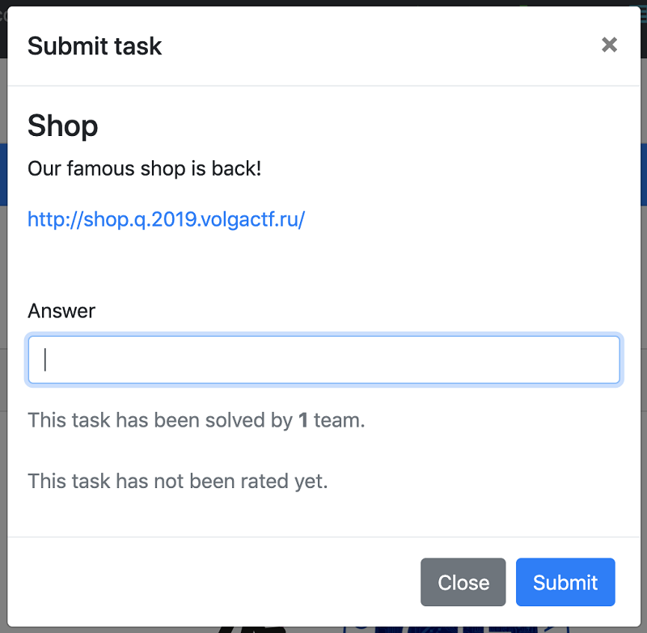

# 問題



# 解法

時間内に解けたことは解けたのだけどadmin、adminで入った場合にBalanceがめちゃめちゃ増えてて(たぶん他の人が解いた)あっさり解けてしまった。
チーム内でこれ違うよね、との議論になって終わった後にwriteupみてたらやっぱり違った。

チームメンバーが```robots.txt```を見つけてくれてその中には
```text
Disallow: /shop-1.0.0.war
```
と書かれている。

早速shop-1.0.0.warをダウンロード。
shop-1.0.0.warはサーブレットのメイン。
拡張子をzipに変えて解凍するとたくさんファイルが出てくる。
単純なMVCになっていて、どう考えても```./WEB-INF/classes/ru/volgactf/shop/controllers/ShopController.class```が怪しい。


```
.
./META-INF
./META-INF/MANIFEST.MF
./META-INF/maven
./META-INF/maven/ru.volgactf
./META-INF/maven/ru.volgactf/shop
./META-INF/maven/ru.volgactf/shop/pom.properties
./META-INF/maven/ru.volgactf/shop/pom.xml
./org
./org/springframework
./org/springframework/boot
./org/springframework/boot/loader
./org/springframework/boot/loader/archive
./org/springframework/boot/loader/archive/Archive$Entry.class
./org/springframework/boot/loader/archive/Archive$EntryFilter.class
./org/springframework/boot/loader/archive/Archive.class
./org/springframework/boot/loader/archive/ExplodedArchive$1.class
./org/springframework/boot/loader/archive/ExplodedArchive$FileEntry.class
./org/springframework/boot/loader/archive/ExplodedArchive$FileEntryIterator$EntryComparator.class
./org/springframework/boot/loader/archive/ExplodedArchive$FileEntryIterator.class
./org/springframework/boot/loader/archive/ExplodedArchive.class
./org/springframework/boot/loader/archive/JarFileArchive$EntryIterator.class
./org/springframework/boot/loader/archive/JarFileArchive$JarFileEntry.class
./org/springframework/boot/loader/archive/JarFileArchive.class
./org/springframework/boot/loader/data
./org/springframework/boot/loader/data/RandomAccessData.class
./org/springframework/boot/loader/data/RandomAccessDataFile$1.class
./org/springframework/boot/loader/data/RandomAccessDataFile$DataInputStream.class
./org/springframework/boot/loader/data/RandomAccessDataFile$FileAccess.class
./org/springframework/boot/loader/data/RandomAccessDataFile.class
./org/springframework/boot/loader/ExecutableArchiveLauncher.class
./org/springframework/boot/loader/jar
./org/springframework/boot/loader/jar/AsciiBytes.class
./org/springframework/boot/loader/jar/Bytes.class
./org/springframework/boot/loader/jar/CentralDirectoryEndRecord.class
./org/springframework/boot/loader/jar/CentralDirectoryFileHeader.class
./org/springframework/boot/loader/jar/CentralDirectoryParser.class
./org/springframework/boot/loader/jar/CentralDirectoryVisitor.class
./org/springframework/boot/loader/jar/FileHeader.class
./org/springframework/boot/loader/jar/Handler.class
./org/springframework/boot/loader/jar/JarEntry.class
./org/springframework/boot/loader/jar/JarEntryFilter.class
./org/springframework/boot/loader/jar/JarFile$1.class
./org/springframework/boot/loader/jar/JarFile$2.class
./org/springframework/boot/loader/jar/JarFile$JarFileType.class
./org/springframework/boot/loader/jar/JarFile.class
./org/springframework/boot/loader/jar/JarFileEntries$1.class
./org/springframework/boot/loader/jar/JarFileEntries$EntryIterator.class
./org/springframework/boot/loader/jar/JarFileEntries.class
./org/springframework/boot/loader/jar/JarURLConnection$1.class
./org/springframework/boot/loader/jar/JarURLConnection$JarEntryName.class
./org/springframework/boot/loader/jar/JarURLConnection.class
./org/springframework/boot/loader/jar/StringSequence.class
./org/springframework/boot/loader/jar/ZipInflaterInputStream.class
./org/springframework/boot/loader/JarLauncher.class
./org/springframework/boot/loader/LaunchedURLClassLoader$UseFastConnectionExceptionsEnumeration.class
./org/springframework/boot/loader/LaunchedURLClassLoader.class
./org/springframework/boot/loader/Launcher.class
./org/springframework/boot/loader/MainMethodRunner.class
./org/springframework/boot/loader/PropertiesLauncher$1.class
./org/springframework/boot/loader/PropertiesLauncher$ArchiveEntryFilter.class
./org/springframework/boot/loader/PropertiesLauncher$PrefixMatchingArchiveFilter.class
./org/springframework/boot/loader/PropertiesLauncher.class
./org/springframework/boot/loader/util
./org/springframework/boot/loader/util/SystemPropertyUtils.class
./org/springframework/boot/loader/WarLauncher.class
./WEB-INF
./WEB-INF/classes
./WEB-INF/classes/application.properties
./WEB-INF/classes/applicationContext.xml
./WEB-INF/classes/data.sql
./WEB-INF/classes/persistence.xml
./WEB-INF/classes/ru
./WEB-INF/classes/ru/volgactf
./WEB-INF/classes/ru/volgactf/shop
./WEB-INF/classes/ru/volgactf/shop/controllers
./WEB-INF/classes/ru/volgactf/shop/controllers/ShopController.class
./WEB-INF/classes/ru/volgactf/shop/dao
./WEB-INF/classes/ru/volgactf/shop/dao/ProductDao.class
./WEB-INF/classes/ru/volgactf/shop/dao/UserDao.class
./WEB-INF/classes/ru/volgactf/shop/filters
./WEB-INF/classes/ru/volgactf/shop/filters/AuthFilter.class
./WEB-INF/classes/ru/volgactf/shop/models
./WEB-INF/classes/ru/volgactf/shop/models/Message.class
./WEB-INF/classes/ru/volgactf/shop/models/Product.class
./WEB-INF/classes/ru/volgactf/shop/models/User.class
./WEB-INF/classes/ru/volgactf/shop/ShopApplication.class
./WEB-INF/classes/static
./WEB-INF/classes/static/css
./WEB-INF/classes/static/css/login.css
./WEB-INF/classes/static/css/shop.css
./WEB-INF/classes/static/img
./WEB-INF/classes/static/img/1.jpg
./WEB-INF/classes/static/img/2.jpg
./WEB-INF/classes/static/img/3.jpg
./WEB-INF/classes/static/img/4.jpg
./WEB-INF/classes/static/img/5.jpg
./WEB-INF/classes/static/img/favicon.png
./WEB-INF/lib
./WEB-INF/lib/antlr-2.7.7.jar
./WEB-INF/lib/byte-buddy-1.9.10.jar
./WEB-INF/lib/classmate-1.4.0.jar
./WEB-INF/lib/dom4j-2.1.1.jar
./WEB-INF/lib/ecj-3.15.0.jar
./WEB-INF/lib/h2-1.4.197.jar
./WEB-INF/lib/hibernate-commons-annotations-5.0.4.Final.jar
./WEB-INF/lib/hibernate-core-5.3.7.Final.jar
./WEB-INF/lib/hibernate-validator-6.0.14.Final.jar
./WEB-INF/lib/jackson-annotations-2.9.0.jar
./WEB-INF/lib/jackson-core-2.9.8.jar
./WEB-INF/lib/jackson-databind-2.9.8.jar
./WEB-INF/lib/jackson-datatype-jdk8-2.9.8.jar
./WEB-INF/lib/jackson-datatype-jsr310-2.9.8.jar
./WEB-INF/lib/jackson-module-parameter-names-2.9.8.jar
./WEB-INF/lib/jandex-2.0.5.Final.jar
./WEB-INF/lib/javassist-3.23.1-GA.jar
./WEB-INF/lib/javax.activation-api-1.2.0.jar
./WEB-INF/lib/javax.annotation-api-1.3.2.jar
./WEB-INF/lib/javax.interceptor-api-1.2.jar
./WEB-INF/lib/javax.persistence-api-2.2.jar
./WEB-INF/lib/jboss-logging-3.3.2.Final.jar
./WEB-INF/lib/jboss-transaction-api_1.2_spec-1.1.1.Final.jar
./WEB-INF/lib/jstl-1.2.jar
./WEB-INF/lib/jul-to-slf4j-1.7.25.jar
./WEB-INF/lib/log4j-api-2.11.2.jar
./WEB-INF/lib/log4j-to-slf4j-2.11.2.jar
./WEB-INF/lib/logback-classic-1.2.3.jar
./WEB-INF/lib/logback-core-1.2.3.jar
./WEB-INF/lib/slf4j-api-1.7.25.jar
./WEB-INF/lib/snakeyaml-1.23.jar
./WEB-INF/lib/spring-aop-5.1.5.RELEASE.jar
./WEB-INF/lib/spring-beans-5.1.5.RELEASE.jar
./WEB-INF/lib/spring-boot-2.1.3.RELEASE.jar
./WEB-INF/lib/spring-boot-autoconfigure-2.1.3.RELEASE.jar
./WEB-INF/lib/spring-boot-starter-2.1.3.RELEASE.jar
./WEB-INF/lib/spring-boot-starter-json-2.1.3.RELEASE.jar
./WEB-INF/lib/spring-boot-starter-logging-2.1.3.RELEASE.jar
./WEB-INF/lib/spring-boot-starter-web-2.1.3.RELEASE.jar
./WEB-INF/lib/spring-context-5.1.5.RELEASE.jar
./WEB-INF/lib/spring-core-5.1.5.RELEASE.jar
./WEB-INF/lib/spring-expression-5.1.5.RELEASE.jar
./WEB-INF/lib/spring-jcl-5.1.5.RELEASE.jar
./WEB-INF/lib/spring-jdbc-5.1.5.RELEASE.jar
./WEB-INF/lib/spring-orm-5.1.5.RELEASE.jar
./WEB-INF/lib/spring-tx-5.1.5.RELEASE.jar
./WEB-INF/lib/spring-web-5.1.5.RELEASE.jar
./WEB-INF/lib/spring-webmvc-5.1.5.RELEASE.jar
./WEB-INF/lib/tomcat-annotations-api-9.0.16.jar
./WEB-INF/lib/tomcat-embed-core-9.0.16.jar
./WEB-INF/lib/tomcat-embed-el-9.0.16.jar
./WEB-INF/lib/tomcat-embed-jasper-9.0.16.jar
./WEB-INF/lib/validation-api-2.0.1.Final.jar
./WEB-INF/lib-provided
./WEB-INF/lib-provided/spring-boot-starter-tomcat-2.1.3.RELEASE.jar
./WEB-INF/lib-provided/tomcat-embed-websocket-9.0.16.jar
./WEB-INF/templates
./WEB-INF/templates/login.jsp
./WEB-INF/templates/profile.jsp
./WEB-INF/templates/registration.jsp
./WEB-INF/templates/shop.jsp
```
JDCだとなぜかShopController.javaがデコンパイルできないのでLuytenを使った。
単純なJSP。
JSPだとGETとPOSTが同じように扱われる場合もあるのを知っていたので
http://shop.q.2019.volgactf.ru/buy?productId=1
にアクセスして購入できたりするのは確認。
ここでどん詰まった後にadminで入れて解けたのだが、正解は違うっぽい。
正解は
http://shop.q.2019.volgactf.ru/buy?productId=4&Balance=10000
でBalanceを書き換えて購入するとのことだった。

ただ、デコンパイルしたファイルを見てもBalanceは書き換えられないように見える。framework使うと勝手にBalanceも外からいじれるようになるとかだろうか？それともダウンロードできたshop-1.0.0.warと実際に上がっているファイルが異なるのだろうか？直感的には後者な気がする。前者だとあまりにも危険。後で自分の手元で試してみたい。


```java
package ru.volgactf.shop.controllers;

import org.springframework.stereotype.*;
import org.springframework.beans.factory.annotation.*;
import ru.volgactf.shop.dao.*;
import org.springframework.web.bind.*;
import org.springframework.ui.*;
import javax.servlet.http.*;
import org.springframework.web.bind.annotation.*;
import org.springframework.web.servlet.mvc.support.*;
import ru.volgactf.shop.models.*;
import java.util.*;

@Controller
public class ShopController
{
    @Autowired
    private UserDao userDao;
    @Autowired
    private ProductDao productDao;
    
    @InitBinder
    public void initBinder(final WebDataBinder binder) {
        binder.setDisallowedFields(new String[] { "balance" });
    }
    
    @ModelAttribute("user")
    public User getUser(final HttpServletRequest request) {
        return (User)((request.getAttribute("user") != null) ? request.getAttribute("user") : new User());
    }
    
    @RequestMapping({ "", "/", "/index" })
    public String index(@ModelAttribute("message") final String message, @ModelAttribute("user") final User user, final Model templateModel) {
        templateModel.addAttribute("products", (Object)this.productDao.geProducts());
        return "shop";
    }
    
    @RequestMapping({ "/login" })
    public String login(@ModelAttribute("message") final String message) {
        return "login";
    }
    
    @RequestMapping({ "/registration" })
    public String registration(@ModelAttribute("message") final String message) {
        return "registration";
    }
    
    @RequestMapping({ "/logout" })
    public String registration(final HttpServletRequest request) {
        final HttpSession session = request.getSession();
        session.setAttribute("user_id", (Object)null);
        return "redirect:index";
    }
    
    @RequestMapping({ "/loginProcess" })
    public String login(@RequestParam final String name, @RequestParam final String pass, final Model templateModel, final RedirectAttributes redir, final HttpServletRequest request) {
        final HttpSession session = request.getSession();
        final User user = this.userDao.login(name, pass);
        if (user != null) {
            session.setAttribute("user_id", (Object)user.getId());
            redir.addFlashAttribute("message", (Object)"Successful login");
            return "redirect:index";
        }
        redir.addFlashAttribute("message", (Object)"Invalid username or password");
        return "redirect:login";
    }
    
    @RequestMapping({ "/registrationProcess" })
    public String registration(@RequestParam final String name, @RequestParam final String pass, final Model templateModel, final RedirectAttributes redir, final HttpServletRequest request) {
        final HttpSession session = request.getSession();
        if (this.userDao.findByName(name) == null) {
            final User user = this.userDao.register(name, pass);
            session.setAttribute("user_id", (Object)user.getId());
            redir.addFlashAttribute("message", (Object)"Successful registration");
            return "redirect:index";
        }
        redir.addFlashAttribute("message", (Object)"User already exists");
        return "redirect:registration";
    }
    
    @RequestMapping({ "/profile" })
    public String profile(@ModelAttribute("user") final User user, final Model templateModel, final HttpServletRequest request) {
        final HttpSession session = request.getSession();
        if (session.getAttribute("user_id") == null) {
            return "redirect:index";
        }
        final List<Product> cart = new ArrayList<Product>();
        user.getCartItems().forEach(p -> cart.add(this.productDao.geProduct(p.getId())));
        templateModel.addAttribute("cart", (Object)cart);
        return "profile";
    }
    
    @RequestMapping({ "/buy" })
    public String buy(@RequestParam final Integer productId, @ModelAttribute("user") final User user, final RedirectAttributes redir, final HttpServletRequest request) {
        final HttpSession session = request.getSession();
        if (session.getAttribute("user_id") == null) {
            return "redirect:index";
        }
        final Product product = this.productDao.geProduct(productId);
        if (product != null) {
            if (product.getPrice() <= user.getBalance()) {
                user.setBalance(Integer.valueOf(user.getBalance() - product.getPrice()));
                user.getCartItems().add(product);
                this.userDao.update(user);
                redir.addFlashAttribute("message", (Object)"Successful purchase");
                return "redirect:profile";
            }
            redir.addFlashAttribute("message", (Object)"Not enough money");
        }
        else {
            redir.addFlashAttribute("message", (Object)"Product not found");
        }
        return "redirect:index";
    }
}
```


# 参考

- [VolgaCTF - Shop [ WEB ] [DeadLock Team ] [ 2019 ] [ Writeup ] - YouTube](https://www.youtube.com/watch?v=Xx8JoCOnUM0)
