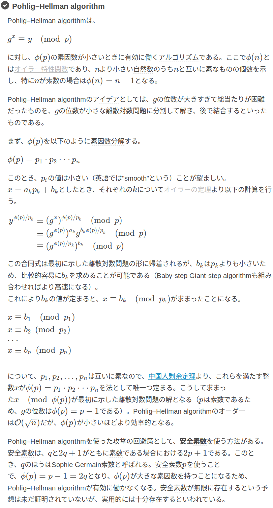
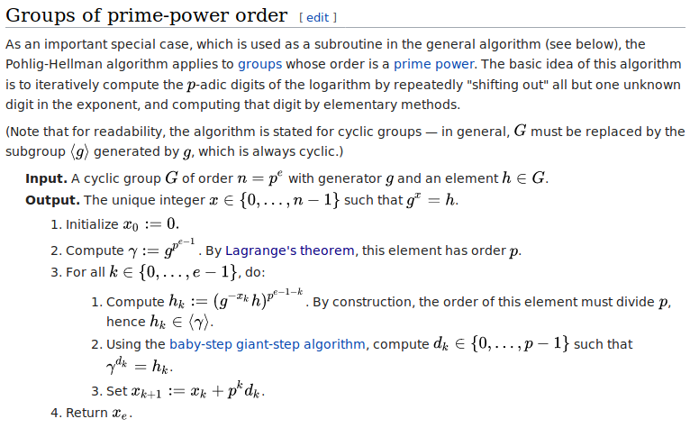

# ångstrom CTF 2019 Paint WriteUp
### 問題
```
This amazing new paint protocol lets artists share secret paintings with each other! Good thing U.S. Patent 4200770 is expired.
```

- paint.py

```python
import binascii
import random

from secret import flag

image = int(binascii.hexlify(flag), 16)

palette = 1 << 2048
base = random.randint(0, palette) | 1
secret = random.randint(0, palette)
my_mix = pow(base, secret, palette)

print('palette: {}'.format(palette))
print('base: {}'.format(base))
print('my mix: {}'.format(my_mix))

your_mix = int(input('your mix: '))

shared_mix = pow(your_mix, secret, palette)
painting = image ^ shared_mix
print('painting: {}'.format(painting))
```

- paint.txt

```text
palette: 32317006071311007300714876688669951960444102669715484032130345427524655138867890893197201411522913463688717960921898019494119559150490921095088152386448283120630877367300996091750197750389652106796057638384067568276792218642619756161838094338476170470581645852036305042887575891541065808607552399123930385521914333389668342420684974786564569494856176035326322058077805659331026192708460314150258592864177116725943603718461857357598351152301645904403697613233287231227125684710820209725157101726931323469678542580656697935045997268352998638215525166389437335543602135433229604645318478604952148193555853611059596230656
base: 13489305024865487703110255658234329747698118206959778644688156332043783846078839120693894255527894489531905012244713117142764166452312133019772171674466933769775907460046497284522592167536594047800489828714315435570429416637425443402332599055774982796405757075108551322778712959943658831605397635195107786224617525627358659165255604556424206194207190437525742567525338826878962081515333896433312311548844614323540250054093970082337500580573165008440265840792908334486258260848163001490152587781983042546491301026074736907693887630347258892882871059741621049169714319440564952700454580681894452760215968494428411686329
my mix: 6870295205307030503255600311283969014496436297715066273709495591567561187646528069669895230912327862244474990612611625088862250315706633708998214109152824455738719595737772769297517386968692628228327225922261219083693899105983726637012353264168761696183327692619506267951701511870035935612090359086376808592001973358166067468618577312983514388332736591060901174314042634365304017788649960016991442596975922402288221898367955532116456798868804571091463566329706023967280838744359633963847966790121312196824818606244189274966061324393424041211903396020720341163472399763951106703068172772579049891895580785347369093113
your mix: 14317253516668543276504878316838097235650210449758621543536146016892160048656997634541093315774403078357942150970695487937570449270120625898199254439189104072891595263513437420116930684308702803055295267600790477195902538538739117809573391251939794413361184343367694928615752045687223262368136262534778688889202144260002584306527206705616186699377315031757095455954292951059462279988296369935635246644221722025457496936215039008069820514166063271894671978845634968761626636993374291118230179892722513818307254406450607168911057458141649111515924404215975886422961651958216688209696158879621701708955382424640000048217
painting: 17665922529512695488143524113273224470194093921285273353477875204196603230641896039854934719468650093602325707751566466034447988065494130102242572713515917910688574332104680867377750329904425039785453961697828887505197701127086732126907914324992806733394244034438537271953062873710421922341053639880387051921552573241651939698279628619278357238684137922164483956735128373164911380749908774512869223017256152942356111845682044048514917460601214157119487675633689081081818805777951203838578632029105960085810547586385599419736400861419214277678792284994133722491622512615732083564207280344459191773058670866354126043620
```

### 解法
- 与えられたpaint.pyを読み解くと、 `my_mix = (base ** secret) mod palette` を満たすような `secret` を求める。ただし、my_mix, base, palette は与えられている。

- これは、離散対数問題なので、それを突破するような手法を検索してみると、 `Pohlig–Hellman algorithm` というアルゴリズムがある。

<br>



- この資料によると、今回のケースでは、paletteをオイラーの特性関数に代入したした結果、返ってくる値の素因数が小さい時に有効なアルゴリズムである。

- paletteは2 ** 2048なので、オイラーの特性関数に代入した値は2 ** 2047である(理由は後述を参照)ので、素因数は2のみであるから、このPohlig–Hellman algorithmを適用できる。

- 実装するための疑似コードは以下の資料に記載されている。



- あとは、実装するのみである。これを実装したのがsolve.pyである。後述の補足にOutputの2でラグランジュの定理を利用することを記載しておく。

- `b'actf{powers_of_two_are_not_two_powerful}'`

- うちのチームのメンバーが誰も解けていなかったので、解いてみたが、めちゃくちゃ時間溶かした ...

### 補足
#### paletteをオイラーの特性関数に代入した結果、返ってくる値に関して

- まず、オイラーの特性関数を実装し、2の累乗に関して考察してみる。

```python
from math import gcd 

def euler(n): 
    if n == 1:
        return 1 
    cnt = 0 
    for i in range(1, n): 
        if gcd(n, i) == 1: 
            cnt += 1 
    return cnt

for i in range(15):
    print(i, 2 ** i, euler(2 ** i))
```

- output

```text
0 1 1
1 2 1
2 4 2
3 8 4
4 16 8
5 32 16
6 64 32
7 128 64
8 256 128
9 512 256
10 1024 512
11 2048 1024
12 4096 2048
13 8192 4096
14 16384 8192
```

- この結果から、2 ** 2048をオイラーの特性関数に代入した結果、返ってくる値はおそらく2 ** 2047である。

#### By Lagrange's theorem, this element has order p about Output 2.
- そもそもラグランジュの定理 (群論)とは、有限群Gの任意の元の位数は群Gの位数を割り切るという定理のことである。

- my_mix = (base ** secret) mod 2 ** 2048 を今扱っていて、secretのみ未知で、secretを求めたい。

- 有限群Gの任意の元の位数とは、(base ** n) = 1 mod 2 ** 2048 を満たすようなnのことである。

- したがって、このnは群Gの位数(ここでは2 ** 2048)を割り切るので、n = 2 ** i (0 <= i <= 2048)で(base ** n) = 1 mod 2 ** 2048を満たすようなnを全探索するとbaseの位数がわかる。。

### 参考
- [CTFにおける離散対数問題に対するアプローチ](http://sonickun.hatenablog.com/entry/2016/11/20/192743)

- [オイラーのφ関数](https://ja.wikipedia.org/wiki/%E3%82%AA%E3%82%A4%E3%83%A9%E3%83%BC%E3%81%AE%CF%86%E9%96%A2%E6%95%B0)

- [オイラーの定理 (数論)](https://ja.wikipedia.org/wiki/%E3%82%AA%E3%82%A4%E3%83%A9%E3%83%BC%E3%81%AE%E5%AE%9A%E7%90%86_(%E6%95%B0%E8%AB%96))

- [Pohlig–Hellman algorithm](https://en.wikipedia.org/wiki/Pohlig%E2%80%93Hellman_algorithm)

- [VBA/VB6で動く多倍長整数計算ライブラリで色々シリーズ（９）Pohlig-HellmanアルゴリズムAdd Star](http://d.hatena.ne.jp/iris2304/20150911/1441899230)

- [ラグランジュの定理 (群論)](https://ja.wikipedia.org/wiki/%E3%83%A9%E3%82%B0%E3%83%A9%E3%83%B3%E3%82%B8%E3%83%A5%E3%81%AE%E5%AE%9A%E7%90%86_(%E7%BE%A4%E8%AB%96))

- [Paint - 100 points - 74 solves](https://github.com/wborgeaud/ctf-writeups/blob/master/angstromctf2019/Paint.md)

- [ångstromCTF 2019 Writeup](https://qiita.com/taiyaki8926/items/3e0768893ba87278d889)
