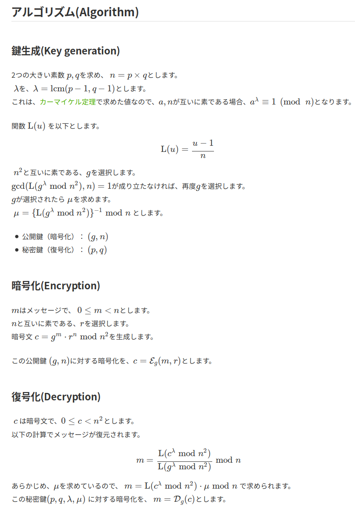

# 
### 問題
```
The year is 20XX. ångstromCTF only has pwn challenges, and the winner is solely determined by who can establish a socket connection first.
In the data remnants of an ancient hard disk, we've recovered a string of letters and digits.
The only clue is the etching on the disk's surface: Paillier.
```

- runes.txt

```
n: 99157116611790833573985267443453374677300242114595736901854871276546481648883
g: 99157116611790833573985267443453374677300242114595736901854871276546481648884
c: 2433283484328067719826123652791700922735828879195114568755579061061723786565164234075183183699826399799223318790711772573290060335232568738641793425546869
```

### 解説
- 問題分を読むと、 `Paillier` と言うヒントっぽいものが見つかる。これを検索してみると `Paillier暗号` が見つかる。以下にそのアルゴリズムに関する情報を添付しておく。

<br>



- これと与えられた３パラメータを元に平文を求める。

- しないといけないことは大きく２つあって、nを素因数分解することと、このアルゴリズムの復号化を実装することである。

- nの素因数分解は後述の`primefac fork`を用いて以下のコマンドを叩けばOK.

```bash
cry-Runes$ python -m primefac 99157116611790833573985267443453374677300242114595736901854871276546481648883
99157116611790833573985267443453374677300242114595736901854871276546481648883: 310013024566643256138761337388255591613 319848228152346890121384041219876391791 
```

- 復号化はsolve.pyに記載した。`Crypto.Util package` を用いれば、逆元も簡単に求められる。

### 補足
- 冪乗の余りの計算に関して。

```python
print((g ** lam) % (n ** 2)) # ダメな計算方法(遅い)
print(pow(g, lam, n ** 2)) # 速い方法
```

### 参考
- [Paillier暗号(Paillier cryptosystem)](https://qiita.com/tnakagawa/items/b1e55e66ae017b0c9d78)

- [primefac fork](https://github.com/elliptic-shiho/primefac-fork)

- [素因数分解用Pythonモジュールprimefacの使い方](https://osanamity.net/2018/11/21/185111)

- [Crypto.Util package](https://pycryptodome.readthedocs.io/en/latest/src/util/util.html)
