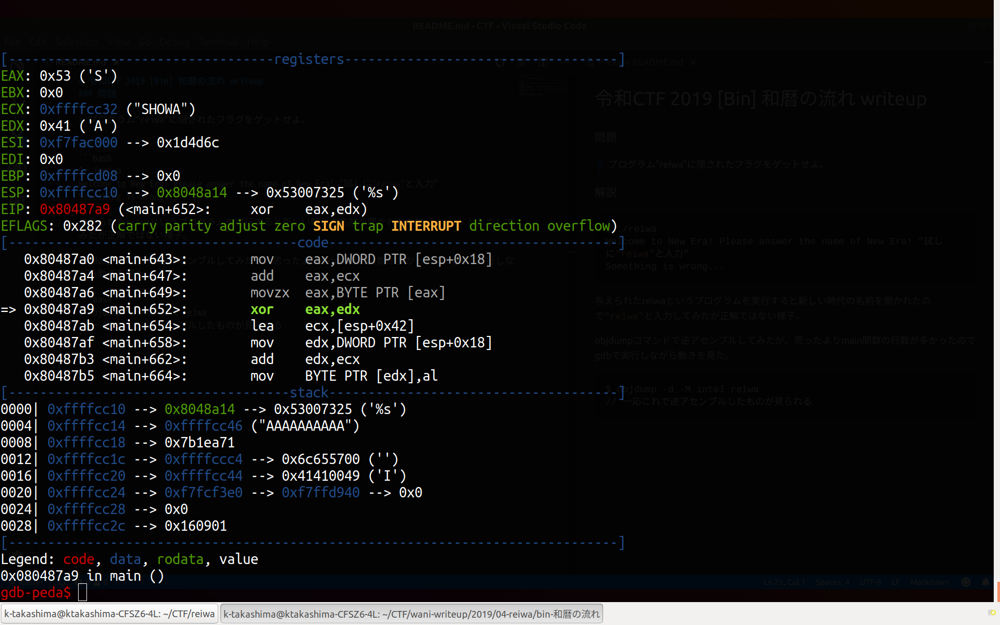

# 令和CTF 2019 [Bin] 和暦の流れ writeup
### 問題

> プログラム"reiwa"に隠されたフラグをゲットせよ。

### 解説
```bash
$ ./reiwa 
Welcome to New Era! Please answer the name of New Era! ”試しに"reiwa"と入力”
Something is wrong...
```
与えられたreiwaというプログラムを実行すると新しい時代の名前を聞かれたので`"reiwa"`と入力してみたが正解ではない様子。

objdumpコマンドで逆アセンブルしてみたが、思ったよりmain関数の行数が多かったのでgdbで実行しながら動きを見た。

```bash
$ objdump -d -M intel reiwa
// 一応これで逆アセンブルしたものが見られる
```

入力された文字列が`"SHOWA"`と１文字ずつxorされている。

その結果がある値と一致しているかどうかをチェックしていた。

入力に"AAAAAAAAA"と入れたときの例



下の表を満たす文字を入力すればOK

|INPUT  |"SHOWA"  |INPUT xor SHOWA  |
|:-----:|:-------:|:---------------:|
|?      |S (0x53) |0x1              |
|?      |H (0x48) |0x9              |
|?      |O (0x4f) |0x16             |
|?      |W (0x57) |0x0              |
|?      |A (0x41) |0x0              |

`RAYWA`と入力すれば次の質問が与えられる。

> Welcome to New Era! Please answer the name of Old Era!

ここは勘で`HEYSAY`と打ってみるとFLAGをゲットできた。先ほどと同じように今度は`"HEISEI`とxorをしていた。

```bash
$ ./reiwa 
Welcome to New Era! Please answer the name of New Era! RAYWA
Welcome to New Era! Please answer the name of Old Era! HEYSAY
SECCON{M-T-S-H-R}
```

```
// main関数内の入力文字列を処理する部分
   0x08048780 <+611>:	call   0x8048410 <__isoc99_scanf@plt> //最初の入力
   0x08048785 <+616>:	mov    DWORD PTR [esp+0x18],0x0
   0x0804878d <+624>:	jmp    0x80487df <main+706>
=> 0x0804878f <+626>:	lea    edx,[esp+0x36]
   0x08048793 <+630>:	mov    eax,DWORD PTR [esp+0x18]
   0x08048797 <+634>:	add    eax,edx
   0x08048799 <+636>:	movzx  edx,BYTE PTR [eax]
   0x0804879c <+639>:	lea    ecx,[esp+0x22]
   0x080487a0 <+643>:	mov    eax,DWORD PTR [esp+0x18]
   0x080487a4 <+647>:	add    eax,ecx
   0x080487a6 <+649>:	movzx  eax,BYTE PTR [eax]
   0x080487a9 <+652>:	xor    eax,edx // XORを行っている
   0x080487ab <+654>:	lea    ecx,[esp+0x42]
   0x080487af <+658>:	mov    edx,DWORD PTR [esp+0x18]
   0x080487b3 <+662>:	add    edx,ecx
   0x080487b5 <+664>:	mov    BYTE PTR [edx],al
   0x080487b7 <+666>:	lea    edx,[esp+0x1c]
   0x080487bb <+670>:	mov    eax,DWORD PTR [esp+0x18]
   0x080487bf <+674>:	add    eax,edx
   0x080487c1 <+676>:	movzx  edx,BYTE PTR [eax]
   0x080487c4 <+679>:	lea    ecx,[esp+0x42]
   0x080487c8 <+683>:	mov    eax,DWORD PTR [esp+0x18]
   0x080487cc <+687>:	add    eax,ecx
   0x080487ce <+689>:	movzx  eax,BYTE PTR [eax]
   0x080487d1 <+692>:	cmp    dl,al // 値の比較
   0x080487d3 <+694>:	je     0x80487da <main+701> // 一致していれば次の文字へ
   0x080487d5 <+696>:	call   0x8048955 <something_is_wrong>
   0x080487da <+701>:	add    DWORD PTR [esp+0x18],0x1
   0x080487df <+706>:	cmp    DWORD PTR [esp+0x18],0x4
   0x080487e4 <+711>:	jle    0x804878f <main+626>

```

### おまけ

FLAGを表示するプログラムの部分に直接飛んでしまえばいいのでは？と思ってgdbの機能を使ってやってみた。

```
set $eip=0x8048872
```

これはうまく行かなかった。入力文字列のチェックを行うプログラムをしっかり通っていないと行けないようだった。
どの命令がその役割を果たしているのかまだわかっていないので調べる。

