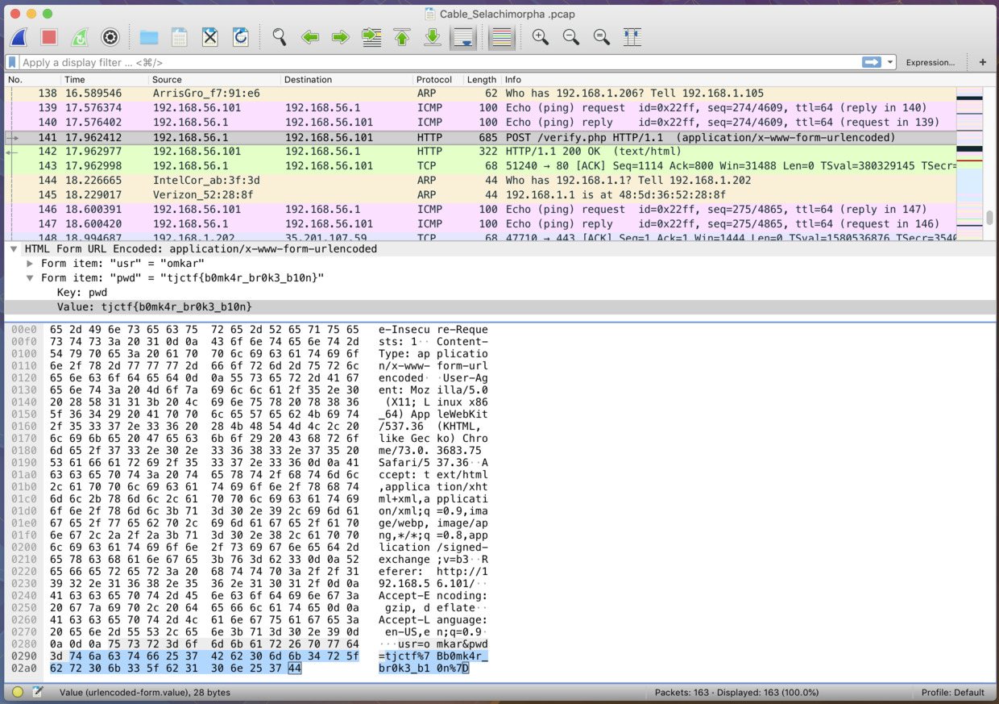

# TJCTF 2019 "Cable Selachimorpha" writeup

## check problem

I get one pcap file.

## solve problem

When I check pcap file by wireshark, I find a communication that include user name and password.

I decode "tjctf%7Bb0mk4r_br0k3_b10n%7D" by URL encoding, I get flag "tjctf{b0mk4r_br0k3_b10n}".

<https://gchq.github.io/CyberChef/#recipe=URL_Decode()&input=dGpjdGYlN0JiMG1rNHJfYnIwazNfYjEwbiU3RA>
