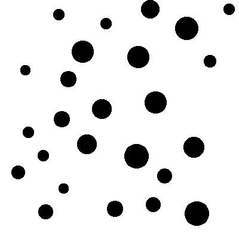

# TJCTF 2019 "Sight at Last" writeup

## Description

`nc p1.tjctf.org 8005`


## Solution

ncすると次のように言われる。
>To get the flag, solve a hundred captchas in 500 seconds!
Find the minimum distance between the centers of two circles to continue:

この文章に続いてBase64らしきデータが与えられる。decode するとこのような画像ファイルであることが分かる。上の文章の指す circles はこの画像のものであることが分かる。



どの画像にも円が25個あり、中心同士の距離を 25*24/2 = 300 通り求め、その最小値を返せば良い。
円の中心の検出には[opencv-python](https://github.com/skvark/opencv-python)を用いた。cv2.HoughCirclesの引数に「検出する円と円の最小距離」を指定する箇所があったので、これを利用して中心間の最小距離を求めた。
具体的には、最小距離を指定する引数に、十分大きい（ただし大きすぎると、時間制限に間に合わない）初期値を設定して、少しずつ小さくしていく。初めは検出される円の個数は画像内の円の個数より少ない。しかしある値を境に、検出される円の個数が25個になる瞬間がある。その時、引数に指定していた距離は求めたい最小距離に等しい。
円が綺麗に検出できれば単純だが、中心からズレていることが多かったので、各種パラメータの調整にほとんどの時間を費やした。

```Python

from pwn import *
from base64 import b64decode
import cv2
import numpy as np
import matplotlib.pyplot as plt
from PIL import Image

io = remote('p1.tjctf.org', '8005')

circles = None
gray = None
img = None
for _ in range(100):
    print('[+] {}'.format(_))
    response = io.recvline().decode()
    print('[+]', response)
    if response[4:].startswith('Wrong'):
        if circles is not None:
            for x, y, radius in circles:
                print('center: ({}, {}), radius: {}'.format(x, y, radius))
                cv2.circle(img, (x, y), radius, (0, 255, 0), 1)
                cv2.circle(img, (x, y), 2, (0, 0, 255), 1)

            plt.imshow(cv2.cvtColor(img, cv2.COLOR_BGR2RGB))
            plt.axis('off')
            plt.show()

    io.recvline()
    if _ >= 1:
        io.recvline()
    with open('./img/polkadot{}.jpg'.format(_), 'wb') as f:
        s = io.recvline().decode().replace('\n', '').replace('Find the minimum distance between the centers of two circles to continue:','').encode()
        f.write(b64decode(s))


    img = cv2.imread('./img/polkadot{}.jpg'.format(_))
    gray = cv2.inRange(img, (100,100,100), (255, 255, 255))
    gray = cv2.GaussianBlur(gray, (11, 11), 0)


    for dist in range(2000,10, -1):
        circles = cv2.HoughCircles(gray, cv2.HOUGH_GRADIENT, 1, dist/10.0, param1=50, param2=20, minRadius=5, maxRadius=40)
        circles = np.squeeze(circles, axis=0)
        if len(circles) >= 25:
            ans = str(dist/10.0)
            print(ans)
            io.sendline(ans)
            break

        prev = dist


io.interactive()

```

500秒以内に100問答えればFlagが手に入る。
`tjctf{i5_th1s_c0mput3r_v1si0n?}`
