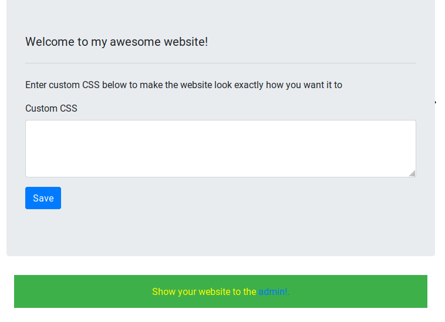

# TJCTF 2019 "Moar Horse 3"

### 問題文
```text
I copped this really cool website(https://moar_horse_3.tjctf.org/) from online and made it customizable so you can flex your CSS skills on everyone, especially the admin.

Note: When you get the flag, wrap it in tjctf{} before submitting
```

### 解説
- 問題文のurlにアクセスしてみると、以下のようなページに飛ぶ。



- 問題文を読んでみると、CSS Injectionを仕込むような問題と推測できる。

- とりあえずこのフォームにHelloという文字列を入れて保存してみると、このhtmlが以下のように変更されている。

```html
<div class="row justify-content-center">
    <div class="col-8">
        <div class="jumbotron">
            <h1 class="lead flag" value="You're not an admin! If you were, this would be the flag.">Welcome to my awesome website!</h1>
            <hr class="my-4">
            <p>Enter custom CSS below to make the website look exactly how you want it to</p>
            <form method="POST">
                <div class="form-group">
                    <label for="custom_css_ta">Custom CSS</label>
                    <textarea class="form-control" name="custom_styles" id="custom_css_ta"
                        rows="3">Hello</textarea>
                </div>
                <button type="submit" class="btn btn-primary" id="save_css">Save</button>
            </form>
        </div>
    </div>
</div>
```

- このフォームに値を入れた値がhtml保存されるような仕様になっているようだ。

- ここで上記のソースをよく見てみると`value="You're not an admin! If you were, this would be the flag."`と書かれているので、ここに対してCSS Injectionを仕込めば良いとわかるので、仕込む。

- また、あなたはadminではないと言っているので、adminのような挙動をしそうな以下のリンク(Show your website to the admin!.)をクリックすると、エンドポイントに対してリクエエストが飛んでくる。


### 参考
- solver.py

- [CSS Injection ++ - 既存手法の概観と対策](https://speakerdeck.com/lmt_swallow/css-injection-plus-plus-ji-cun-shou-fa-falsegai-guan-todui-ce)
