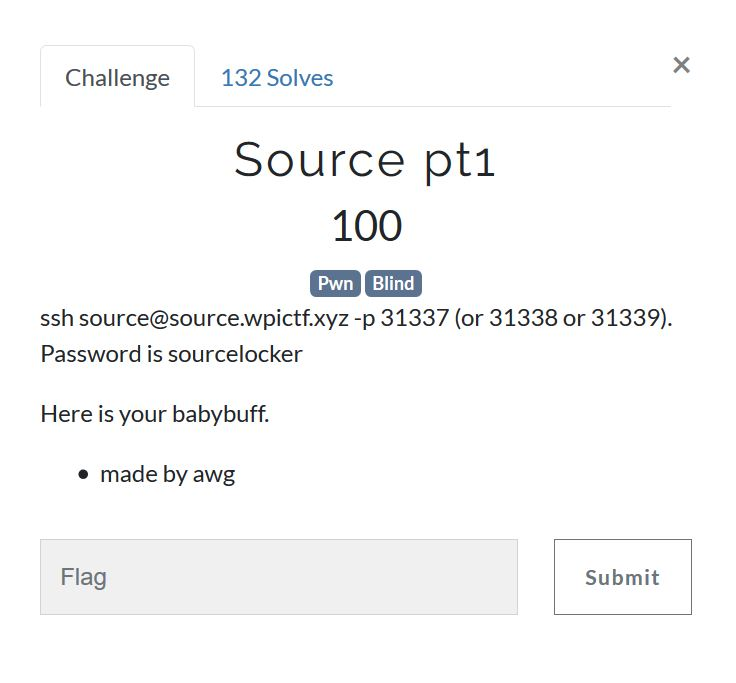
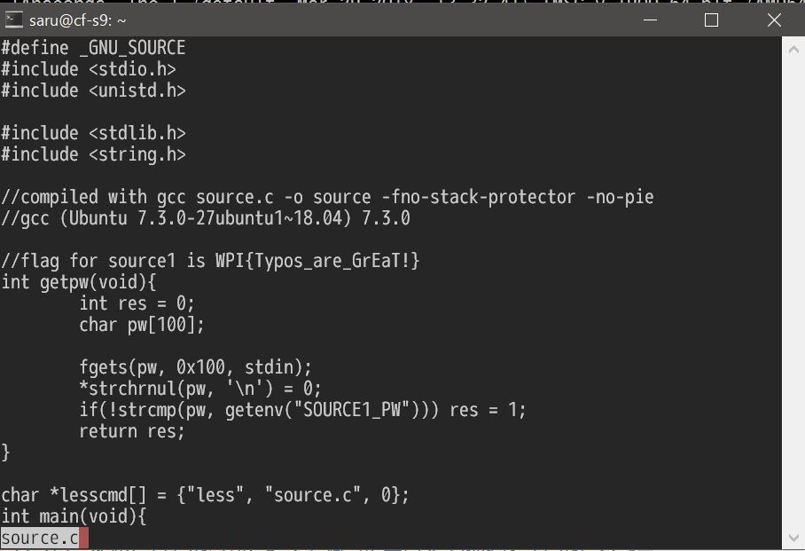

# WPICTF 2019 `Source pt1 [Pwn 100]` writeup

## 問題





## 解答

とりあえずsshでつないでみるとパスワードを聞かれるので適当に入力してみる。

```bash-statement
$ ssh source@source.wpictf.xyz -p 31339
source@source.wpictf.xyz's password:
Enter the password to get access to https://www.imdb.com/title/tt0945513/
AAAA
Pasword auth failed
exiting
Connection to source.wpictf.xyz closed.
$
```

「
https://www.imdb.com/title/tt0945513/
」にアクセスすると映画が。
これ関係あるのかなと思ってキーワードをいろいろ入れてみるけどだめ。

バッファオーバフローを起こしてみるかと考えて適当に長い文字列を送ってみたらソースコード表示。
そしてその中にフラグが。
意味も分からないうちに解けてしまった。
入力した文字列は`"A" * 117`。




ソースコードを精査してみるとたぶんstrcmpでパスワードが一致しないと`res`が1に書き換わらないところにバッファオーバフローで書き換えてしまうことによってgetpwが`!0`で返って`less`起動するようだ。

```C
#define _GNU_SOURCE
#include <stdio.h>
#include <unistd.h>

#include <stdlib.h>
#include <string.h>

//compiled with gcc source.c -o source -fno-stack-protector -no-pie
//gcc (Ubuntu 7.3.0-27ubuntu1~18.04) 7.3.0

//flag for source1 is WPI{Typos_are_GrEaT!}
int getpw(void){
        int res = 0;
        char pw[100];

        fgets(pw, 0x100, stdin);
        *strchrnul(pw, '\n') = 0;
        if(!strcmp(pw, getenv("SOURCE1_PW"))) res = 1;
        return res;
}

char *lesscmd[] = {"less", "source.c", 0};
int main(void){
        setenv("LESSSECURE", "1", 1);
        printf("Enter the password to get access to https://www.imdb.com/title/tt0945513/\n");
        if(!getpw()){
                printf("Pasword auth failed\nexiting\n");
                return 1;
        }

        execvp(lesscmd[0], lesscmd);
        return 0;
}
```

## 参考
