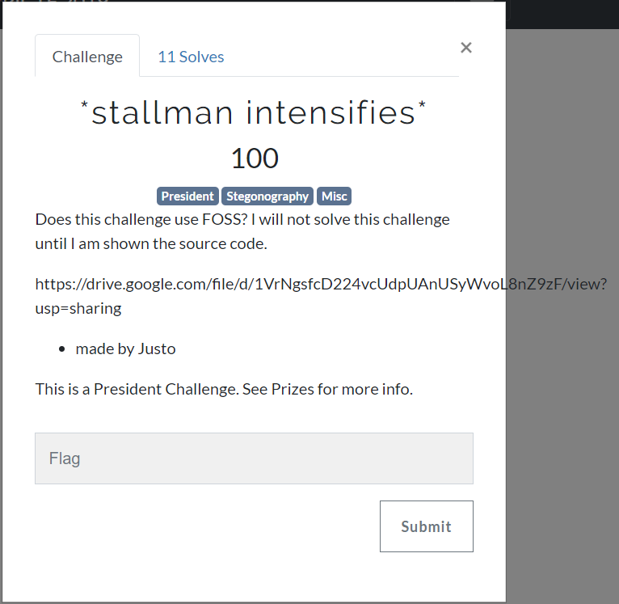
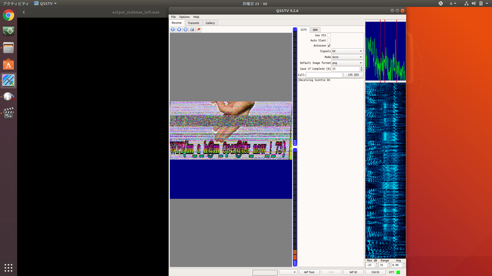

# WPICTF 2019 `*stallman intensifies* [stg 100]` writeup

## 問題

## 解答
リンク[[1.]](https://drive.google.com/file/d/1VrNgsfcD224vcUdpUAnUSyWvoL8nZ9zF/view?usp=sharing)[[2.]](https://www.dropbox.com/s/xhab7zms5n35867/stallman-intensifies.zip?dl=0)からダウンロードできるzipファイルを解凍すると，中身は5枚のJPEG画像とpass付の7zファイル．

7zファイルが解凍できればflag GETだろうと予想して，5枚のJPEG画像を調べる．

[青空白猫](https://digitaltravesia.jp/usamimihurricane/webhelp/_RESOURCE/MenuItem/another/anotherAoZoraSiroNeko.html)でJPEG画像を調べると，うち2枚の画像にsteghideの可能性があるらしい．

教えに従って`exiftool`，`file`，`exiftool`，`steghide`，`strings`コマンドを一通り試していく．

`babby.jpg`

上の画像の一番最後に`WPI+GNUCSC`といういかにもな文字列が出力されていて，これが7zファイルのパスワードだった．

解凍するとmp4ファイルが出てくるので，とりあえず視聴するもよくわからない．

*終わりじゃなかった......困った......*

改めてちゃんと聞こうと思ってヘッドホンをつけると音がほとんど右側からしか聞こえず，左からは「ｶﾞﾋﾟｶﾞﾋﾟｶﾞﾋﾟｰ」とノイズのようなものが聞こえる．おかしい．とてもおかしい．

......が，音声のSteganography問題をやったことがなかったためこの違和感はいつのまにか忘れて(というか対処できずに)，フレームの切り出しなどに終始してお手上げタイムアップ．

(緑一色のフレームなどそれっぽいものもあってなかなか諦めきれなかった．かなり緑だった．)

次の日，"**sstv signal**"なるものが使われていたというチャットを公式discordで見かける．
調べてみると，sstvという狭帯域での画像送信方法らしく，過去のCTF問題にもいくつかあったっぽい．

それらのWriteupを眺めると，[Qsstv](https://charlesreid1.com/wiki/Qsstv)というツールを使えばsstv signalの画像化ができるらしいので，
[Audacity](https://www.audacityteam.org/)で左側の音声を分離してからQsstvを通してみる．

ｶﾞﾋﾟｶﾞﾋﾟｶﾞﾋﾟｰと画像が生成されていく様子は音も相まって個人的になかなか怖かったが，ノイズが一番ひどくなったタイミングでflag画像が無事出力された．

flag画像

WPI{im_a_h@m_0per@10r_now_!_73} (たぶん？)

## 反省
1つの方針にとらわれて時間が無くなってしまった．
結局は最初に感じた違和感が一番解答に近いものだったので，感覚はやっぱり大事(サブカテゴリはMiscだったし).
今回見つけたQsstvは今後も役立ちそう．右耳の音声を使ってsstv signalだけをきれいに抽出する必要があるかとも思ったけどそのままいけたので，結構気楽に使えそうな印象だった．

## tool
+ [汎用ファイルアナライザ "青い空を見上げればいつもそこに白い猫](https://digitaltravesia.jp/usamimihurricane/webhelp/_RESOURCE/MenuItem/another/anotherAoZoraSiroNeko.html)
+ [Qsstv](https://charlesreid1.com/wiki/Qsstv)
+ [Audacity](https://www.audacityteam.org/)
