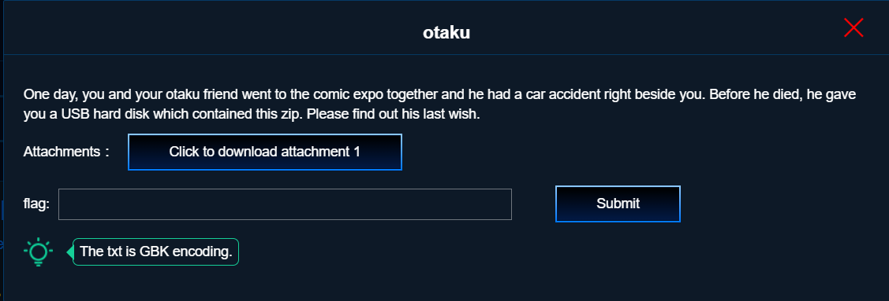

# *CTF 2019 `otaku [Misc]` writeup

## 問題


## 解答
[https://adworld.xctf.org.cn/media/uploads/task/82598457d27f4149a96e2cc38f49c873.zip](https://adworld.xctf.org.cn/media/uploads/task/82598457d27f4149a96e2cc38f49c873.zip)からzipファイルがダウンロードできる．

```
$ binwalk 82598457d27f4149a96e2cc38f49c873.zip

DECIMAL       HEXADECIMAL     DESCRIPTION
--------------------------------------------------------------------------------
0             0x0             Zip archive data, at least v2.0 to extract, compressed size: 3584630, uncompressed size: 3584144, name: flag.zip
3584668       0x36B29C        Zip archive data, at least v2.0 to extract, compressed size: 11573, uncompressed size: 14392, name: Anime_Intro.doc
3596473       0x36E0B9        End of Zip archive
```

中身は`flag.zip`と`Anime_Intro.doc`の2つで，
`Anime_Intro.doc`の方はパスワードがかかっていないので，`unzip`で解凍できる．

### 第1話「~~愛してる~~」と自動手記人形

Anime_Intro.docから確認していく．
内容はヴァイオレット・エヴァーガーデンの話で，
まるごと検索すると第1話のあらすじらしい．
ギルベルト少佐の名前に訂正線が引いてあり，"I-the-almighty-quiz-maker"に書き換えられている．
自分のことをギルベルト少佐だと勘違いしたオタク，またの名をI-the-almighty-quiz-maker．この問題は彼の遺言探しから始まる．

本来"I love you"が入っているはずの空白部分が彼のlast wishであり，`flag.zip`のパスになるのだろうと思って調べると，普通に白文字で"I love you"とそのまま書いてあった．
目をつけるところは間違っていないはずなので少し考えると，少佐がオタクの二つ名に書き換えられていることから，同様に"I love you"の後ろにもオタクが書き換えた文章が本来はあるはずだと思い至った．

以前PowerPointの問題か何かで聞いたことがあったメタデータの見方を思い出したので，wordも同じだろうと考える．
変更履歴を見るため拡張子を変えて`Anime_Intro.zip`にして解凍し，`Anime_Intro/word/document.xml`からAnime_Intro.docのメタデータを確認する．
「"I love you」に続いて文章があるようなので，位置的にも正しい．
もっと楽な方法があるのかもしれないが手作業でタグを消すと，以下の文章が現れる．

**(注) 以下の文章はヴァイオレット・エヴァーガーデンのネタバレを含みます．**
僕みたいに「原作は読んでないけどアニメは見たよ」「2020年の新作映画も楽しみだね」って人は，文章の内容自体は問題にほとんど関係ないので読み飛ばしてください．ネタバレはどちらかといえば調べてた途中に読んだwikipediaのせいですが，怒る人もいるからよくないですね．

<details><summary>I-the-almighty-quiz-makerの遺言</summary><div>

```
Hello everyone, I am Gilbert.
Everyone thought that I was killed, but actually I survived.
Now that I have no cash with me and I’m trapped in another country.
I can't contact Violet now.
She must be desperate to see me and I don't want her to cry for me.
I need to pay 300 for the train, and 88 for the meal.
Cash or battlenet point are both accepted.
I don't play the Hearthstone, and I don't even know what is Rastakhan's Rumble.
```
</div></details>

### オタクが残した「Hearthstone」の意味を知るために．

突然のHearthstoneの圧倒的違和感のために，しばらく[Rastakhan's Rumble wiki](https://hearthstone.gamepedia.com/Rastakhan%27s_Rumble)を眺めて時間を溶かすことになる．
カードの設定を読んでみたり，必要だという電車賃や食費で買えるカードパックとかを探したりなどしていた．
ちなみに，`unzip 82598457d27f4149a96e2cc38f49c873.zip`をパスワード`Hearthstone`で解凍すると，`flag.zip`が取り出せるが，破損しているといわれる．

`7z x -tzip 82598457d27f4149a96e2cc38f49c873.zip`というように解凍すると，パスワードも必要なく，正常な`flag.zip`がとりだせた．(もはやHearthstoneとはなんだったのか)

binwalkで調べると，手に入ったflag.zipの中身は`flag.png`と`last word.txt`らしい．
外側のパスワードが一応`Hearthstone`だったので，内側は`Rastakhan's Rumble`あたりを使えるのかと思ったが違う．
チームメンバーから「last wordがヒントになるのでは」というコメントをもらって，last wordsといえば明らかにメタデータから抜いてきた文章だろうと目星がついたので，[pkcrack](http://kaworu.jpn.org/kaworu/2012-12-07-1.php#2012-12-07-1-14b7d76f2abce310837a677aad65c1ad)を利用して既知平文攻撃をすることにした．


### 自動既知平文攻撃人形
上の遺言の改行をなくして`last word.txt`を作ると，flag.zip内の`last word.txt`のファイルサイズと一致したので，確実に合っていると思いそのまま実行する．

`pkcrack -C flag.zip -c last\ words.txt -p last\ words.txt -d output.zip`

が，うまくクラックできない．

方針としてはかなり確信があったので何か足りない部分はないかと考えていると，問題文の下にtips的なものが書いてあったのを思い出した．

**The text is GBK encoding.**

つまりUTF-8のままでは別のファイルになっているからダメだったということらしいので，手元のlast words.txtの文字コードをGBKに変換する．
今度こそいけるだろうと再度pkcrackを実行するも，まだ成功しない．

ファイルサイズとエンコードも合わせているので，textファイル自体は合っているはずである．
そこで，pkcrack自体の処理方法に原因があるのかもしれないと考えた．
そもそもpkcrackがどういう動作をしているのかよくわかってなかったので少し調べてみると，-p オプションで渡したファイルを圧縮してからクラッキングが行われているらしい．
つまり「pkcrackは渡したtextファイルを自動で圧縮処理している」ということになる．
どういう形式で圧縮しているのかは分からないが，
「そういえば最初普通にunzipしただけだとflag.zipが壊れてたなぁ」と気になったので，
手元でいつもの通りlast words.txtを圧縮してから`zipinfo`でzipファイルを確認していく．

```
ishioka@/mnt/c/Users/ishioka/Desktop/workspace/CTF/2019_04_xctf/Misc/otaku
$ zip last\ words.zip last\ words.txt
  adding: last words.txt (deflated 37%)
ishioka@/mnt/c/Users/ishioka/Desktop/workspace/CTF/2019_04_xctf/Misc/otaku
$ zipinfo last\ words.zip
Archive:  last words.zip
Zip file size: 451 bytes, number of entries: 1
-rwxrwxrwx  3.0 unx      432 tx defN 19-Feb-27 00:28 last words.txt
1 file, 432 bytes uncompressed, 273 bytes compressed:  36.8%
ishioka@/mnt/c/Users/ishioka/Desktop/workspace/CTF/2019_04_xctf/Misc/otaku
$ zipinfo flag.zip
Archive:  flag.zip
Zip file size: 3584144 bytes, number of entries: 2
-rw-a--     3.1 fat  3583101 BX defN 19-Feb-26 16:22 flag.png
-rw-a--     3.1 fat      432 BX defN 19-Feb-26 23:28 last words.txt
2 files, 3583533 bytes uncompressed, 3583717 bytes compressed:  0.0%
```

よくわからんけどなんか別のっぽい...

少し調べてみても，調べ方が悪いのかそもそも記事がないのか，あまりヒットしない．
ここで思い出したのが壊れてないflag.zipをunzipした時の文字化け出力．

```
$ unzip flag.zip
Archive:  flag.zip
ѹ�������winrar�汾 5.70 beta 2
���ã�zipѹ���ļ�����ѹ���ʣ�
ѹ��ʽ����׼
[flag.zip] flag.png password:
```

WinRARなるものを使って圧縮してそうなので，[WinRAR](https://www.winrarjapan.com/download)をダウンロード．
それを使ってzipに圧縮してみる．
書庫形式を"ZIP"にして，圧縮方式はひとまず"標準"にしておく．
これをzipinfoで確認すると，

```
$ zipinfo last\ words.zip
Archive:  last words.zip
Zip file size: 434 bytes, number of entries: 1
-rw-a--     3.1 fat      432 bx defN 19-Feb-27 00:28 last words.txt
1 file, 432 bytes uncompressed, 272 bytes compressed:  37.0%
```

よくわからんけどなんか揃ったっぽい！

形式を合わせたzipファイルを-Pオプションで追加して，再度pkcrackに挑戦する．

```
$ pkcrack -C flag.zip -c last\ words.txt -p last\ words.txt -P last\ words.zip -d output.zip
Files read. Starting stage 1 on Sun Apr 28 19:04:47 2019
Generating 1st generation of possible key2_283 values...done.
Found 4194304 possible key2-values.
Now we're trying to reduce these...
Done. Left with 29381 possible Values. bestOffset is 24.
Stage 1 completed. Starting stage 2 on Sun Apr 28 19:04:52 2019
Ta-daaaaa! key0=106d3a93, key1=6c0cc013, key2=338e8d6f
Probabilistic test succeeded for 264 bytes.
Ta-daaaaa! key0=106d3a93, key1=6c0cc013, key2=338e8d6f
Probabilistic test succeeded for 264 bytes.
Ta-daaaaa! key0=106d3a93, key1=6c0cc013, key2=338e8d6f
Probabilistic test succeeded for 264 bytes.
Ta-daaaaa! key0=106d3a93, key1=6c0cc013, key2=338e8d6f
Probabilistic test succeeded for 264 bytes.
Stage 2 completed. Starting zipdecrypt on Sun Apr 28 19:15:15 2019
Decrypting flag.png (08d85bc0059d9b317475d782)... OK!
Decrypting last words.txt (bece79e363558e91e0a590bb)... OK!
Finished on Sun Apr 28 19:15:15 2019
```

いけた．ついに終わった．

あとは`flag.png`に書いてあるflagを確認して，


`.........ヴァイオレットちゃんはかわいいなぁ......ふぅ.........`

ひとまず手元で簡単にできるsteganographyのチェックをひと通り終え，心が折れたので作業中断．

早く大会終わって解放されないかなーと思いながらご飯を食べていると，チームメンバーからflagゲットの連絡が入った．
[Steganography Online](https://stylesuxx.github.io/steganography/)に画像を放り込んだらflagがでたらしい．
もはや悔しいやら嬉しいやらもなく，解放してもらえたことにただただ感謝．

果報は飯食って待て．

<details><summary>flag</summary><div>
*ctf{vI0l3t_Ev3rg@RdeN}
</div></details>

## 反省
気付きが求められる部分もあってMiscっぽいなぁという印象．
しかし，喜びもつかの間に問題が終わらないせいで，どちらかといえば精神との戦いだったような気がする．負けたけど．

いろいろやったので備忘録として早めにwriteupを書いたものの，
気になっていることもいくつかあって，
WinRARの試用期間が終わっても同じことができるのかどうかも不安だし，
最後のステガノはオンラインツールでできるなら手元でもできるんだろうなと感じている．
今後のためにも，暇を見てもう少し調べてみたい問題ではある．

何かわかれば追記します．何かわかっていれば教えてください．

## 追記
普通にzstegで出た......

ステガノの問題やり始めてから今までに使ったことがなかったから完全に忘れてた．

```
$ zsteg flag.png
/usr/lib/ruby/2.5.0/open3.rb:199: warning: Insecure world writable dir /home/ishioka/.local/bin in PATH, mode 040777
imagedata           .. file: VAX-order 68k Blit mpx/mux executable
b1,rgb,lsb,xy       .. text: "*ctf{vI0l3t_Ev3rg@RdeN}\n"
b2,r,msb,xy         .. text: "UUUUUUV)\\"
b4,r,lsb,xy         .. text: "gwdUB33\""
b4,r,msb,xy         .. text: "UUUUUUUUUUUUYU"
b4,g,lsb,xy         .. text: "23TETfTER\"1"
b4,b,lsb,xy         .. text: "gTT#%Ugi"
b4,b,msb,xy         .. text: "DDDD\"\"\"\"\"\"\"\",\""
```

手元の環境だとstepicがエラーで使えないのでzstegを使うことにする．

## tool
+ [pkcrack](http://kaworu.jpn.org/kaworu/2012-12-07-1.php#2012-12-07-1-14b7d76f2abce310837a677aad65c1ad)
+ [WinRAR](https://www.winrarjapan.com/download)
+ [Steganography Online](https://stylesuxx.github.io/steganography/)
