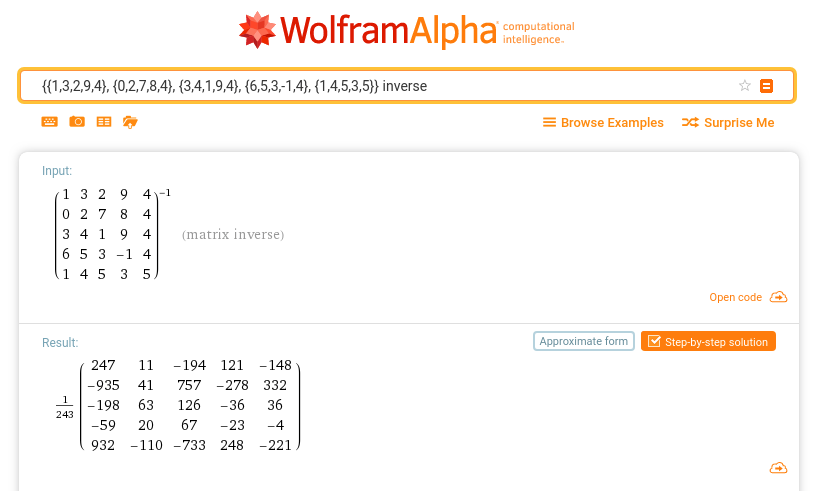

# Harekaze CTF 2019 "ONCE UPON A TIME" [Crypto, 100pts]

## Description

Now!! Let the games begin!!

* [problem.py](problem.py)
* [result.txt](reuslt.txt)


## Solution

encryptは行列の積を計算していることが分かる。ただし、掛ける順序はランダムで各要素はmod 251での値である。
片方の行列が分かっているので、逆行列を求めて左右から掛けて試せば良い。
ただし、逆行列はmod 251での値を計算する必要がある。

WolframAlphaに逆行列の計算を投げると以下のようになる。


1/243 は 243で割るのではなく、243x ≡ 1 (mod 251) となるxを掛ければ良い。


```Python
from ctflib import *
import numpy as np
import binascii

def dec(a):
    a = np.ravel(a)
    m = [chr(c%251) for c in a]
    print(''.join(m))

c = binascii.unhexlify(b'ea5929e97ef77806bb43ec303f304673de19f7e68eddc347f3373ee4c0b662bc37764f74cbb8bb9219e7b5dbc59ca4a42018')
one, two = c[:25], c[25:]

invB = np.array([[247,11,-194,121,-148],[-935,41,757,-278,332],[-198,63,126,-36,36],[-59,20,67,-23,-4],[932,-110,-733,248,-221]])
invB *= inv(243, 251)

C_1 = [[one[i*5+j] for j in range(5)] for i in range(5)]
C_2 = [[two[i*5+j] for j in range(5)] for i in range(5)]

dec(np.dot(C_1, invB))
dec(np.dot(invB, C_1))
dec(np.dot(C_2, invB))
dec(np.dot(invB, C_2))
```


Flag: `HarekazeCTF{Op3n_y0ur_3y3s_1ook_up_t0_th3_ski3s_4nd_s33}`
