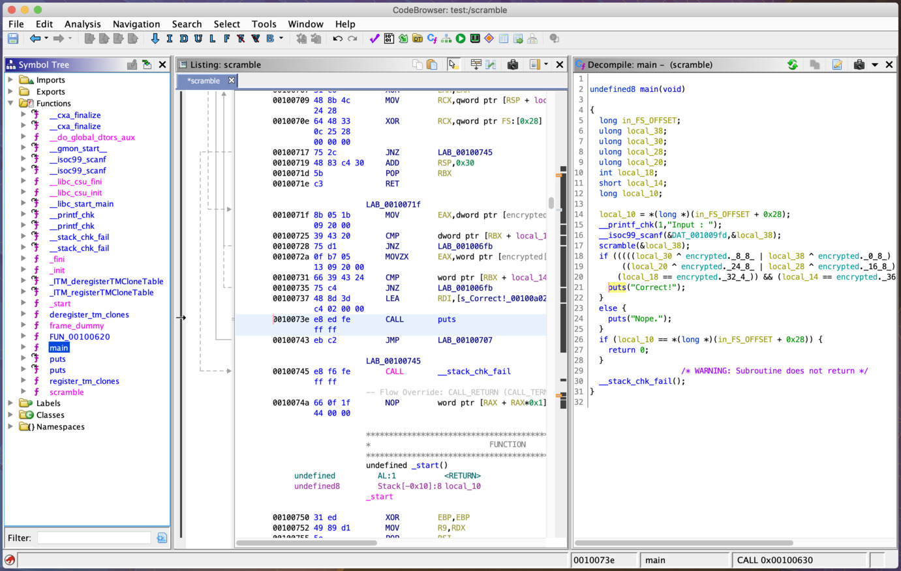

# Harekaze 2019 "scramble" writeup

## problem

One binary "scramble" is provided.

## solution



check "puts("Correct!")" address and solve by angr.

<https://docs.angr.io/core-concepts/pathgroups>

```python
import angr

proj = angr.Project("./scramble")

# puts("Correct!")
target_addr = 0x40073E

state = proj.factory.entry_state()
simgr = proj.factory.simgr(state)
simgr.explore(find=target_addr)
state = simgr.found[0]
print(state.posix.dumps(0))
```

```
b'HarekazeCTF{3nj0y_h4r3k4z3_c7f_2019!!}'
```
