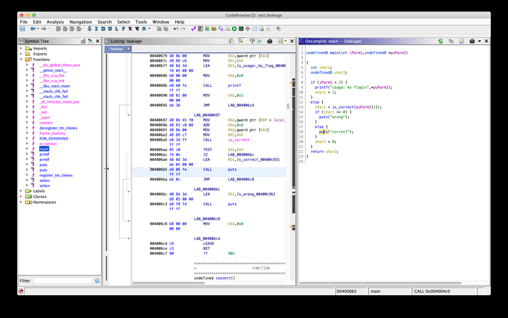

# SECCON Beginners CTF 2019 "Leakage" writeup

## problem

One binary "leakage" is provided.

## solution



check "puts("correct")" address and solve by angr.

<https://docs.angr.io/core-concepts/pathgroups>

```python
import angr
import claripy

project = angr.Project("./leakage")
argv1 = claripy.BVS("argv1",100*8)
initial_state = project.factory.entry_state(args=["./leakage",argv1])
sm = project.factory.simulation_manager(initial_state)
sm.explore(find=0x4006b5)
found = sm.found[0]
solution = found.solver.eval(argv1, cast_to=bytes)
print(repr(solution))

# b'ctf4b{le4k1ng_th3_f1ag_0ne_by_0ne}\x00\x00\x00\x00\x00\x00\x00\x00\x00\x00\x00\x00\x00\x00\x00\x00\x00\x00\x00\x00\x00\x00\x00\x00\x00\x00\x00\x00\x00\x00\x00\x00\x00\x00\x00\x00\x00\x00\x00\x00\x00\x00\x00\x00\x00\x00\x00\x00\x00\x00\x00\x00\x00\x00\x00\x00\x00\x00\x00\x00\x00\x00\x00\x00\x00\x00'
```

```
ctf4b{le4k1ng_th3_f1ag_0ne_by_0ne}
```
