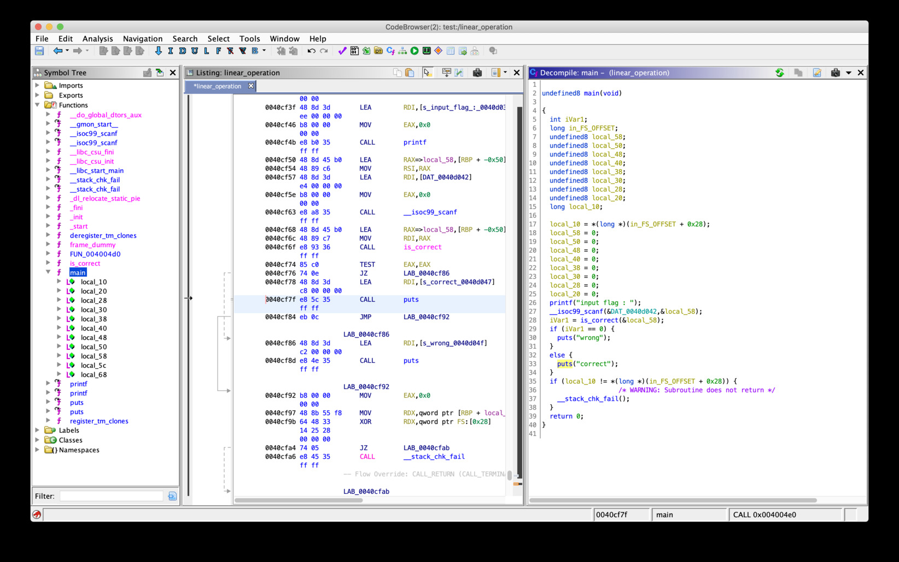

# SECCON Beginners CTF 2019 "Linear Operation" writeup

## problem

One binary "linear_operation" is provided.

## solution



check "puts("correct")" address and solve by angr.

<https://docs.angr.io/core-concepts/pathgroups>

```python
import angr

proj = angr.Project("./linear_operation")

target_addr = 0x40cf7f

state = proj.factory.entry_state()
simgr = proj.factory.simgr(state)
simgr.explore(find=target_addr)
state = simgr.found[0]
print(state.posix.dumps(0))

# b'ctf4b{5ymbol1c_3xecuti0n_1s_3ffect1ve_4ga1nst_l1n34r_0p3r4ti0n}'
```

```
ctf4b{5ymbol1c_3xecuti0n_1s_3ffect1ve_4ga1nst_l1n34r_0p3r4ti0n}
```
