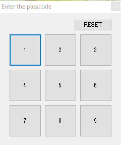
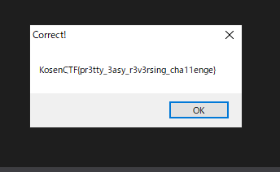

# InterKosenCTF writeup
## passcode [Reversing, 357pts, 18 solved]
### 問題
The flag is protected by passcode

### 解法

exeファイルを実行するとこんな画面が表示されます。


適当にクリックしてても何も反応がありません。何も手がかりがないのでdnSpyでデコンパイルしました。パスコードっぽいものがハードコーディングされているのが分かります。

また、表示上変化はないですが、毎回ボタンの配置がシャッフルされていることも分かります。
```cs
// Token: 0x06000003 RID: 3 RVA: 0x000021D8 File Offset: 0x000003D8
        private void shuffle()
        {
            int num = 0;
            foreach (int num2 in this.state)
            {
                num = num * 10 + num2;
            }
            Random random = new Random(num);
            for (int i = 0; i < 9; i++)
            {
                int index = random.Next(9);
                int value = this.vars[i];
                this.vars[i] = this.vars[index];
                this.vars[index] = value;
            }
        }
```
ボタンの配置の変更も反映されないので、パスコードが分かっていてもどのボタンを押せばいいか分からず、どこまで押したか分からないので、それらが分かるようにコードを修正しました。C#全然触ったこと無くてこれくらいの修正しか出来なかったので、後は書いてあったパスコードを地道に打ってFlagを入手しました。結構パスコード長くて、間違えると最初からやり直しだったのでこの作業が一番キツかったです🤪



<br/>

Flag: `KosenCTF{pr3tty_3asy_r3v3rsing_cha11enge}`
