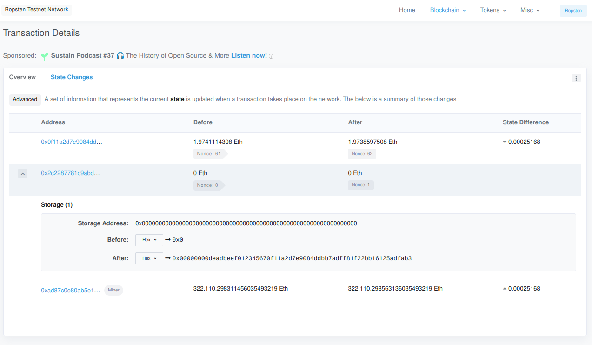
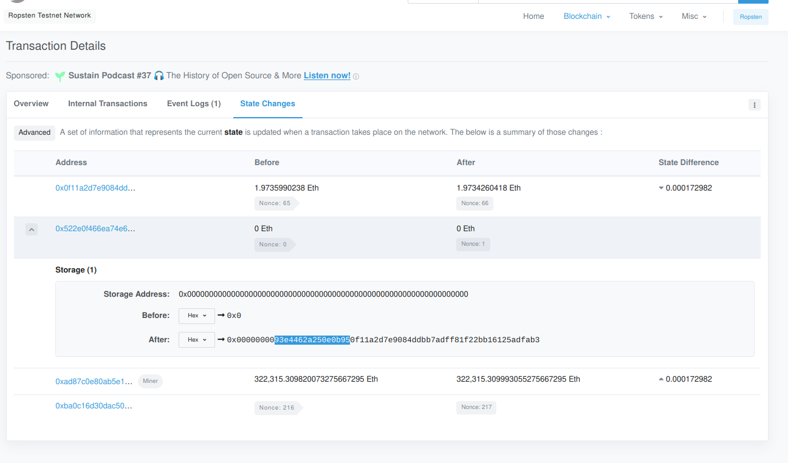
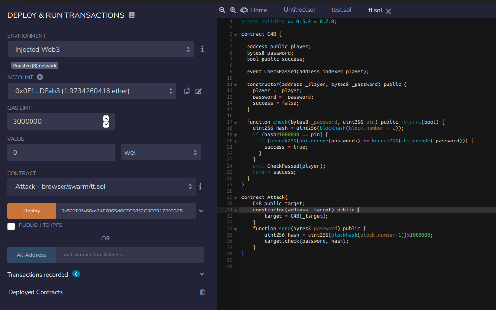
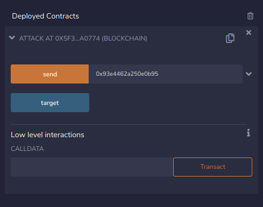
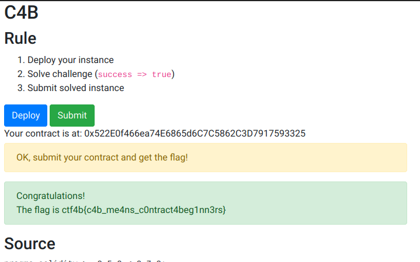

# SECCON Beginners CTF 2020 C4B writeup

## 問題
Are you smart?


## 解法

スマートコントラクト問は先週のSharky CTFで初めて触ったので何をすれば良いのかほとんど分からなかったが、そのwriteupを参考にしていたらなんとなく分かった。

この問題は大まかに、

1. contractを作る。
2. passwordとpinを特定する。
3. checkに特定した値を渡してsuccessをtrueにする。

という流れになっている。

まずcontractを作る。リンク先のDeployを押すだけでいいが、MetaMaskは事前に入れておく必要がある。

次にpasswordとpinを特定する。pinはblock.numberつまりblock heightでありこれは簡単に取得できるのでOK。  
passwordはcontractを作成したときのトランザクションに書いてあるはずだが、どのような形式で与えられているのか分からなかったのでソースコードを使って分かりやすいパスワードでdeployして実験した。ここでは `0xdeadbeef01234567` とした。EtherscanのTransaction Details→State Changesから確認してみると、以下のような値になっていることが確認できる。



leading zeroを除いた先頭8バイト分がパスワードであることが分かった。  


これを踏まえて最初に作ったcontractのパスワードを確認する。
ここでは `0x93e4462a250e0b95` であることが分かる。


後はpasswordとpinをcheckに渡してやればいいが、pinが頻繁に変わってしまうのでsolidityで攻撃用のcontractを作った。


```solidity
pragma solidity >= 0.5.0 < 0.7.0;

contract C4B {

  address public player;
  bytes8 password;
  bool public success;

  event CheckPassed(address indexed player);

  constructor(address _player, bytes8 _password) public {
    player = _player;
    password = _password;
    success = false;
  }

  function check(bytes8 _password, uint256 pin) public returns(bool) {
    uint256 hash = uint256(blockhash(block.number - 1));
    if (hash%1000000 == pin) {
      if (keccak256(abi.encode(password)) == keccak256(abi.encode(_password))) {
        success = true;
      }
    }
    emit CheckPassed(player);
    return success;
  }
}

contract Attack{
  C4B public target;
  constructor(address _target) public {
    target = C4B(_target);
  }
  function send(bytes8 password) public {
    uint256 hash = uint256(blockhash(block.number-1))%1000000;
    target.check(password, hash);
  }
}
```

これをRemix(スマートコントラクトのIDE)からDeployする。



先程入手したパスワード(`0x93e4462a250e0b95`)を入力してsendする。



successがtrueになったのを確認後に元のページでSubmitすればFlagが手に入る。



Flag: `ctf4b{c4b_me4ns_c0ntract4beg1nn3rs}`


